Last week I went to San Francisco for the third time this year. Ostensibly, it was for [Convex Abstract](https://abstract.convex.dev/), which is [Convex's](https://convex.dev/) developer conference, but while I was there I got up to many other activities that I thought might be worth remembering.

I thought it would also be fun to share this in a chronological timeline format so you can journey along with me.

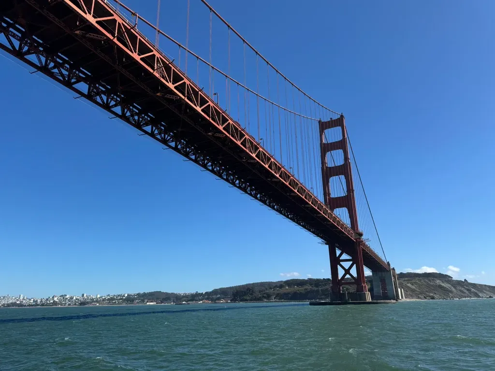

# Sunday

I caught a bus from Busselton at 7:30am. It's a three-hour journey to Perth Airport and I was a little worried, as I was cutting it fine with only 1 hour and 10 minutes between when I arrived and when my flight was scheduled to leave for Sydney. Because it was a domestic flight on a Sunday morning, I was pretty confident that I would be okay, but my AI agent that organised the trip for me was worried for me.

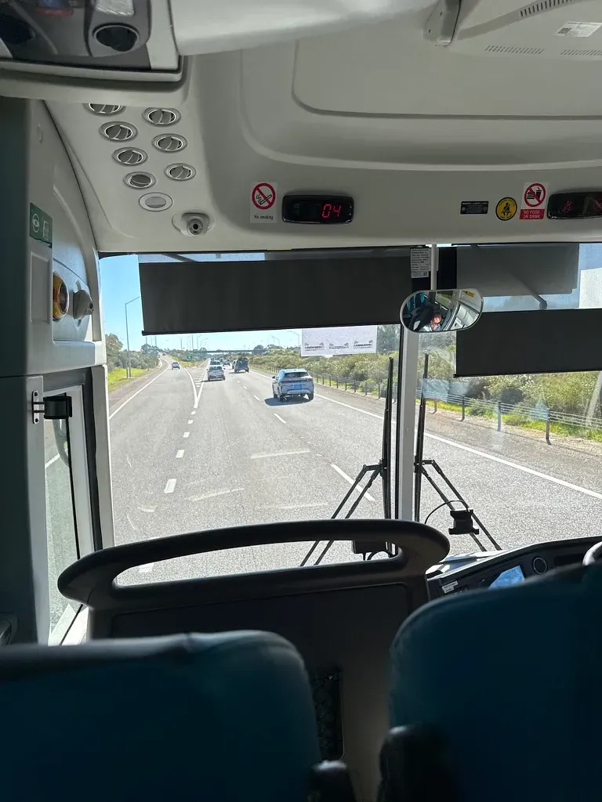

Fortunately, I got there bang on time and progressed through check-in and security with enough time to indulge in some of the most expensive bottled water I have ever seen.

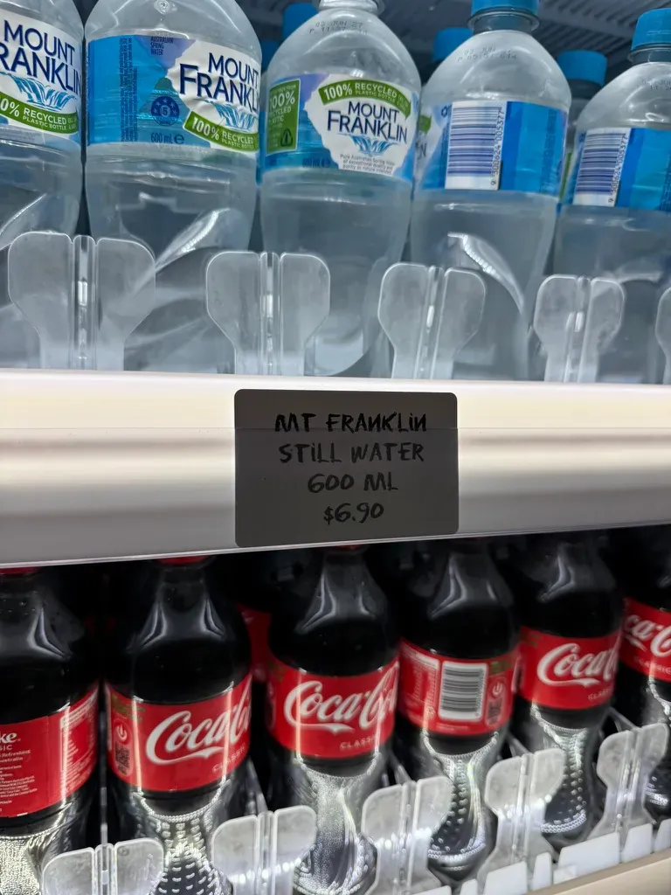

I arrived in Sydney four and a half hours later, then transferred from the domestic to the international terminal and waited the three hours before my 9:25pm flight to SF.

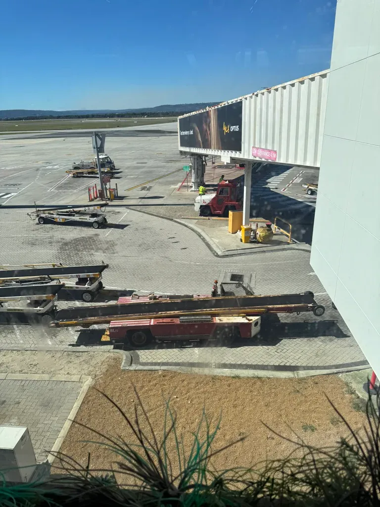

I finally arrived in SF at 5:45pm, over three hours before I left!

After grabbing my bag, I hopped in an Uber and made my way to my hotel near Union Square in the city.

That evening I enjoyed one of the top five meals I have ever had, a chicken Thai noodle curry from [Wanjai Restaurant & Bar](https://www.google.com/maps/place/Wanjai+Restaurant+%26+Bar/@37.786698,-122.4167825,622m/data=!3m1!1e3!4m10!1m2!2m1!1sthai+restaurant!3m6!1s0x80858128b907218f:0x2ec1991ed5f899b8!8m2!3d37.786698!4d-122.4144089!15sCg90aGFpIHJlc3RhdXJhbnRaESIPdGhhaSByZXN0YXVyYW50kgEKcmVzdGF1cmFudJoBRENpOURRVWxSUVVOdlpFTm9kSGxqUmpsdlQyeEdiVmRXUmpWVVJsVTBZVVpHU2xRemJGVlVXR2hwWlc1Q1ZGRXpZeEFC4AEA-gEECAAQQg!16s%2Fg%2F11yk5yc520?entry=ttu&g_ep=EgoyMDI2MDkwOS4wIKXMDSoASAFQAw%3D%3D). Absolutely fantastic.

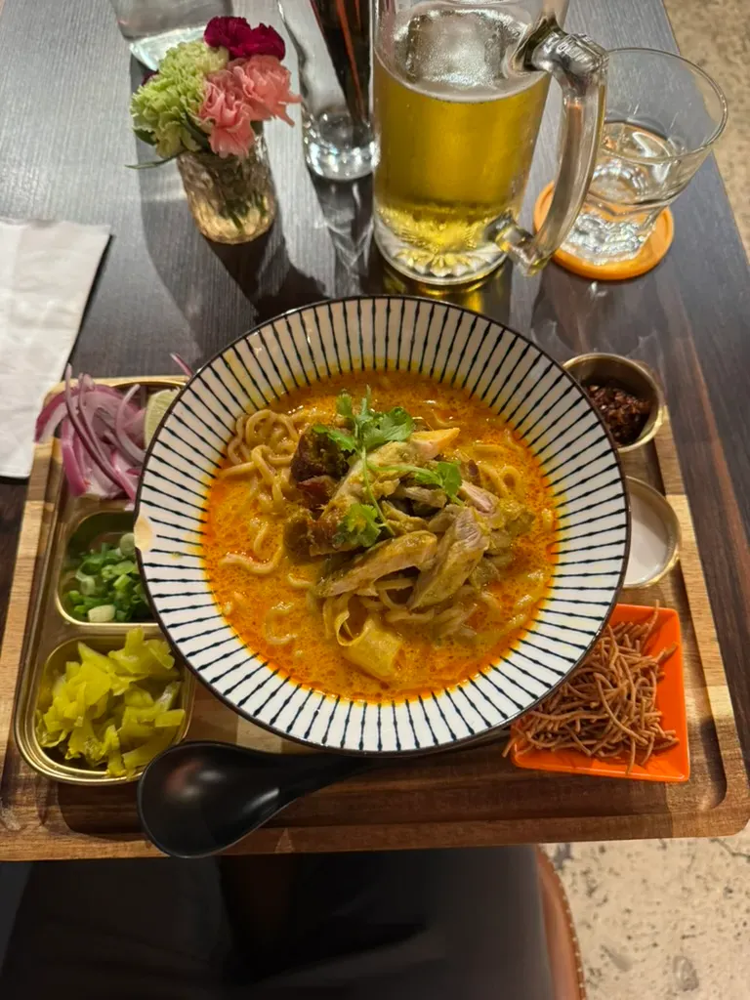

# Monday

I was up bright and early, thanks to jetlag, so I headed into the office.

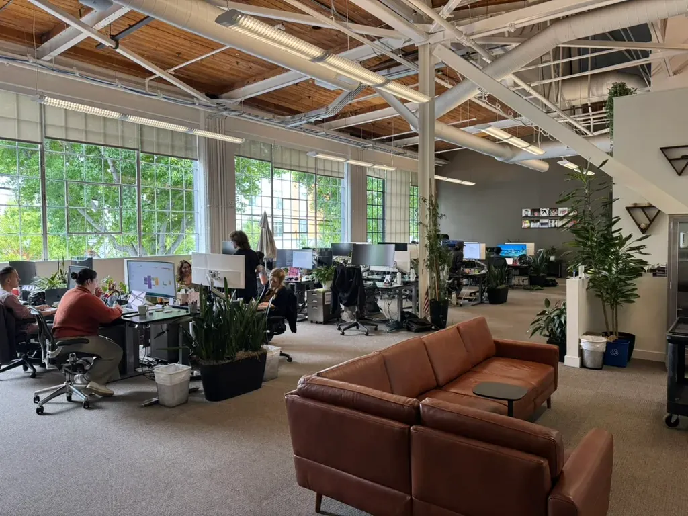

That first day I kept intentionally quite loose, expecting to get interrupted chatting to colleagues I had only met over Slack before and preparing for the activities to come later in the week.

# Tuesday

On Tuesday I had arranged to meet a couple of Convex fans, one for morning coffee and one for lunch.

The weather was glorious the majority of the time I was there, with cool, crisp air in the shade but nice and warm in the sun.

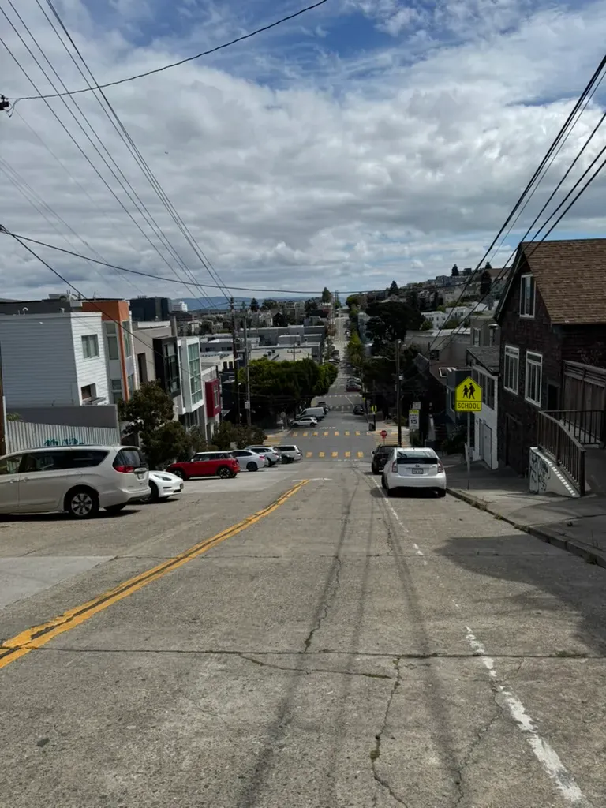

Preparations for the conference the following day were well underway and everyone was preparing for their part.

That evening was the speakers' pre-dinner. I somehow managed to get myself invited despite not being a speaker, though I was partaking in other public speaking-related activities.

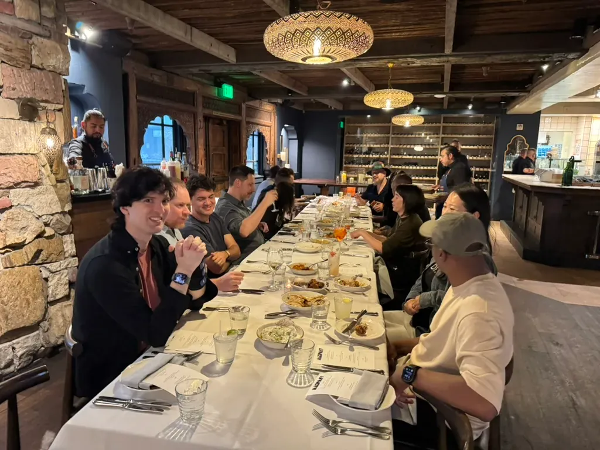

The dinner was fantastic. Getting a chance to speak to so many super-smart people was a pleasure, even though it was a little warm in the room.

On the way home at 9:30pm I stumbled across one of these famous "Corgi" cafes I had been told about. IMO, a very "SF" sight to see so many people still hammering away at their laptops this late at night.

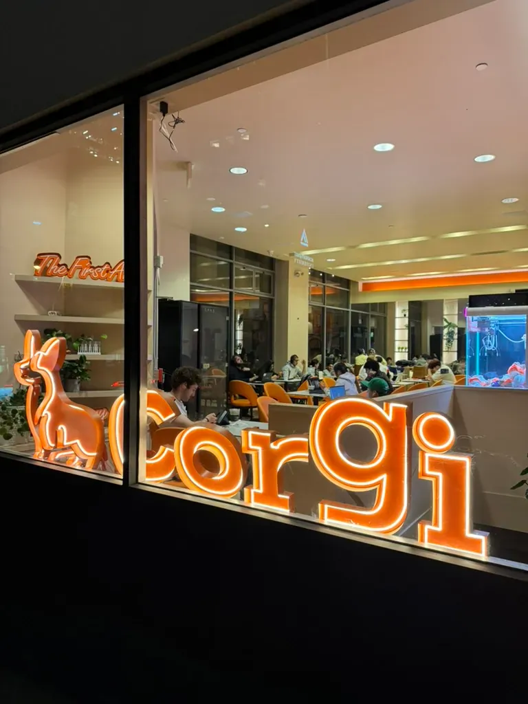

# Wednesday

It's the big day, Convex Abstract!

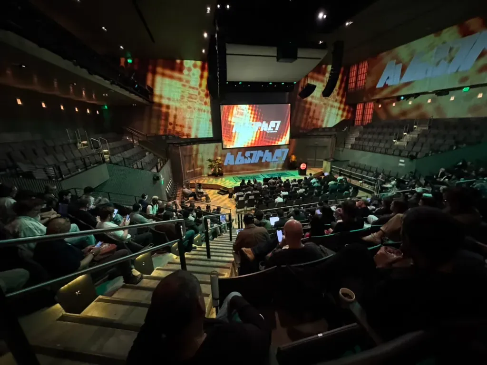

It was a great day. It started early, with me rocking up to see a big queue of people outside. I got in and met the film crew I was going to be working with for the day.

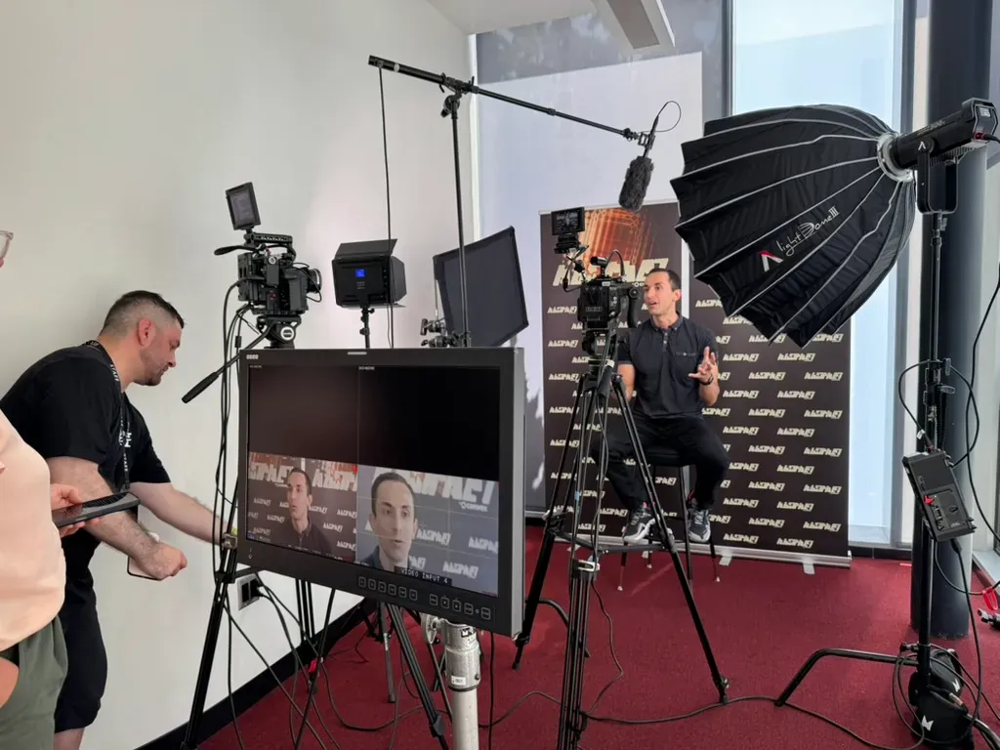

Throughout the day we were doing customer interviews and "man on the street" videos.

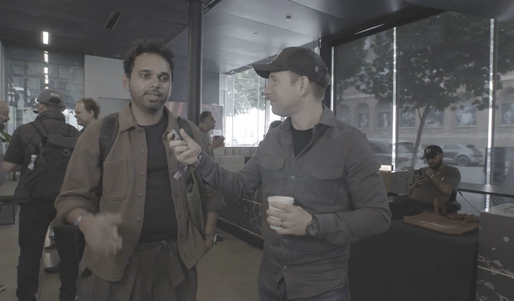

I was pretty nervous going into this, as it involved me going around "bothering" people and asking them if they would mind being interviewed. Everyone was super kind though, said yes, and was very forthcoming about talking to me.

It was also awesome to have so many people come up to me because they recognised me [from the videos I have done](https://www.youtube.com/@convex-dev). I guess this was to be expected, given this was a Convex conference, but it was still very nice to be recognised and complimented. I hope it doesn't go to my head.

Speaking of going to my head, I found myself settling into the "man on the street" interviews quite quickly, actually. I wouldn't say I "enjoyed" them, but once I got over the fear of the unknown and what was expected from me, I felt much more confident, which reflected back on the interviewee and thus the quality of the video.

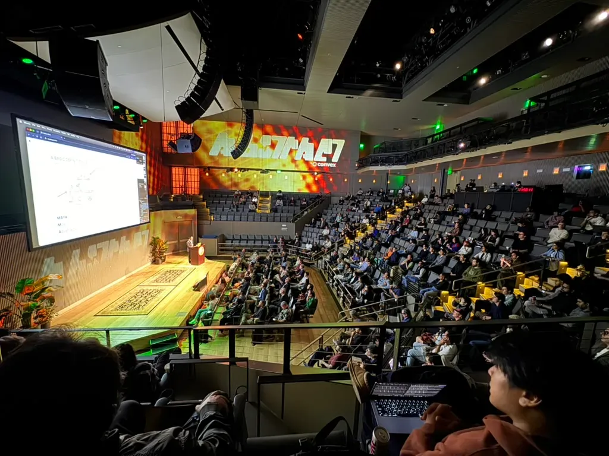

The after-party for the conference was great. I once again found myself hanging out with a heap of Convex fans, chatting about AI and everything that's going on right now.

At the after-after-party we got particularly stuck into the recent controversy around [Dwarkesh's article on the Hugging Face breach](https://www.dwarkesh.com/p/openai-huggingface). I actually came away feeling a little more worried about the future.

# Thursday

I intentionally kept this day quite empty, knowing that the day before was going to be a big one.

I mostly spent the day preparing for the videos the following day and the talk I was going to give on Saturday.

The office had a pizza order and I was really impressed by the variety of different pizzas they had.

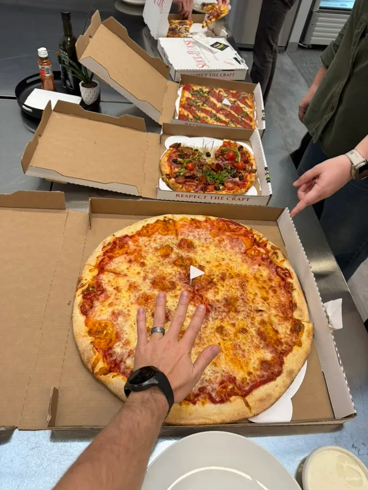

# Friday

Today was a busy day. We had Mikhail the cameraman in once again to do some videos.

I had two "whiteboard"-style videos, one with Nipunn and one with Ian, and then later in the day a "Spicy Questions" interview with James, the CTO.

I was much less nervous doing these interviews this time compared to the first time I did them. Again, I think a lot of the fear comes from the unknown. Once you have done it before, you know what to expect and what is expected of you, so you can prepare and ease into it. Once you are eased in, you can start to enjoy it.

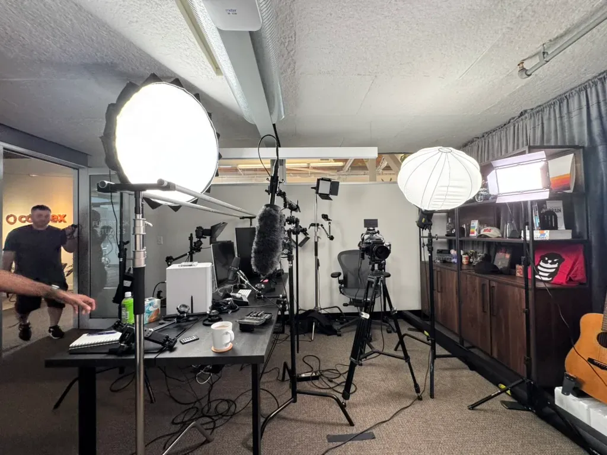

In between the interviews I gave a "show and tell" for the engineers at their weekly meeting.

This was the first time I had participated in this, despite enjoying watching them every week.

I decided to do a little "tour" of Australia, showing on a map some of the places around the continent and where I live.

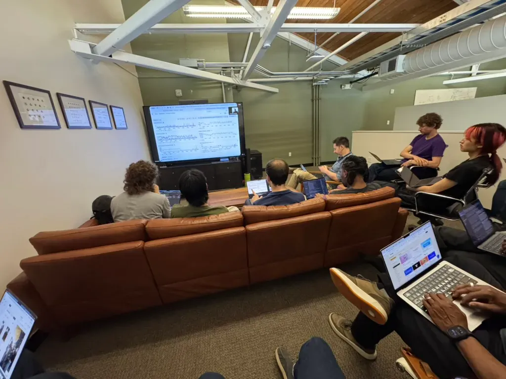

# Saturday

On Saturday I ended up giving a talk at a "Spatial Intelligence" hackathon.

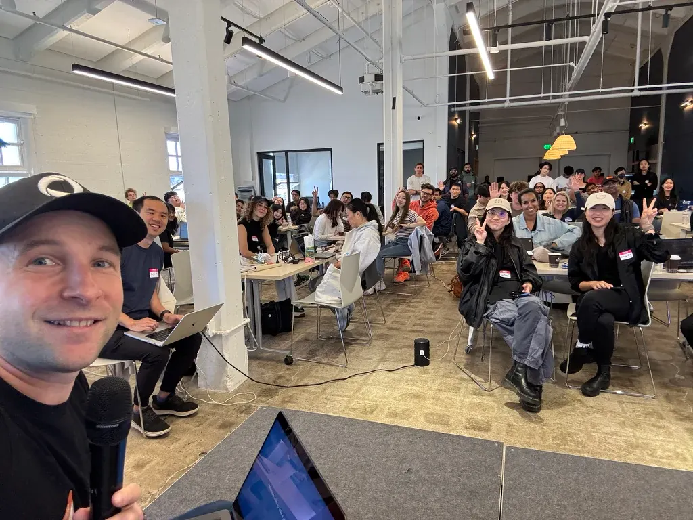

I wanted to do something a bit different for the talk and, as there was a "gaming" track, I went for a [3D set of slides](https://wonderful-sockeye-352.convex.site/) which kept it a bit more interesting:

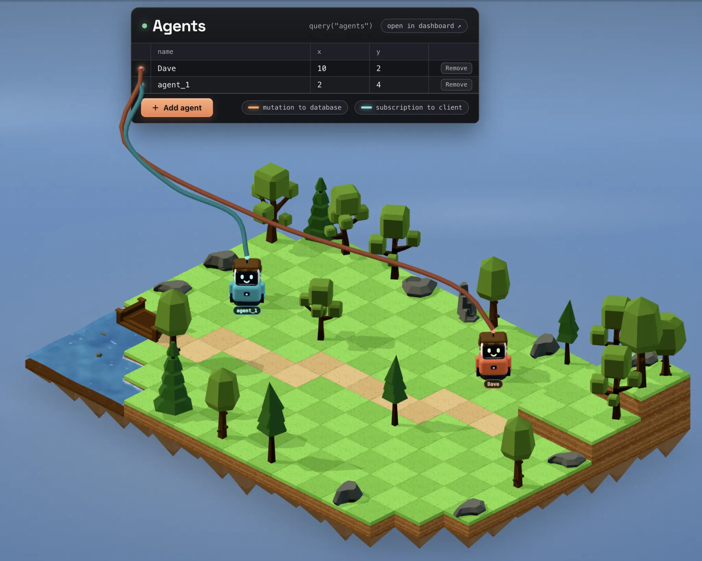

The interesting thing is I was not nervous at all about this talk, which was a major surprise given [how nervous I was about the talk I gave earlier in the year in Singapore](https://mikecann.blog/posts/ai-engineer-singapore-agents-anxiety-and-actual-humans). Again, I think it really was just a matter of knowing what to expect and being prepared.

The interesting thing I took away from the talk is that people really wanted to see more use cases, reasons, and ways to use Convex. This is something I'll have to carry through into my next talks.

After that I decided to give myself the second half of the day off. I wanted to walk around, so I decided to walk for four hours or so along Ocean Beach, an area of SF I had yet to visit.

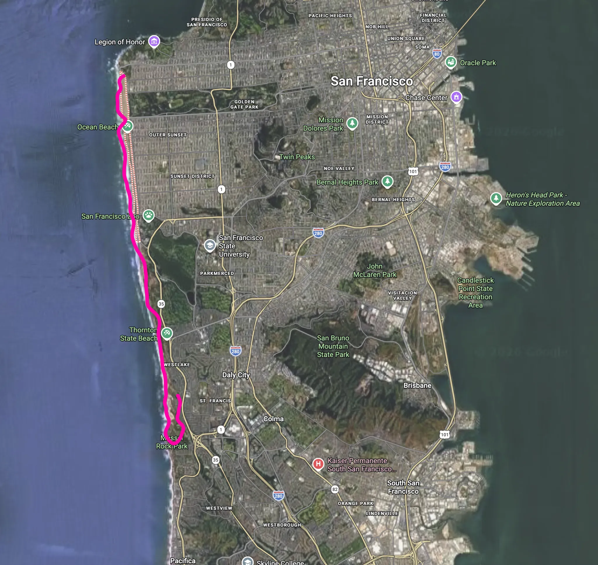

Along the way I saw a bunch of interesting things washed up on the beach and some interesting treasures.

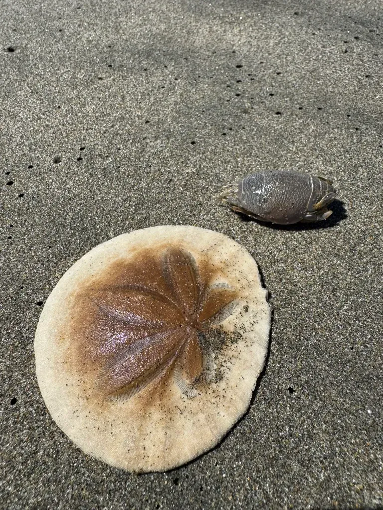

I also saw a bunch of people paragliding along the cliff face. This made me incredibly jealous and envious, as I remembered back to my time [flying in Colombia](https://mikecann.blog/posts/the-trip-2013-tyrona-to-bucaramanga).

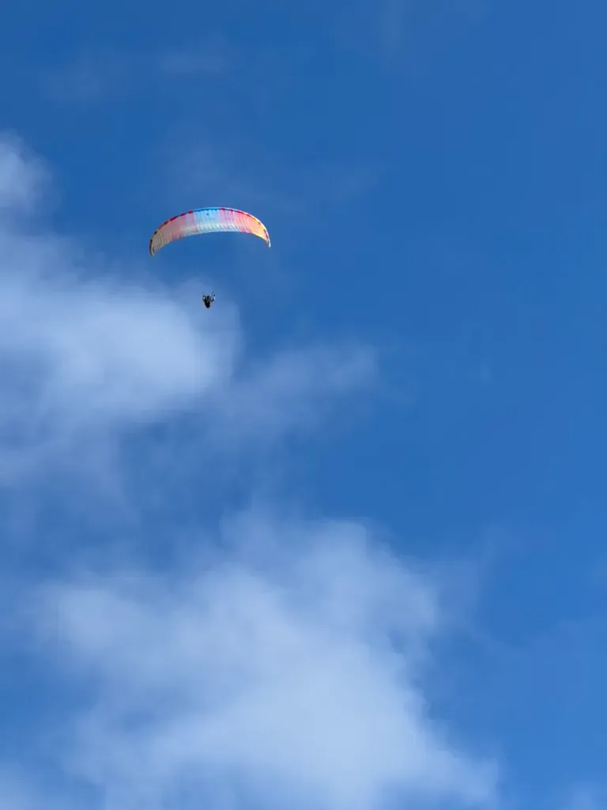

# Sunday-Tuesday

Sunday morning I had booked to go see *The Odyssey* at the IMAX 70mm theatre in SF.

<video controls playsinline preload="metadata" poster="/posts/a-big-week-in-sf/imax-odyssey-poster.webp" style="width: 100%; max-height: 720px;">
  <source src="/posts/a-big-week-in-sf/imax-odyssey.webm" type="video/webm" />
  <source src="/posts/a-big-week-in-sf/imax-odyssey.mp4" type="video/mp4" />
  Your browser does not support the video tag.
</video>

It's an absolutely massive space, which was supposed to be the absolute best way to see the movie. The movie was okay, 7/10 IMO.

After the movie and some lunch I had a few more hours to kill before my flight, so I decided to take a little cruise in the bay. I had done something like this before, but that's okay, it was a beautiful, if windy, day.

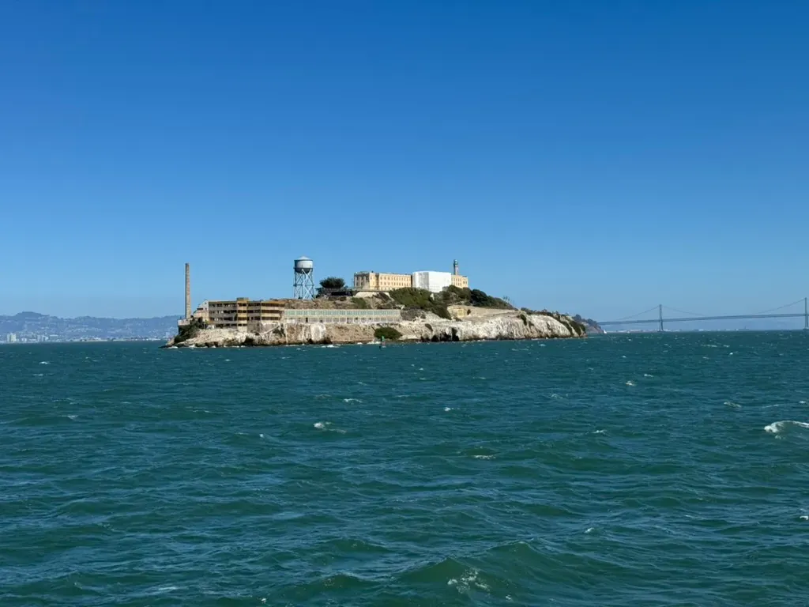

Yeah, speaking about it being windy, this is the first time I have seen kite surfers and wingdingers out in the bay. Maybe I should see if I can go out next time? 🤔

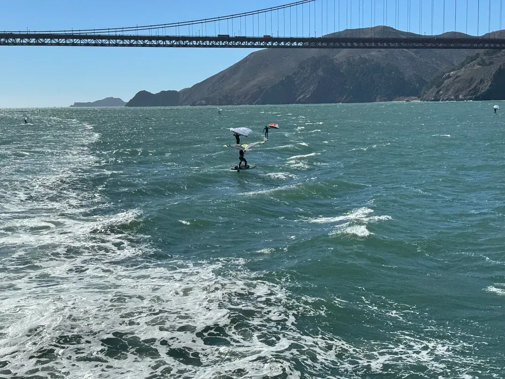

After that I was on the plane and on the way back home.

By the time I got to Sydney I was over the travelling, to be honest, and just wanted to be home. Fortunately, though, nothing bad happened along the way and it was smooth all the way back to Busselton.

All in all, a great trip. I think I did some good work and felt like I grew a bunch as a person.
