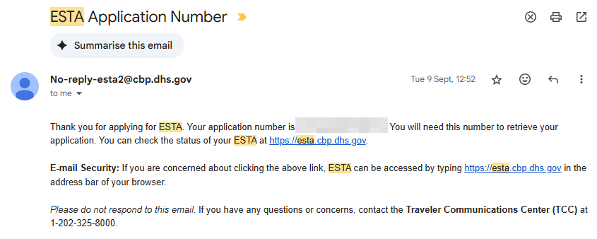
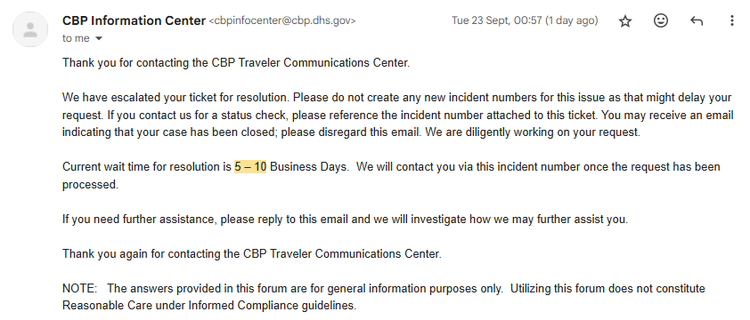
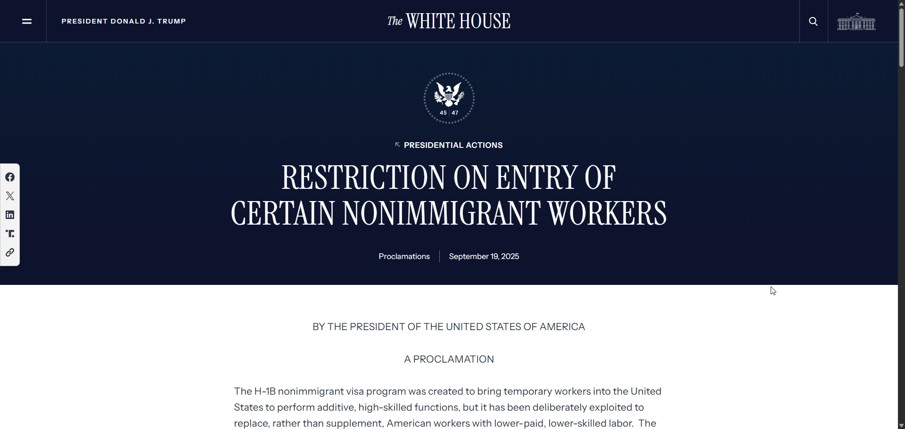
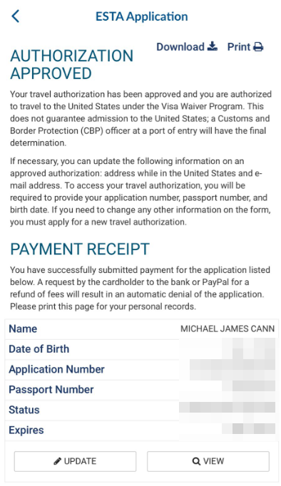

---
coverImage: ./header.webp
date: "2025-09-24T07:31:40.000Z"
tags:
  - personal
  - convex
  - travel
title: A Cautionary Tale - Stuck in ESTA Limbo
---

I am supposed to be in San Francisco right now meeting my new [Convex](https://convex.dev) colleagues an reacquainting with others that I met when I was last there in December but instead im on my way back home plans cancelled and spirits low.

For a couple of months now I have been planning this trip and never expected any difficulties but as I will explain, I suspect I got caught in the crossfire of Whitehouse policy changes then trapped by an inflexible Visa system.

# What Happened?

I booked my flights on the 30th of August and was due to leave Perth Western Australia on the 21st of September at 11:55pm.

Knowing I would need a Visa to enter the US I went on the [ESTA site](https://esta.cbp.dhs.gov/) which recommends that I used their mobile app, so I did that and submitted by visa application on the 9th of September and had a status update on the same day telling me that my Visa application was accepted, this was 12 days before I was due to fly.

I went ahead and booked hotels, made plans, setup events all with the expectation that everything was fine.

On the 20th of September at 2am I received an email informing me of a a status change to my ESTA application. When I woke up in the morning I saw the email and checked the status and was surprised to see it back in the “Pending” state. The message told me that I had to wait up to 72 hours for a change.

At the time I felt that it must just be a temporary thing and I was out enjoying the spring weather with my family and camping with my son so didn't have the time to dig into it any deeper.

As the hours went by though I become more and more concerned.

I was due to catch a 3 hour bus journey from my home to the airport and 2 hours before that I still had not received an update so I decided to call the Customs and Border Protection hotline which I had hear was the authority to assist with this kind of issue.

After putting some international calling credits on my phone I called the hotline and navigated the unskippable 5 minute intro. I was quickly put through to a CBP officer who told me that they could fast track the ESTA process but all the staff that do that were not there because it was a weekend. I asked what else I could do and I was told nothing, this was just how it was, I could wait and hope that the automated system would resolve before my flight.

So what choice did I have? I hopped on the bus and went to the airport in the hope that in the intervening 6 hours then something would change.

I arrived at the airport and the sympathetic Quantas staff member said there was unfortunately nothing they could do, they could not allow me on a plane without a valid ESTA application.

At this point it 11pm and I was tired and had not eaten so I booked a nearby hotel, cancelled my flights (which I surprisingly received a full refund for) and went to bed.

In the morning I called the CBP again hoping that now that it was no longer the weekend they would be able to assist and maybe I could then get on a flight that day and all would not be lost.

After another 5 minutes of unskippable messages and telephone menus I was put through to another person who told me that they could not fast track me until the 72 hour window was up. Ughh!

I decided that it was worth one more shot as the 72 hour period would have been up by midnight that day so maybe I would be able to get on a flight the next day.

So I spent the rest of the day bouncing between various cafes and co-working places in Perth.

That evening (at midnight) I called the CBP again and they finally said they can fast track me and I should receive an email soon. I was super tired so went to sleep hopeful that by the time I woke up I would be approved.

The following day I checked my email and frustrated to see no approval notice only this email informing me that my ticket has been escalated

I highlight the most relevant part for me. 5-10 business days meant that even in the best case that I was approved after 5 days there was no way I was going to have any time remaining for the trip when you take into account the travel time.

So I reluctantly made the decision to call the whole trip off. I cancelled my hotel, events and other plans.

# Why?

I can only speculate as to what happened but I find it more than a coincidence that at around exactly the same time my ESTA status reverted from approved back to pending the Whitehouse announced a [RESTRICTION ON ENTRY OF CERTAIN NONIMMIGRANT WORKERS](https://www.whitehouse.gov/presidential-actions/2025/09/restriction-on-entry-of-certain-nonimmigrant-workers/).

This presidential action doesn't directly say anything about ongoing work travel Visa applications but I can only speculate that this triggered a mass-review of all current work-related applications.

This combined with the fact that it occurred on a Friday before the ESTA fast track people went home for the weekend was just very bad luck for me who was due to fly out at the end of the weekend.

# Now What?

Well this trip is cancelled but im going to continue to wait for the ESTA approval and hopefully some sort of reason as to why the status changed so suddenly without reason but I wont be holding my breath on that one.

Hopefully next time I need to travel to the US I have better luck and hopefully if you need to make the journey too then this story acts as a warning to the risks you take whenever trying to enter the US as a foreigner.

_EDIT_: just as I went to publish, this just came through:

SIGH
