As I write this, I'm sitting on a bus on my way back from [AI Engineer Singapore](https://www.ai.engineer/singapore). I went mostly to run a 90-minute Convex workshop, but also partly to find out whether I could handle doing that sort of thing without completely falling apart.

[AI Engineer](https://www.ai.engineer/) is probably the biggest conference right now for software engineers building with AI. Not machine learning researchers, although there were plenty of technical people there, but software engineers, founders, devtools people, agent people, infra people, and everyone else trying to work out what building software looks like now.

I was there because last year I gave a 15-minute online workshop for a Cursor hackathon, and apparently that went down well enough that Wayne, our head of events at Convex, built a relationship with the organisers. When they decided to run [AI Engineer in Singapore](https://www.ai.engineer/singapore), I was invited to give a proper 90-minute workshop in person.

This was quite a big step up for me. I had asked some friends and colleagues beforehand for advice with giving talks and workshops, and one thing that stuck with me was that speaking often gets easier when you can look back and say, "I've done bigger things than this before."

The problem was that I hadn't really done anything bigger than this before.

So I went into the week wanting to prove to myself that I could step up into a bigger room, carry a bigger talk, and have something useful to say. I wanted this to become one of those reference points I could use next time the nerves appeared; proof that I had done this before and it was probably not going to kill me.

# Convex + AI

The workshop was called "Convex + AI: Everything You Need to Know".

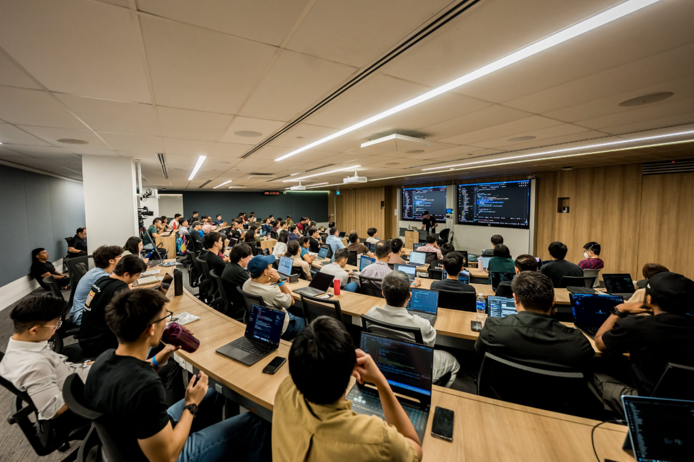

The idea was to start from nothing and end with a hosted AI application, while being honest about how people actually build now. I didn't want to stand on stage and pretend everyone is still manually hand-writing every line of code, because thats just not the case when it comes to agentic coding.

IMO Convex is a great fit for the agentic era because AI like humans really benefits from good abstractions and gaurdrails. They also need state. They need workflows. They need persistence, auth, background work, realtime updates, and all the boring-but-essential application stuff around the model.

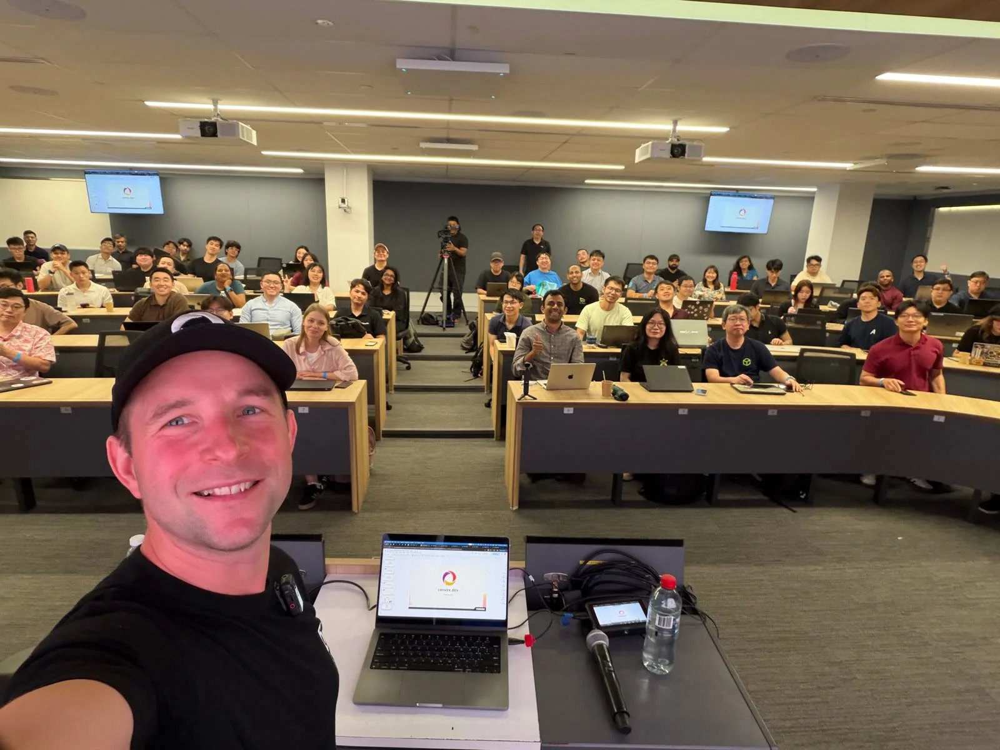

So the workshop went well for the first 15 minutes but there was a bit of a hiccup..

I intended the audience to create a Convex project from scratch using `npm create convex@latest` then `npm run dev`. Basic but reasonable given I wanted to start people from the very beginning.

Unfortunately tho, that setup process was broken, I received a nasty error when I tried to run `npm run dev` when it worked perfectly the day before.

So I was standing in a seminar room with close to 100 people watching me, many of whom had paid hundreds of dollars to be there, and the thing I needed them all to do had stopped working. I was already nervous before the workshop started, but there is a very specific kind of helplessness that comes from being on stage, needing to debug something in real time, while also being painfully aware that the entire room is watching you think.

It turned out that Convex 1.39 had shipped about seven hours before my talk and included a critical bug that broke the workflow I was trying to teach.

Ah great.. Funny in the abstract I guess, in the way that being attacked by a swan is probably funny to everyone except the person being attacked.

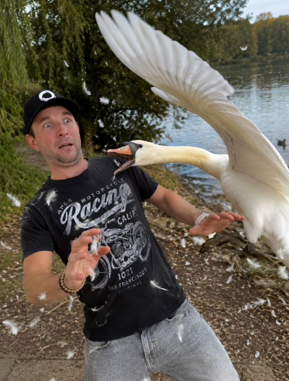

Fortunately, an audience member helped identify that it was a version issue. Even more fortunately, I had rehearsed the workshop several times and had a backup project from before the broken release. I was able to switch over, route around the problem, and keep going.

My prayers to the demo gods had obviously been heard that day.

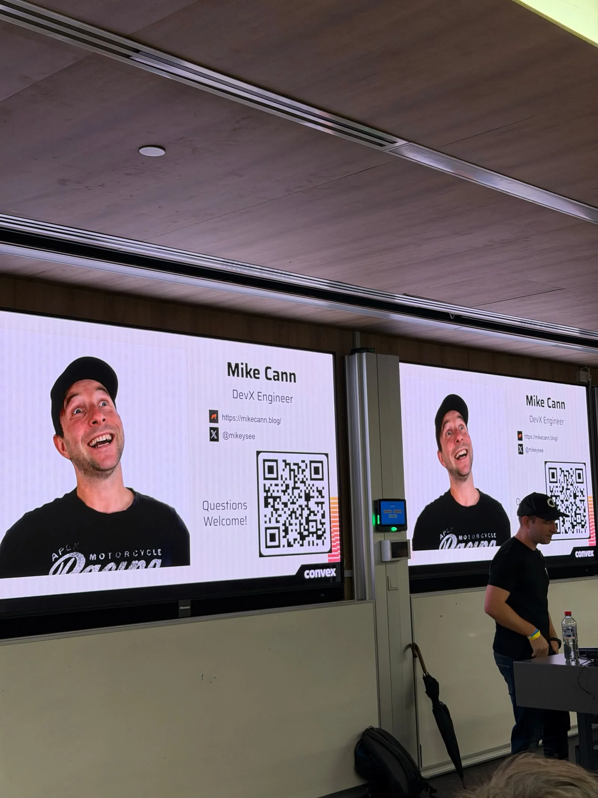

I don't know how many people were able to follow along cleanly after that. Some definitely did, some may have used agents to work around the issue, and some probably just watched from that point onwards.

But its all good the rest of the session went well in the end.

As part of my workshop I built a [small questions platform](https://github.com/mikecann/questions) for the workshop, so people could ask questions as we went. That worked really well, and breaking up the prepared content gave both me and the audience a bit of breathing room. A 90-minute workshop is a long time to talk at people, even when they are interested, because concentration is not infinite.

Afterwards, a few people came up to ask more questions and say nice things which felt great.

BTW I will insert the video recording of my workshop here once it becomes available!

# The strange reality of content impact

One of the most surprising things during the week was how many people recognised me from the 15-minute Cursor hackathon workshop the year before.

That workshop had felt small to me, just one of those things you do, hope is useful, and then move on from. But people remembered it, took value from it, recognised my face during the Convex event on Wednesday, and mentioned it to me throughout the week.

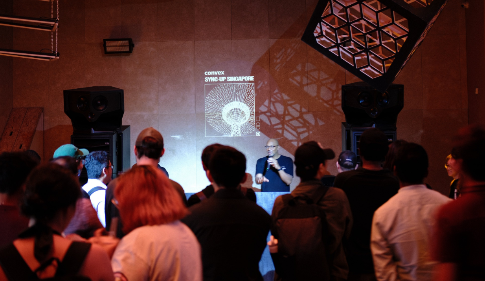

This changed how I think about the videos and workshops I make.

When I look at YouTube numbers, a few thousand views can feel small. Five thousand people watching a technical video does not always feel like a lot, especially compared with the scale of the internet and the ridiculous numbers other people seem to pull. But meeting actual humans who watched something, used it, remembered it, and maybe went on to build something with Convex because of it makes the impact feel much more real.

A few hundred or a few thousand of the right people is not nothing.

If the work is useful, it travels further than the number suggests. People build with it. They tell other people. They form an opinion about Convex, and about me, based on whether the thing helped them.

That is both encouraging and slightly terrifying, because it means the work matters and is therefore worth doing properly.

# AI Engineer as a scene

The actual conference started properly on Friday and ran through the weekend. The format was quite different to some other conferences I have been to. Most talks were short, around 10 or 15 minutes, and there were a lot of them.

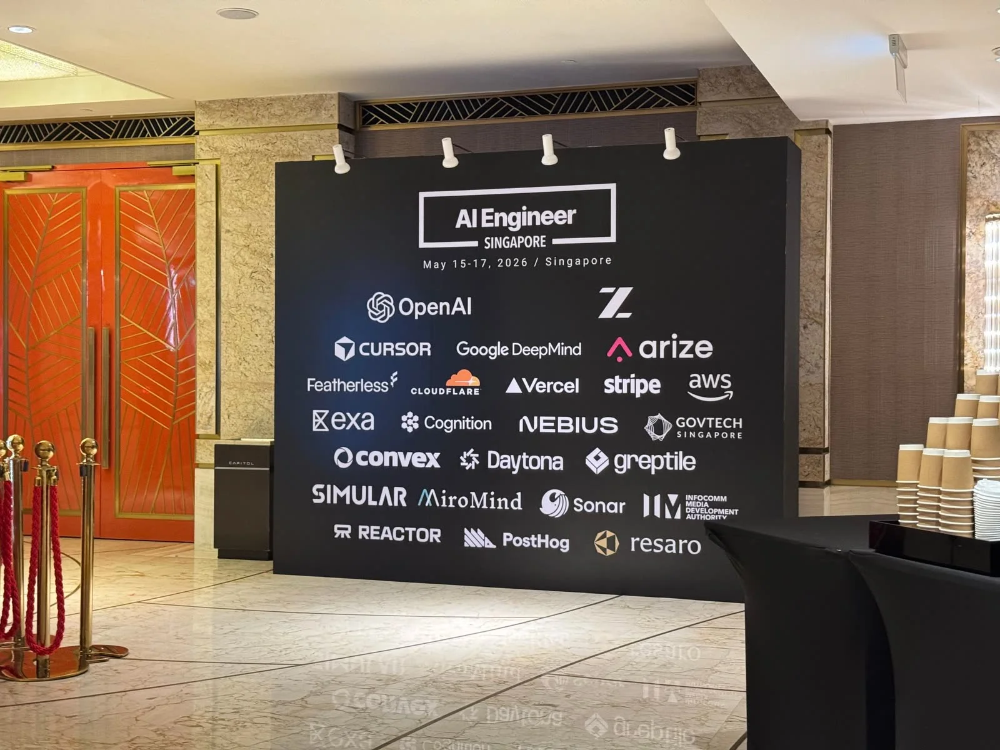

I liked not having to move between rooms constantly. There was one main theatre, so you could just sit down and let the conference come to you. Topics jumped around between a few different tracks; you might get a design talk, then robotics, then coding, then agents, then something else entirely. This is not necessarily a bad thing as it breaks things up but it did mean that there were a number of talks that did very little for me.

Some of the talks were truely excellent however and I learnt a great deal from them, not just the content but also how to give engaging presentations.

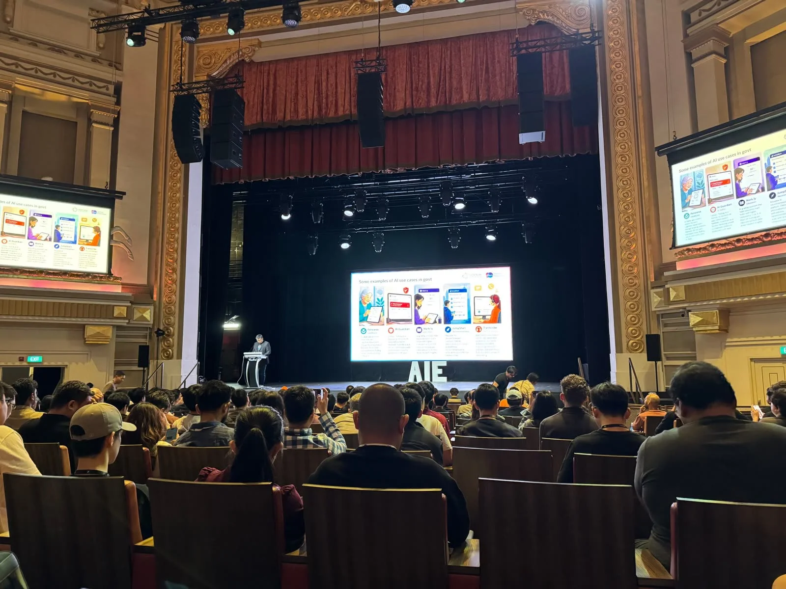

I don't think AI Engineer radically changed my perspective on AI, but it did make me feel closer to the centre of the AI application-building world.

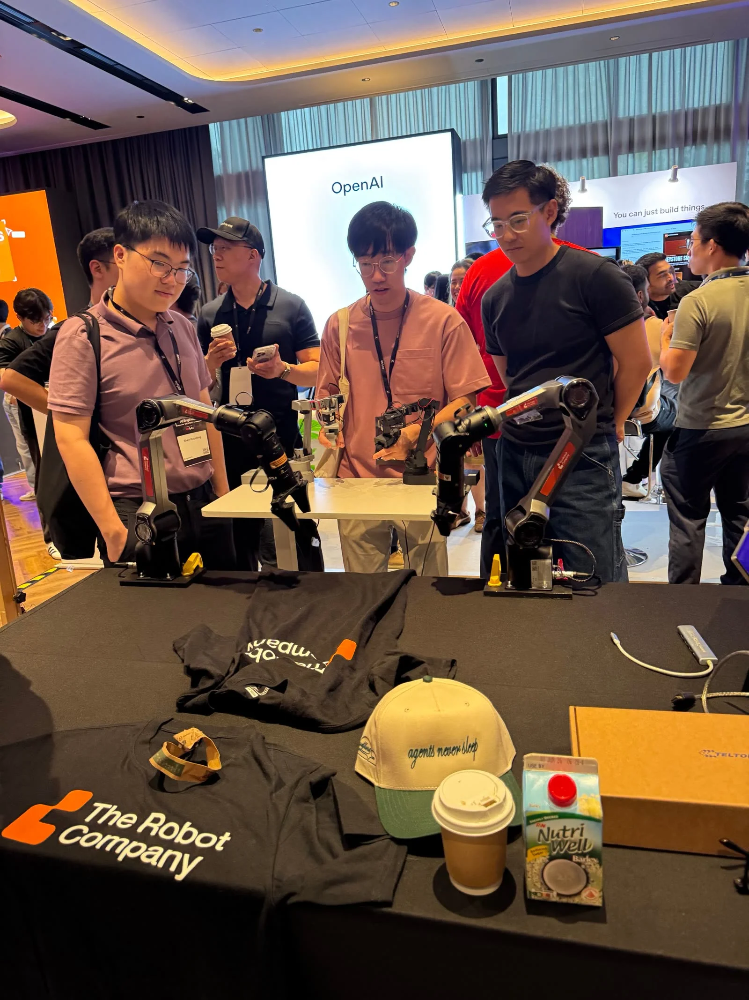

The best image of the week might have been Friday night, after the speaker and sponsor dinner, when we ended up in a packed club and I found myself sitting with someone showing off an agent setup on a laptop while music was blasting around us.

Laptops in a nightclub is obviously a very normal and healthy thing, but it also oddly felt quite natural given the current frenetic state of AI.

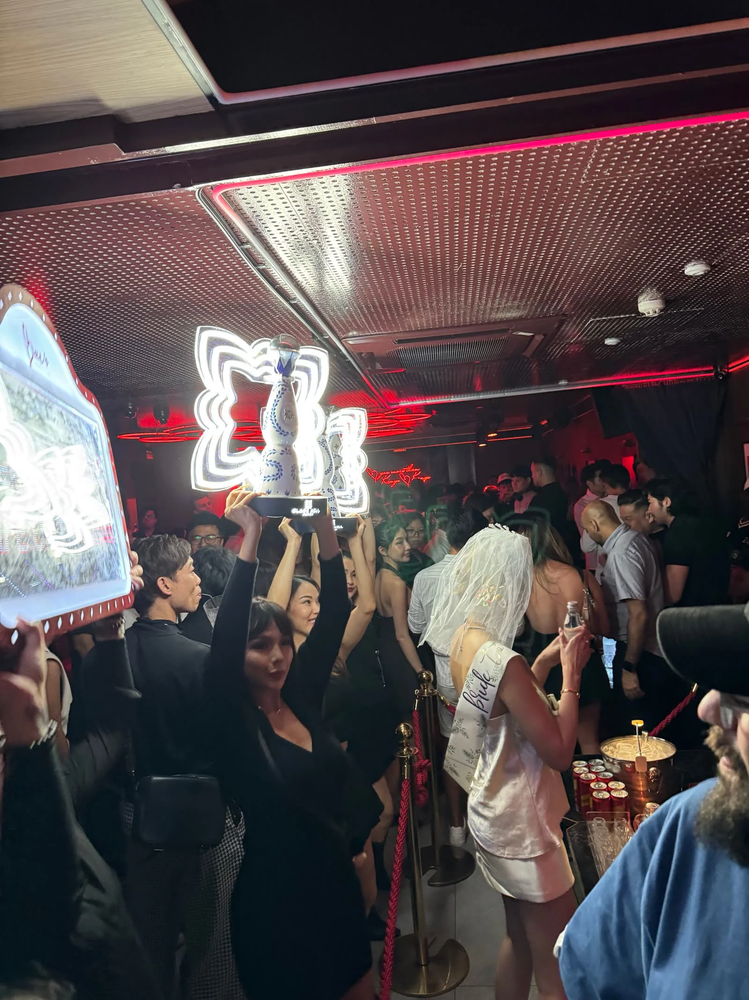

His setup was impressive tho. He could apparently spin up hundreds of agents and have them work on things together, but when I asked what they were actually working on, he just kind of shrugged, "They chose what they wanted to work on".

I found that both fascinating and slightly alarming.

My immediate questions were: how many tokens does that use, how do you keep the quality high, how do you stop churn, how do you know the work is useful etc?

That is probably where I am with a lot of agent hype at the moment. Im in love with AI and all the power they give you, it is for sure changing how software gets made. But I am also suspicious of demos where the impressive part is the number of agents rather than the quality of the outcome.

More agents is not necessarily better. Sometimes it is just a more expensive way to make a mess.

# The human interface layer

I am not naturally good at conferences.

I can talk about technology and I can talk about Convex, especially if someone recognises me or has seen my work, because then there is already a shared starting point. But floating around a room full of people trying to work out when to introduce myself, how much to talk about Convex, whether I am shilling too hard, whether I am being too quiet, or whether I should be somewhere else, is exhausting.

Wayne is much better at this than me.

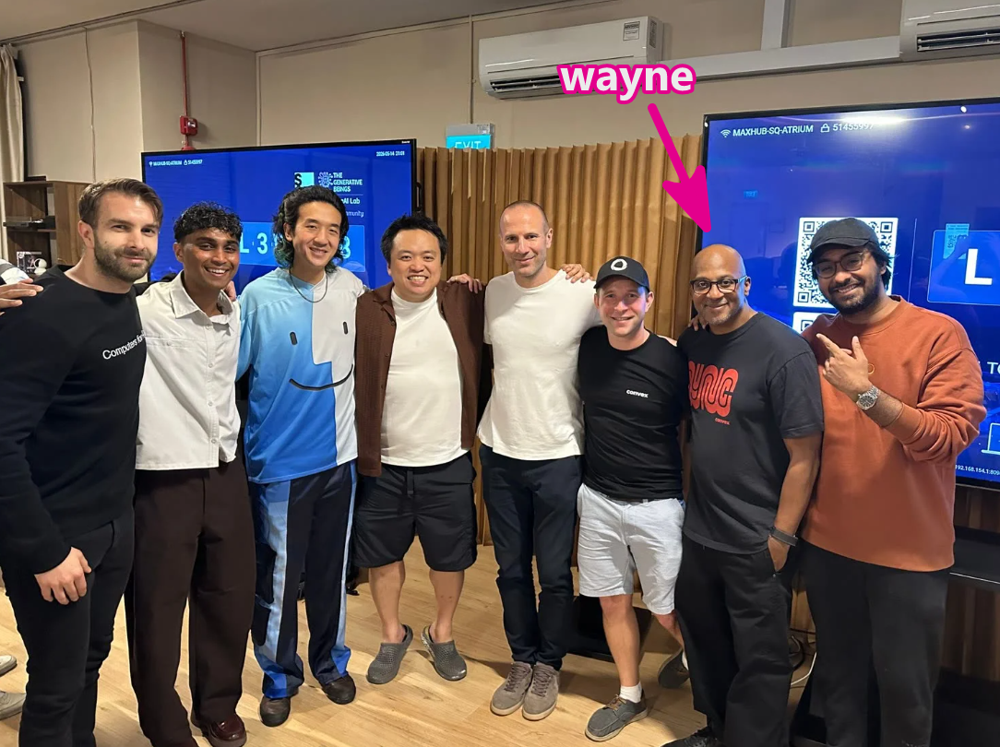

Watching him work during the week gave me an even deeper appreciation for what he does. I already knew he put in a huge amount of effort, but seeing it in person confirmed how much of events is invisible relationship work: knowing people, introducing people, remembering context, moving between groups, and making sure Convex is present without making everything feel like a pitch.

He also gave me one piece of advice that stuck: you need to know when you have reached your limit.

On Saturday night there was a closing party that started at 10pm and was supposed to go until 3am. The theatre had been converted into a nightclub. After the Friday I had just had, I could have forced myself to go. Part of me felt like I should. Conferences create this weird fear that if you are not at every event, you are missing the one conversation that would have justified the whole trip.

But I was knackered, so I skipped it and had some Mike time.

When I go to a new city, one of my favourite things to do is just pick somewhere on the map and walk, so that is what I did. I walked through Singapore listening to audiobooks and podcasts, decompressing after days of noise and people and talks and nerves. I ended up climbing a steep hill to a spot where I could see the cable car moving through the night, then took a Grab back to the hotel and went to bed.

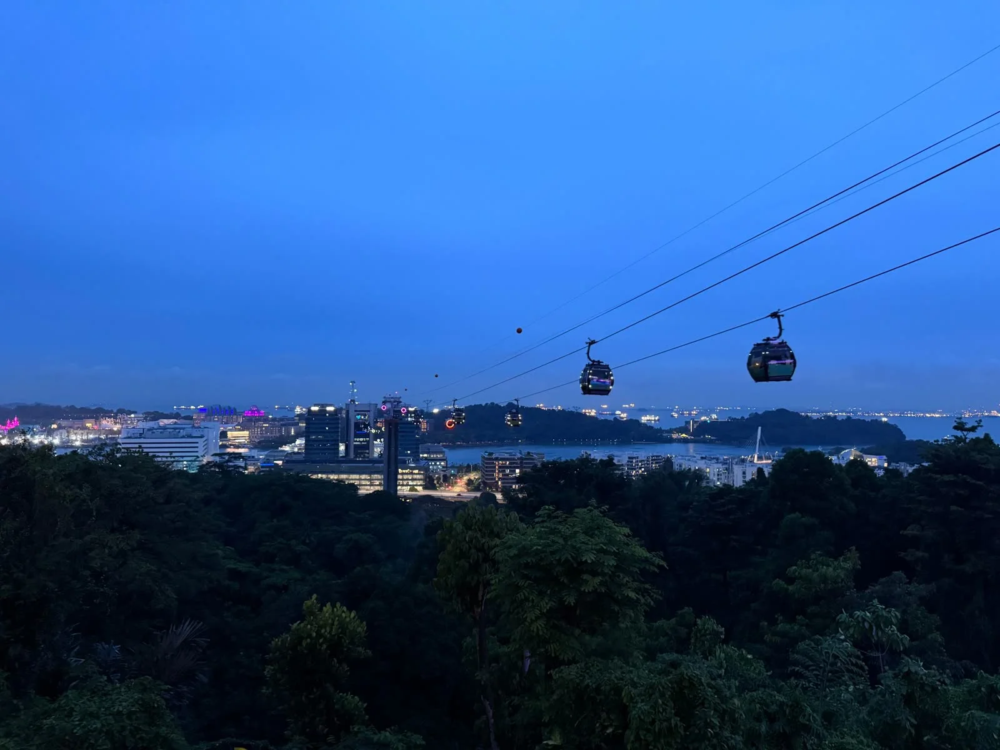

It was exactly what I needed, and the next day Wayne told me the party had mostly fizzled out by midnight anyway, which made me feel much better about the decision. Sometimes the responsible choice is also the correct party analysis.

# Actual humans

There were a lot of status-coded rooms during the week: speaker dinners, sponsor events, rooftop drinks at Marina Bay Sands, a club table with a minimum spend that made me glad I was not personally responsible for the bill, people whose names I recognised from the internet, founders, CTOs, investors, speakers, and organisers.

Those environments are still strange to me. I did not grow up around that sort of thing, and I do not think I will ever be the person who glides through them effortlessly.

But something shifted after the workshop.

At the speaker dinner on Friday night I sat next to the CTO of Daytona and had a genuinely enjoyable conversation about family, entrepreneurship, travel, Silicon Valley, and technology. Normally, talking to someone I perceive as important can make me nervous. I worry about saying something stupid or exposing some gap in what I know.

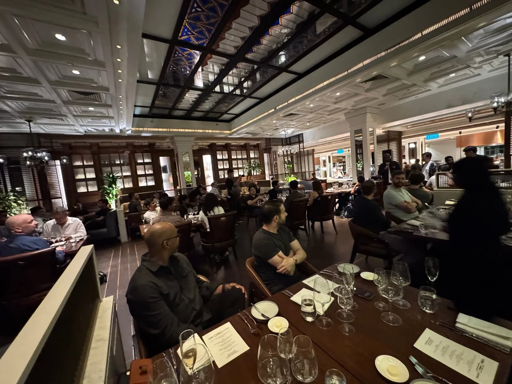

That night I did not feel that as much.

Maybe it was because I had already had a couple of drinks, or maybe it was because the workshop was finally done and the stress had left my body. But I think a bigger part of it was that I felt like I had earned my place in the room.

Not in some grand, dramatic way, just quietly. I had done the thing I came to do. It had gone wrong, I had recovered, and people had still found value in it.

That makes it easier to talk to people as people.

And that was another thing the week reinforced. People are just people. Some are generous, some are impressive, some are arrogant, some mostly want to talk and are not that interested in listening, and some are nerds with laptops in clubs. You do not have to be intimidated by all of them, and you do not have to prove yourself to all of them either.

Sometimes it is fine to let someone talk, sometimes it is fine to listen, and sometimes it is fine to leave and go for a walk.

# Singapore

I really like Singapore.

I did not get to explore it as much as I might have liked, because the week was mostly conference events, side events, dinners, and trying not to collapse, but the parts I did see were beautiful and easy to move through.

The rooftop at Marina Bay Sands was ridiculous in the way famous city viewpoints are supposed to be ridiculous: free drinks, beautiful views, me dressed slightly too formally and joking that I looked like a VC.

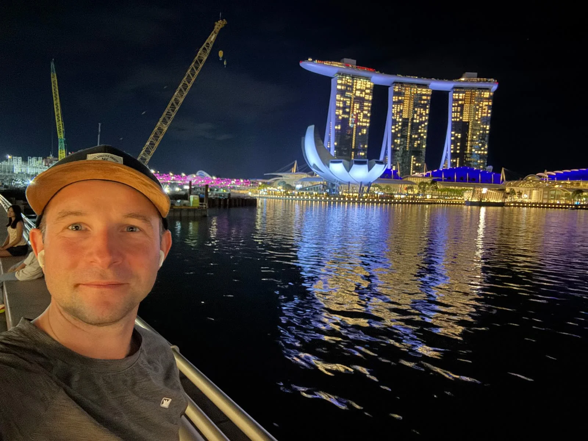

The more memorable parts, though, were quieter. Walking through the city on Saturday night. Sitting outside chatting with Wayne, Liz and [Debbie](https://www.instagram.com/debbieyphotography/) after an event. Liz headed off at some point, and we ended up sitting on benches talking until we got kicked out. Wayne looked the most relaxed I had seen him all week.

That was lovely.

The official things are often not the best things. Sometimes the plan falls apart, and what is left is just a quiet conversation outside in a warm city after a long week.

# Coming home

The next morning I woke up at eight, was out the door by 8:20, and got in a taxi to the airport. Then back to Perth, then home.

I went to AI Engineer Singapore nervous that I was out of my depth. I came home still not magically transformed into a conference extrovert, but with proof that I can do this.

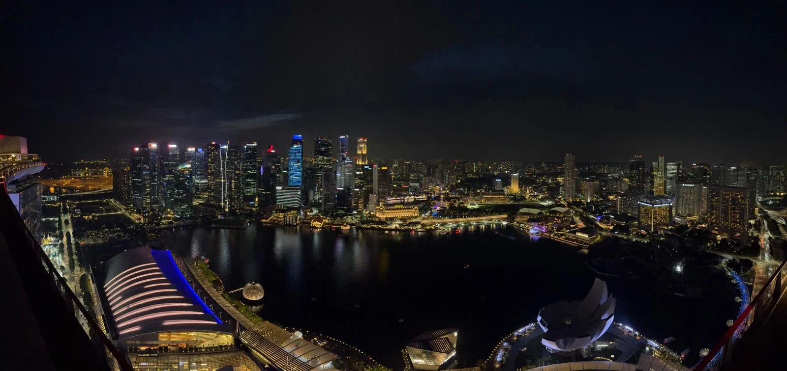

I can step up into a bigger room, give a bigger workshop, survive the live demo curse, and talk to people I would previously have put on a pedestal while realising they are mostly just people with different jobs, different incentives, and occasionally laptops in nightclubs.

That is probably the thing I will carry into the next one. Not that the nerves disappear, but that I now have a bigger reference point.

I have done this before.
