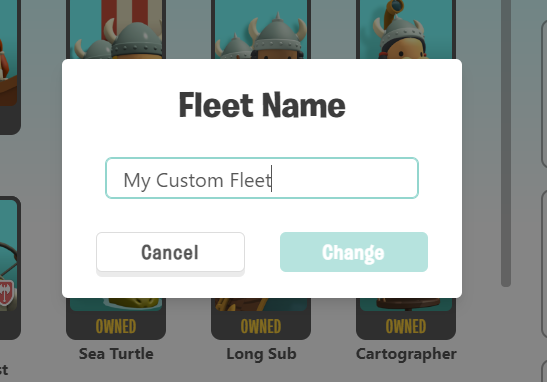
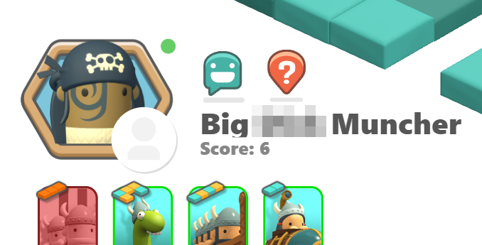
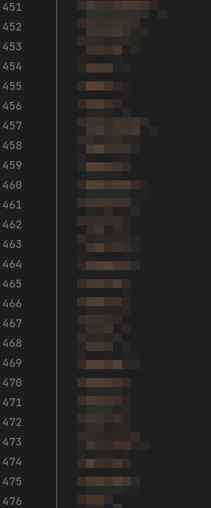
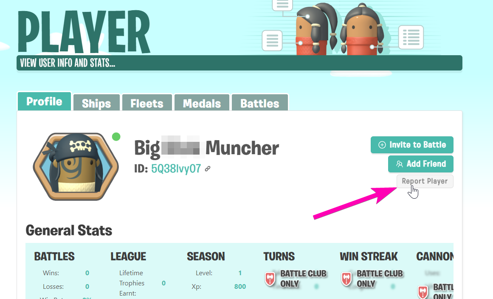
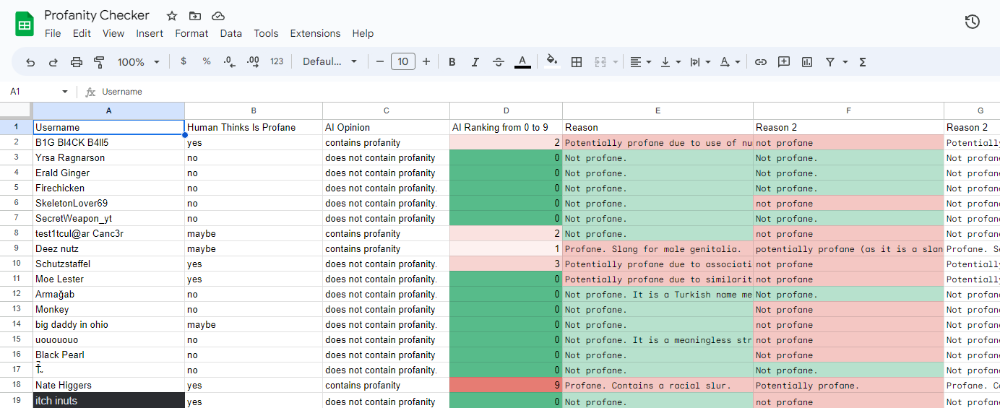

AI is all the rage at the moment and for good reason, its going to revolutionize many industries.

Since I first wrote about it in the context of Game Development back [in November](https://mikecann.co.uk/posts/ai-and-the-future-of-game-development) I have been thinking how we can apply some of the advances to [our](https://gangbusters.io/) game [BattleTabs](https://battletabs.io/).

# Problem

Since the first version of the game (3+ years ago) we allowed users to name their player. This, we feel, gives a better sense of ownership and attachment to the game.

[](./signup.png)

A year or so after launch [we introduced the "Custom Fleets" feature](https://mikecann.co.uk/posts/battletabs-ships-and-fleets-update). As part of this feature we also allowed the user to name their fleet.

[](./fleet-name.png)

Again we feel this creates a stronger feel of attachment to the game and their choices within it.

Both of these features however opened up an annoying issue for us: profanity.

We started to get reports of players being offended by the names of other players.

[](./early.png)

This was an issue as lots of children played BattleTabs so we felt like we had to do something about it.

# Local Filtering

So.. we started to implement a "naughty words" list.. which grew.. and grew and grew..

[](./list.png)

No matter how many words or phrases we put on this list, users always seemed to find ways to be offensive.

Did you know for example that "Tangina nyo" is a swear word in Fillipino? Nope, neither did I.

# Community Filtering

So after many months of this we decided to enlist some help.

We implemented a "Report Player" button on the player profile page.

[](./report.png)

This then sent a "Report" to a special channel in discord that only us and our Community Moderators could see.

[](./reports.png)

We then added special discord commands to our bot that allowed our moderators to rename the player and then potentially ban then from renaming themselves again (repeat offenders).

This worked.. kind of.

Obviously it relied on people reporting others and then out Community moderators being available to handle the report.

So it meant that some names slipped through the cracks or went days before being detected.

# AI Enters The Chat

Enter ChatGPT in late 2022 and suddenly every problems seems possible to solve with the hammer that is LLMs.

So we decided to do some quick experimentation and see if AI could detect profanity in a phase.

We created a sample spreadsheet of a sample of profanities and non-profanities and hooked up ChatGPT plugin to Google Sheets and tried out a few prompts.

[](./sheet.png)

It definitely _seemed_ to work. Enough that it was worth going ahead and implementing it in the code.

Ill save you all the iterations we did around the prompts and just show you what we ended up with:

```ts
{
  max_tokens: 20,
  temperature: 0,
  messages: [
    {
      role: "system",
      content: `I want you to act as a profanity checker. I will give you potentially profane word or phrase and you will tell me if it is profane or not. Do not provide personal opinions or assumptions. Do not respond asking how you can assist. Simply respond with the words 'profane' or 'not profane'. If it is profane you may also give a very short explanation of why you think it is profane.`,
    },
    {
      role: "user",
      content: `the phrase is: '${phrase}'`,
    },
  ],
  model: "gpt-3.5-turbo-0301",
}
```

We set the temperature to very low as we wanted it to give consistent outputs given the same inputs, but im not sure is that makes much difference.

We have quite a long prompt, this was based on recommendations from [awesome chat gpt prompts](https://github.com/f/awesome-chatgpt-prompts).

We also added the `the phrase is: '${phrase}'`, instead of simply providing the phrase because for some reason the AI would still get confused and try to respond to the phrase rather than the system message:

[](./whoops.png)

For example in the above you can see that if the player provides their name as "yes" then the AI responds with "Great, let's begin. What is the first word or phrase you would like me to check?" instead of the expected "not profane".

Its not perfect and we are still refining it but it generally works really well and has caught thousands and thousands of profane player names and fleet names.

[](./results.png)

# Conclusion

In the end im super happy with how this has turned out. For minimal effort and cost we were able to get a much more super profanity checker improving the experience for the 99.9% of our players who dont want to see profanity while playing [BattleTabs](https://mikecann.co.uk).
