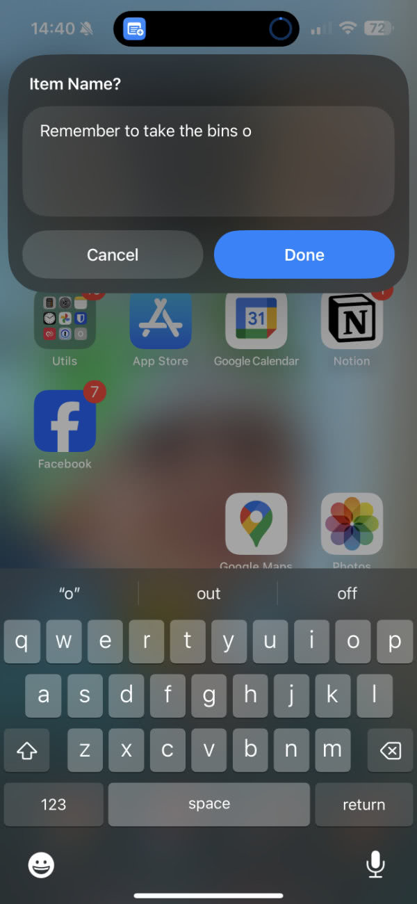
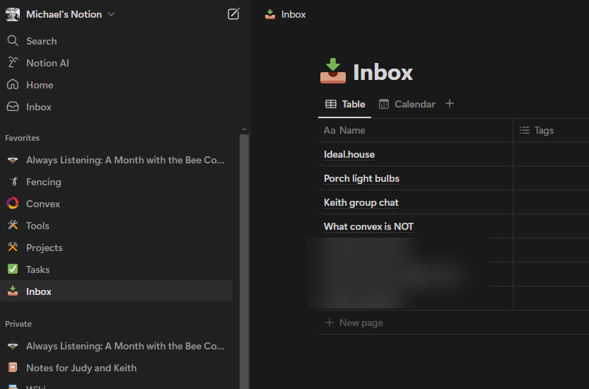
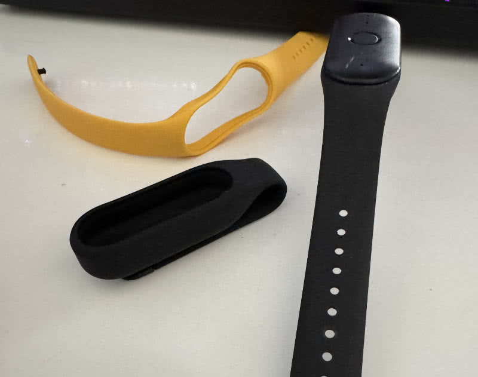
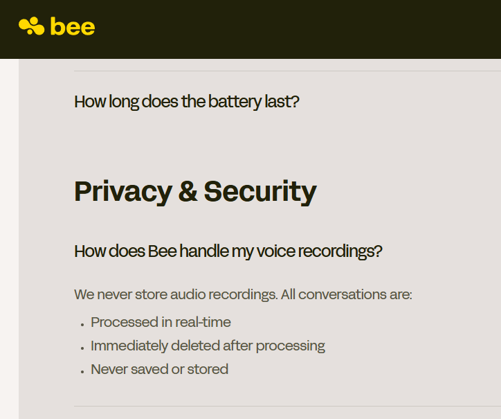
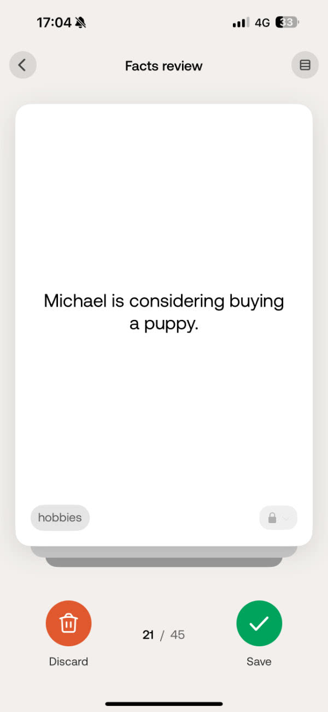
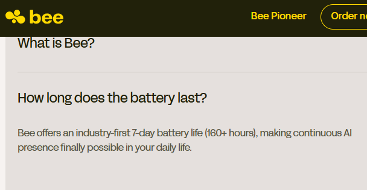
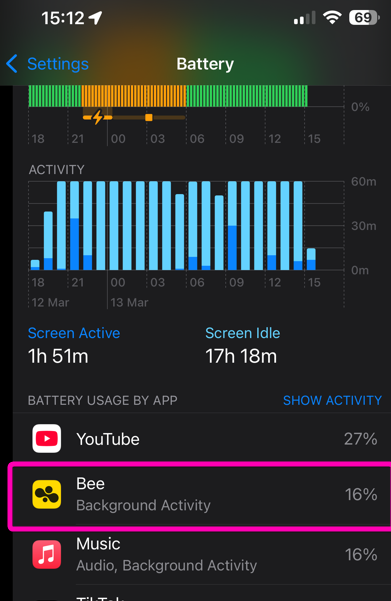
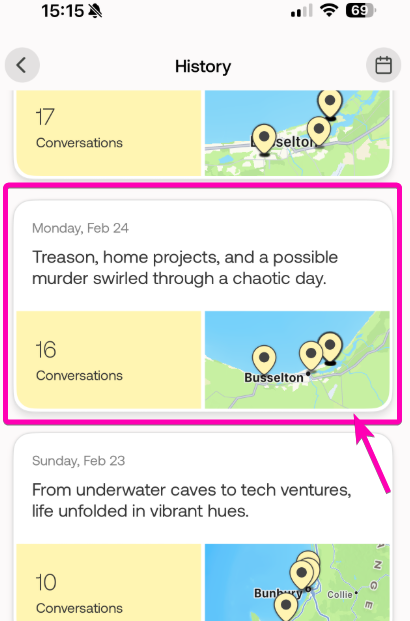

---
coverImage: ./header.jpg
date: '2025-03-13T07:31:40.000Z'
tags:
  - ai
  - wearables
  - personal
  - tech
title: 'Always Listening: A Month with the Bee Pioneer AI Wearable'
---

So I've been thinking about something super exciting lately - I reckon we're not far off from everyone walking around with their own AI buddies that are always listening. 

I'm not just talking about helping with memory (though that's definitely a big deal), but proper digital pals that are just part of how we live our lives. Just imagine - every kid with their own AI tutor, learning exactly how they need to, getting feedback right away, and having someone to answer all their random questions. Sounds like sci-fi? Maybe, but we're already seeing the first baby steps towards making this real!

Now, as someone who's absolutely hopeless with memory (more on that in a sec), I'm super excited about where this tech could go.

# The Problem

Right, confession time - my memory is about as reliable as an Aussie  gardener. It's something I've always struggled with, and over the years I've cobbled together various [life hacks and tricks](https://mikecann.blog/posts/mikes-lifehacks-keys-reminder) to deal with it. Tech has been an absolute lifesaver here - todo lists, calendar stuff, you know the drill.

I even went full self-help and created my own little Apple shortcut to quickly jot down thoughts when people are chatting.

These little brain dumps go straight into what I call my "Inbox" in Notion. Every day, I do a quick sweep through these "memories" to figure out what needs doing. I've even got this cheeky little Convex-powered app that checks this daily and bugs me via email if there's stuff to look at.

Now, this lifehack is super awesome when it works, but there are tons of times when I can't faff about with my phone. Like when I'm driving (obviously), or when I'm juggling shopping bags.

What I really want (and I know this sounds lazy) is a personal assistant that could just... listen. Something that could catch all those random thoughts and to-dos and turn them into a nice, actionable list for later.

If something could help me keep track of all the stuff that usually leaks out of my brain like a sieve, and actually make sense of my daily experiences - well, that'd be absolutely incredible.

# The Bee 🐝

So when I stumbled across the [Bee Pioneer](https://www.bee.computer/bee-pioneer) - this little gadget promising exactly what I wanted for just $49 USD with no subscription - I couldn't throw my money at them fast enough. Probably should've done a bit more research first, but hey, YOLO right? :D

This little thing is pill shaped, about 3 cm by 1.5 cm. You can wear it as a watch or rock it as a necklace. I went for the wrist option, and they give you two strap choices - bright orange (if you're feeling brave) or black.

 

I picked black (playing it safe), figuring this might be a bit of a controversial gadget, so better not draw too much attention to it. More on the privacy stuff later.

The way it works is pretty simple - it listens to nearby chatter, zaps it to your phone via Bluetooth, where it's transcribed locally before being binned (at least that's what they promise).

The app serves up these things called "Daily Memories" - tap one and boom, you get a nice summary of your day, with all the key stuff that happened and what you talked about.

You can dig deeper into each conversation if you want, checking out the vibe, main takeaways, and who was talking. And if you really need to, you can get right down to the actual transcript.

<iframe width="458" height="815" src="https://www.youtube.com/embed/nMlebwSlM_I" title="showing some bee features" frameborder="0" allow="accelerometer; autoplay; clipboard-write; encrypted-media; gyroscope; picture-in-picture; web-share" referrerpolicy="strict-origin-when-cross-origin" allowfullscreen></iframe>

Every now and then it'll pop up with suggested to-dos based on your nattering. You can either chuck these on your todo list or bin them if they're not relevant.

Along with the todos, it creates these "facts" about you - little snippets of info it thinks it's learned. Not entirely sure what these are for if I'm honest. Maybe just helping the AI understand me better?

To be honest I dont know how accurate this really is, it often comes up with a bunch of nonsense.

The last big feature is "Buzz" - your personal AI buddy. You can have a proper chat with it about any of your conversations or history.

# 1 Month of using Bee

Alright, after playing with this bad boy for a month, I've got some thoughts to share (and boy oh boy, there are a lot of them! :D)

## The Good Stuff

Let me tell you what's got me super excited about this thing, because despite its quirks, there's actually some pretty cool stuff happening here!

### Automatic To-dos That Actually Work!

No joke, the always-listening feature is absolutely crushing it when it comes to catching todos. I've been trying to break it (because that's what I do), and I'm properly impressed.

Whether I'm chatting with the missus in the car or just muttering to myself like a crazy person (we all do it, right?), I just say "Oh, need to remember to do X" and BAM - it's in my todo list. Dreams do come true! :D

### Buzz: My New AI Bestie (Sort Of)

Haven't quite made it part of my daily routine yet, but the potential here is super exciting.

I've been playing around asking it some pretty deep questions like "how do others see me" and "what's my relationship with my wife like?" (Don't worry, I'm keeping those spicy answers to myself!), but I gotta say - the insights were surprisingly spot-on.

This could be an absolute game-changer for anyone looking to level up their self-awareness game.

### Privacy & Security (On Paper)

Right, so Bee's making some pretty bold promises in their FAQ:

1. They process and delete recordings straight away - no hanging around
2. You're the boss of your data - delete what you want, when you want
3. No sneaky AI training with your data, no selling it, no sharing it
4. All the security boxes are ticked - third-party audits, proper encryption, the whole shebang

Sounds amazing, right? But here's the thing - they're the new kids on the block, and I'm not sure I'm ready to just hand over the keys to my life based on some promises. Plus, strapping an always-listening device to your wrist? That's a pretty big ask in terms of trust!

## The Not-So-Good Stuff

Look, I wanted to love this thing (I really did!), but I've run into some proper annoying issues. Let me break it down for you:

### Water and Electronics Don't Mix (Who Knew? 🙄)

Here's a fun story - turns out the Bee isn't waterproof AT ALL. You're supposed to wear this thing 24/7, but one quick dip in the pool and... well, let's just say mine is now sleeping with the fishes. Not ideal for something that's meant to be your constant companion!

### The World's Most Annoying Strap

Oh. My. Days. This strap is driving me absolutely bonkers! It's got this flimsy dimple-and-groove system that just loves to pop open at the worst possible moments. Put on a jacket? Pop! Reach in your bag? Pop! I've lost count of how many times this thing has ninja'd its way off my wrist without me noticing.

Try finding something that tiny once it's made its great escape! I'm constantly doing the paranoid wrist-check, which kind of defeats the whole "forget it's there" vibe they're going for.

### Battery Life (or Lack Thereof)

They claim "7-day battery life"

But I'm lucky if I get 2 days out of this thing! That means nightly charging, which is exactly why I rock a Garmin instead of an Apple Watch - I can't be dealing with yet another device screaming for juice every day.

### RIP Phone Battery

Speaking of battery drain, my phone's battery life has taken an absolute nosedive since I started using this thing. Pretty sure it's because the Bee's constantly chatting with my phone via Bluetooth and doing all that transcription work.

I get why they're doing the transcription on-device (privacy and bandwidth and all that jazz), but surely there's a better way?

Maybe they could batch up all the transcriptions and only process them when my phone's charging? Just thinking out loud here...

### Settings? What Settings?

I need more control over this thing! The lack of customization is doing my head in - there's so much potential here if they'd just let us tweak how it works.

Right now, I had to completely kill notifications because it was absolutely spamming me every time it processed a conversation. Problem is, now I miss the actually important stuff like todo reminders. Come on, guys, give us some proper notification controls!

I would love more control of...

### Always Listening (Even When It Shouldn't)

Don't get me wrong, I love that it's always listening, but it needs to be way smarter about when to shut up. Sure, there's a mute button, but who actually remembers to hit that before Netflix time or podcast sessions?

The AI keeps thinking my media consumption is real conversation (which is hilarious but super annoying). Like, no, I'm not actually involved in a murder investigation - I'm just watching true crime!

This would be so much better if it could figure out when I'm actually chatting vs just consuming content.

### Mic Issues

The microphone situation is... interesting. Sure, it picks up my voice perfectly (I mean, it's strapped to my wrist), but trying to record anyone more than a few meters away? Good luck with that! Despite what their marketing says, the range is pretty disappointing.

This becomes a proper pain in group settings. Anyone not practically hugging my wrist might as well be speaking in space. The 2-3 meter range just doesn't cut it in the real world.

Makes it pretty useless for bigger meetings or group hangouts where people aren't all crowded around my arm like it's storytime.

### Trust Issues

First time I fired up the app, it wanted access to EVERYTHING - my calendar, contacts, emails, personal notes, probably my first born son. Look, I get that an AI assistant needs data to be helpful, but slow down there mate - we just met!

It's like giving someone the keys to your digital life before they've even bought you dinner. Sure, their privacy policy looks good on paper, but they're the new kid on the block - I need time to build trust!

### My AI Assistant Needs an Assistant

Using this thing has become a proper job! Every day it spits out about 15 todos I need to review and 25+ "facts" I have to verify. Instead of making my life easier, I'm now spending more time managing its output than I would just handling things myself!

The irony is absolutely killing me - it's like hiring a personal assistant who creates more work than they save. (Anyone else had that coworker? 😅)

I really wish it was smarter about importance. Rather than drowning me in low-priority noise, focus on the stuff that actually matters! Right now it's just information overload pretending to be assistance.

# Final Thoughts

## The Privacy Elephant in the Room

So here's the thing - when I show people the Bee, reactions are... interesting. Some folks get super excited about the whole memory-enhancement thing, while others (quite reasonably) look at me like I've lost the plot when I tell them I'm wearing an always-on recording device.

Let's be real for a sec - we're in proper murky waters here. Sure, technically it might be legal to record conversations in many places with single-party consent, but ethically? That's a whole other can of worms! Most people chatting with me have absolutely no idea they're being recorded by my fancy wrist gadget.

I've been wrestling with some pretty thorny questions: Do I need to start every conversation with "Hey, my AI buddy might be recording this"? What about those sensitive chats that probably shouldn't be recorded? And what happens when my device picks up random conversations from people nearby who haven't signed up for this weird future we're living in?

The professional setting adds another layer of "yikes" to the whole thing. While it'd be amazing for catching those meeting details I usually forget, most workplaces (quite understandably) aren't too keen on recording devices. Schools, hospitals, government buildings - they're generally a firm "nope" on this sort of thing.

We're basically making up the rules as we go along here. It's a bit like the early days of mobile phones in restaurants - remember how weird that was? We're still figuring out the social etiquette of these devices.

## The Future's Coming (Ready or Not!)

Right, so the first-gen Bee Computer has its issues (quite a few of them, as you might have noticed from my epic rant above), but I can't help being super excited about where this tech is heading. It's rough around the edges now, but it's pointing to something potentially game-changing.

Here's a use case that's been bouncing around my head: imagine this tech in education. Picture every student with their own AI tutor, listening along during lessons. Not just recording the boring bits, but actually understanding each student's unique learning quirks and challenges.

When kids get home, homework becomes more like having a chat with a really knowledgeable friend who was right there in class with them. The AI would know exactly what was covered and where each student might need a bit of extra help.

These AI assistants could provide instant feedback and adjust difficulty on the fly. They could send teachers detailed reports showing where students are crushing it and where they're struggling, making classroom teaching more targeted and effective.

It's a potential solution to that age-old problem of one-size-fits-all education. Instead of students getting frustrated with standardized assignments, they'd get personalized support that adapts to their pace while ensuring they're actually learning what they need to.

The current Bee might not quite get us there, but it's a glimpse of what's possible.

# Wrapping Up

Look, the Bee Computer is clearly a first attempt - and boy does it show. The hardware issues (water vulnerability, dodgy strap, battery life) are pretty significant pain points. But you know what? That's actually fine for a market-testing product. By getting something affordable out there, Bee can learn how people actually use these AI assistants in the real world.

Their approach of shipping early and iterating based on user feedback is pretty solid from a product development perspective. I'll be sending them this review - hopefully it helps shape future versions.

As for me, while I won't be replacing my water-damaged Bee (RIP mate 😢), I'm not giving up on this space. I've actually gone ahead and ordered the Limitless pendant - curious to see how their approach differs.

I'll report back once I've had a proper play with it. If you're interested in following along on this AI assistant journey, chuck your email in the subscribe form below and I'll let you know when my next post drops.
