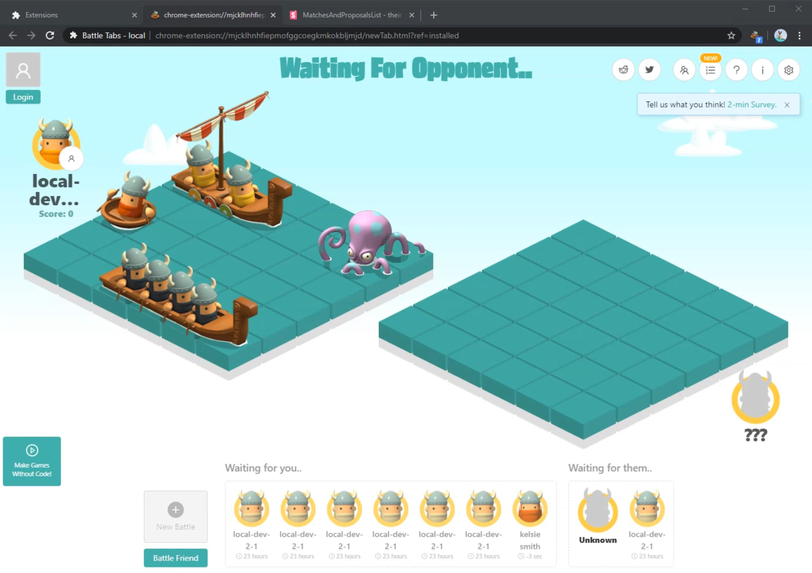
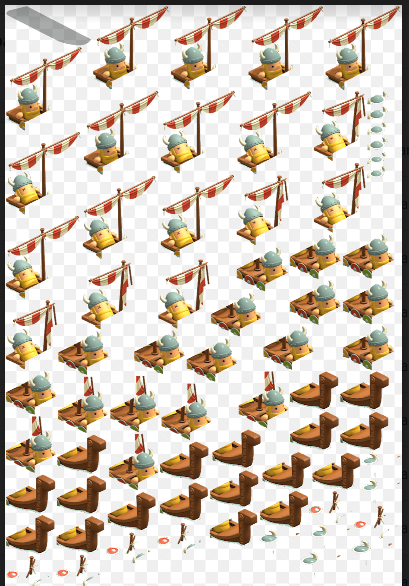
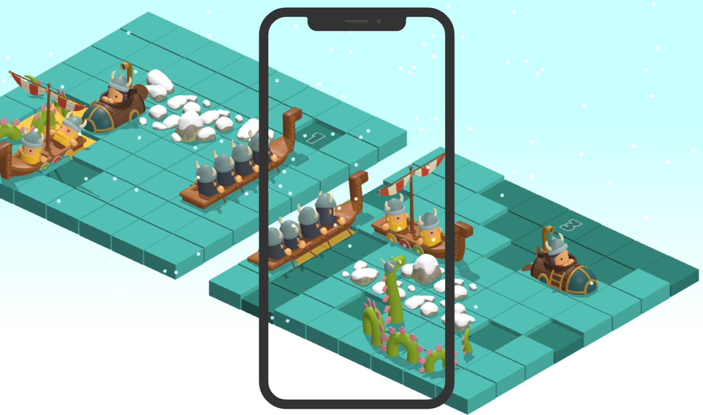
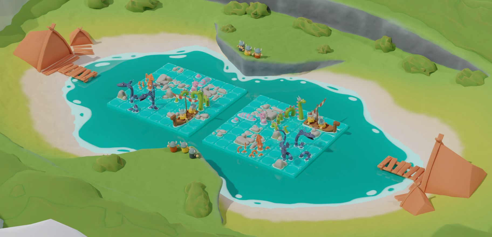
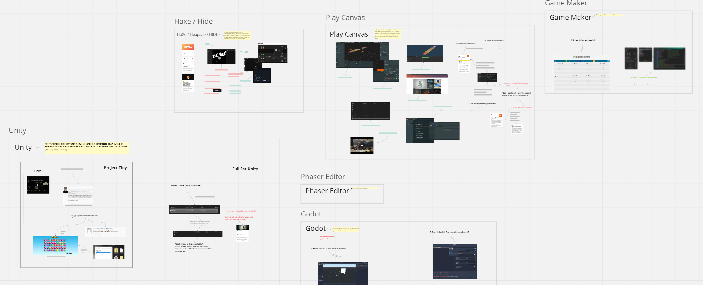

---
coverImage: ./header.jpg
date: '2022-12-29T07:31:40.000Z'
tags:
  - battletabs
  - Gangbusters
  - GameDev
  - BabylonJS
title: Why we converted BattleTabs from 2D to 3D
---

This month we completed probably the single largest change in the history of our game [BattleTabs](https://battletabs.io), we converted our 2D game to run completely in 3D. This was obviously a massive undertaking for a 3 year old game but I personally think the results are fantastic and unlock a whole bunch more capabilities for us.

# History

Ever since the very earliest version of [BattleTabs](https://battletabs.io) the game has been rendered using a 2D canvas (PhaserJS & PixiJS).

This has been a surprise to some as they assumed the game was 3D but in actuality the art was authored in 3D then simply rendered out to 2D sprite sheets.

This looked great and worked just fine at first but then we started to add more and more ships and started to run into issue with our process. I have previously [discussed this in detail here](https://mikecann.blog/posts/introducing-battletabs) but the short version is "isometric is hard".

<iframe width="853" height="480" src="https://www.youtube.com/embed/ivIm2bZNQ3Q" frameborder="0" allow="autoplay; encrypted-media" allowfullscreen></iframe>

Not only did the 2D pipeline cause us issues in art output it also limited us design wise.

For example, we would liked to have done 4-way rotations, but that would have meant we would have to render out the ships facing the opposite direction then sliced them up, increasing the art load significantly. We also would have loved to have more than one animation per ship.

# Mobile Woes

There was a bigger looming issue on the horizon however; our port to Mobile. With mobile we knew that the smaller screen size was going to be a big problem for the game as there simply wasnt going to be enough space to fit both boards on screen in portrait or landscape.

We could have done some clever scaling and blurring to give the illusion of depth:

This however would limit our future plans for improving the scenery aesthetics and features:

What we needed really was a way to rotate and move the camera in 3D space so we could shift the players perspective around the world.

# Going 3D

So for these reasons (and others) we decided to bite the bullet and rewrite the game in 3D.

We did some preliminary investigations into various game engines:

We really liked the look of Godot and Unity. We have lots of experience with Unity as as team but worried that its Web output file size would have been too large for users to download.

In the end the thing that decided it for us was the mountains of existing shared code between the server and client and we really didn't want to have to rewrite that in another language (such as c#) and then potentially have to maintain two codebases.

We decided to stick with our existing codebase and replace the [PixiJS](https://pixijs.com/) 2D engine and replace it with a [BabylonJS](https://www.babylonjs.com/) 3D engine. We went for Babylon because of the great documentation, feature set and rave reviews from other developers.

Because we were using a custom ECS implementation for the 2D version in theory I should have been able to simply swap out the 2d rendering components and systems and replace them with 3D versions. In reality there was too many other things that required changes that I decided to start from scratch with a brand new ECS architecture.

After a lengthy evaluation process I ended up going with hman's excellent [miniplex](https://github.com/hmans/miniplex). Miniplex is so cool I think I will devote an entire post to it in the future but ill just say if you need an ECS engine in JS and dont need vast numbers of entities then I strongly recommend miniplex.

<iframe width="853" height="480" src="https://www.youtube.com/embed/hbAWQYpoL-c" frameborder="0" allow="autoplay; encrypted-media" allowfullscreen></iframe>

As this post is getting quite long already ill skip a lot of the middle ground and just say that our artist, Sophie, did an incredible job converting the existing ships and assets over to work in 3D. She slogged through all 30 ships 3 times to get the number of draw-calls down and performance under control but I think the end result is fantastic.

For this first release we decided to keep the game looking as close as we can to the 2D version. This reduced the number of design-related changes so we could simply focus on the bare essentials of the port. This also reduced the list of changes for our existing user base.

# Conclusion

Since we released the 3D update earlier in the month, we have have done a number of follow-up updates including the first feature we were unable to do in 2D; full 4-direction ship rotation!

<iframe width="853" height="480" src="https://www.youtube.com/embed/BtXFBOO-Gk8" frameborder="0" allow="autoplay; encrypted-media" allowfullscreen></iframe>

I feel like we now have a really firm footing which to build on for our mobile port and upcoming set of exciting features.

Stay tuned as I think 2023 is going Gangbusters!
