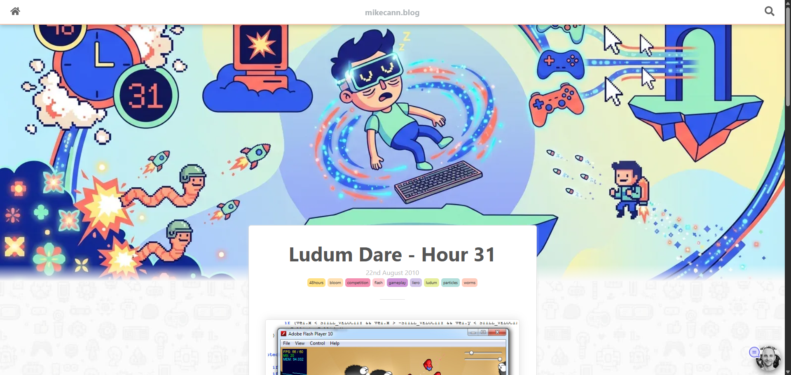
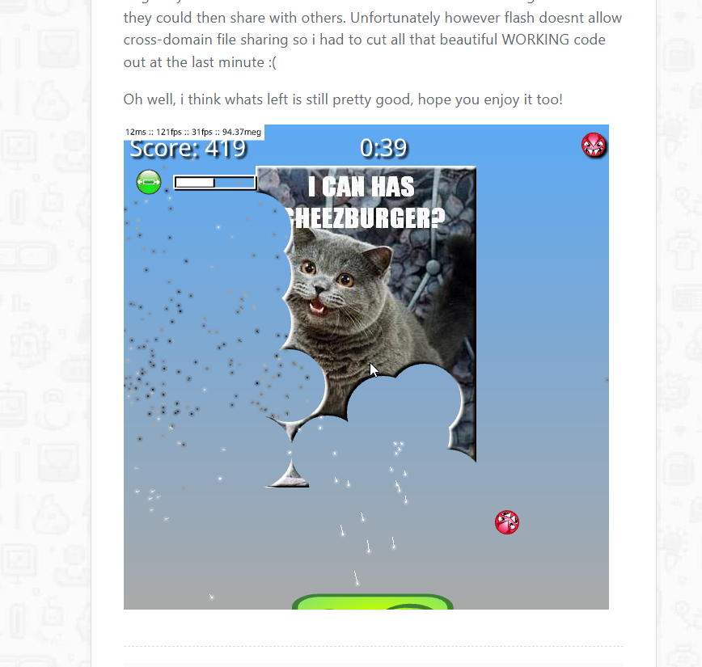
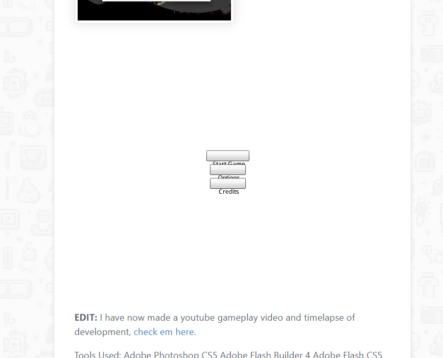

---
coverImage: ./header.webp
date: "2026-03-12T07:31:40.000Z"
tags:
  - personal
  - blog
  - AI
title: Blog Fixes
---

So I have maintained this blog in its various incarnations for [23 years at this point](https://mikecann.blog/posts/snakez-2003). As such it has undergone many transformations:

https://mikecann.blog/posts/wordpress-23
https://mikecann.blog/posts/the-static-blog
https://mikecann.blog/posts/migrating-from-hexo-to-gatsby
https://mikecann.blog/posts/why-this-blog-runs-on-nextjs-instead-of-gatsby-now

627 posts and many transitions have left some issues that I have been aware of for a while. Issues such as dead links, missing header images, unrenderable content such as my [flash games](https://mikecann.blog/tags/flash).

I knew that I really should address those issues but never really had the energy to do so. Well fortunately things have become much easier with the advent of AI.

I tasked an AI to create a blog [audit script](https://github.com/mikecann/mikecann.blog/blob/main/scripts/auditPosts.ts) to check for:

1. Dead external links (HTTP 4xx/5xx or unreachable)
2. Broken local images (file doesn't exist on disk)
3. Broken external images (HTTP errors)
4. Dead/obsolete embeds (Flash/SWF, defunct services)
5. Missing or fallback cover images
6. Broken iframes (YouTube removed, defunct services)

Well predictably when I first ran it it found thousands of issues. Thousands of dead links, hundreds of broken images, 300+ missing cover images for posts, etc.

The next step was to address each of these categories by having the orchestrator AI spawn off many sub-agents in parallel to address each one.

# Header Images

I addressed the missing header images by leveraging [nano banna](https://openrouter.ai/google/gemini-3-pro-image-preview) to generate a new image in the correct size and style, this worked really well as you can see from some of my older posts:

https://mikecann.blog/posts/conways-game-of-life-in-haxe-nme-massiveunit
https://mikecann.blog/posts/48-hours-later-timelapse-gameplay-videos
https://mikecann.blog/posts/ludum-dare-hour-31

# Flash

For the dead flash I leveraged the excellent [Ruffle WASM based Flash emulator](https://ruffle.rs/).So now all of my posts that embed flash content should now work, or at least attempt to, heres some examples:

https://mikecann.blog/posts/blast-out

As good as Ruffle is, unfortunately is not perfect so some of the flash doesnt work as expected, such as the one at the bottom of this page: https://mikecann.blog/posts/ludum-dare-hour-40-complete

Hopefully this will be fixed in future versions of Ruffle.

# Dead Links

For dead links, a lot of them were pointing to content from my old wordpress blog and somehow the links had been broken in the process. Well fortunately I have all the old content stored on a couple of S3 buckets so it was just a matter of converting all those dead links to point to the correct place.

# Conclusion

Its very likely I would not have had the energy to tackle these fixes without AI and certainly not create all those header images. We really are living in interesting times!