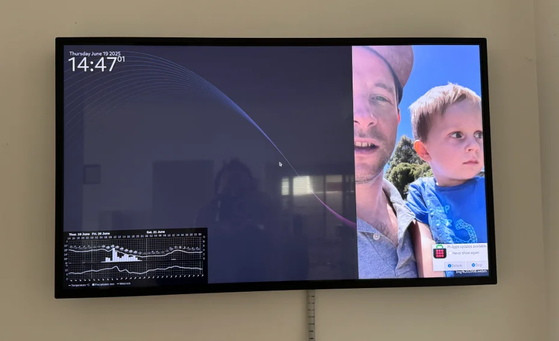

I wanted a way to sync photos from my Google Photos account down to my computer so I could show them on home [smart mirror](https://mikecann.blog/posts/mikes-mirror-overview) (no longer a mirror but thats another story). 

I thought this would be simple, but for ["reasons" Google has recently made it super hard](https://developers.google.com/photos/support/release-notes#2025-04-01) to export a selection of photos from your google photos album.

The only way to currently do it is using the only API left to us, the Google Photos Picker API.

So thats what I leveraged in this project.

Checkout this video for more details and a demo:

<iframe width="853" height="380" src="https://www.youtube.com/embed/VcyMwbDZCsA" frameborder="0" allow="autoplay; encrypted-media" allowfullscreen></iframe>

If you want to use this project youself the source is here: https://github.com/mikecann/google-photos-picker-sync