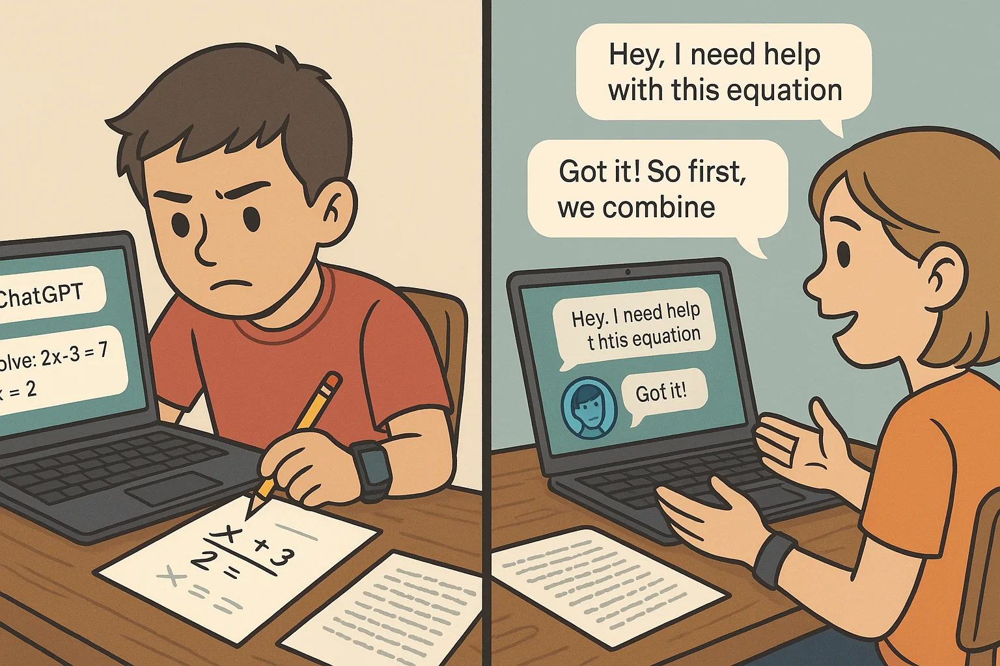
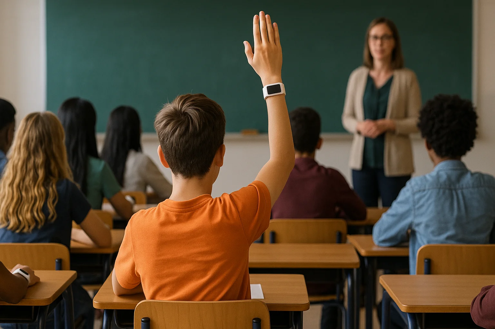
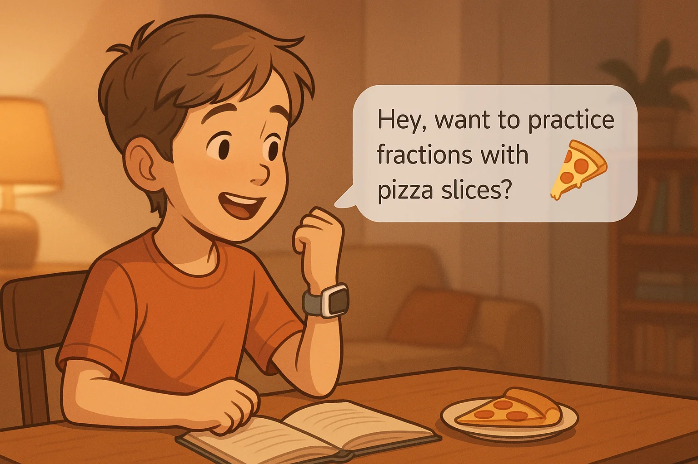
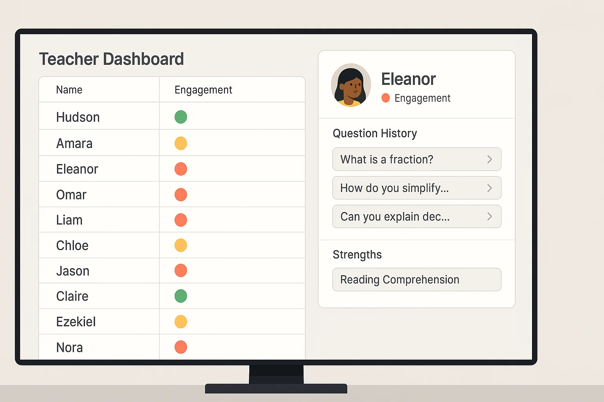
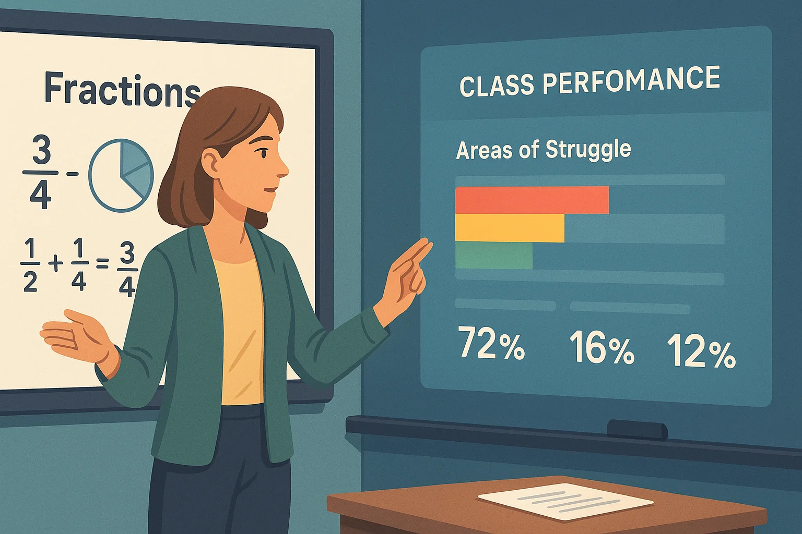

***Note: I briefly talked about this idea [in my last post](https://mikecann.blog/posts/always-listening-a-month-with-the-bee-computer-ai-assistant#the-futures-coming-ready-or-not) but I thought it was worth expanding out to a full article as I feel quite strongly about it.***

The way we currently give kids homework is dumb, it should be a lot smarter and it can be. With low-cost hardware and powerful AI systems I think its time to do something about it.

# Problem

If you've ever been a student (and I'm guessing you have), you know exactly what I'm talking about when it comes to homework. It's usually this mind-numbing collection of worksheets that feel like they were designed to test your patience more than your knowledge. Every kid gets the exact same stuff, regardless of how they learn best or what actually interests them.

So here's the thing, it turns out we might not even need all this homework. There are some pretty interesting examples out there. Take Finland, for instance - they're absolutely crushing it in education, and guess what? [Their kids only spend about 2.8 hours a week on homework](https://www.weforum.org/stories/2016/11/finland-has-one-of-the-worlds-best-education-systems-four-ways-it-beats-the-us) (that's the lowest among 38 countries!). And they're not alone - [South Korea's doing the same thing, with just 2.9 hours of homework](https://www.marshridge.com/successful-countries-that-allocate-less-homework-to-students), and their students are still acing math and science.

Sure, you've got places like Shanghai where kids are drowning in homework ([we're talking 14 hours a week!](https://www.oecd.org/content/dam/oecd/en/publications/reports/2014/12/does-homework-perpetuate-inequities-in-education_g17a258a/5jxrhqhtx2xt-en.pdf)), and yeah, they do well on tests too. But here's the thing - Finland's getting the same results with way less homework and are no doubt having a substantially higher quality of life at the same time.

Now, throw AI into the mix, and things get even more interesting. These days, students can just chuck their math problems into ChatGPT or use AI to write their essays. It's not just making it easier to cheat - it's making us question the whole point of traditional homework.

Think about it - when kids can get instant answers from AI, what are we really testing? Their ability to learn, or their ability to copy-pasta?

The usual response to this has been to crack down harder on cheating. But honestly? That's missing the point entirely. If AI can so easily bypass what homework is supposed to achieve, maybe we need to completely rethink how we're doing this.

This is where I think AI could actually be the solution rather than the problem. Instead of fighting against it, we could use AI for personalized tutoring - having actual conversations about the material, where students have to demonstrate real understanding. It's a lot harder (and pretty pointless) to try to "cheat" when you're having a back-and-forth with an AI tutor that knows your learning history and can adapt on the fly.

I've seen glimpses of what's possible through my time with the [Bee.ai](http://Bee.ai) wearable, and let me tell you - the future of education could be way more exciting than endless worksheets!

# Personal Tutor

Okay so what's the solution then?

What I am imagining is every kid gets their own AI companion on their wrist that listens and learns throughout the school day. 

It would be an intelligent assistant that's actually paying attention to how they learn through their conversations and interactions. 

This AI friend would be like that super-observant teacher who notices every verbal cue. When little Timmy sounds confused during algebra but gets excited talking about science experiments? The AI's taking notes. 

The really cool part? By being there in class, listening to everything that happens, this AI tutor builds up this amazing understanding of both what's being taught AND how your kid learns best. 

It's like having a personal teacher who's completely tuned in to your child's learning style through their questions, answers, and discussions. 

# Homework as a Conversation

Instead of traditional worksheets, homework could become interactive conversations with an AI companion that attended class alongside the student. This AI would act as a personal study partner, understanding exactly what concepts resonated with the student and which ones needed more attention.

For example, if a student struggles with fractions during math class, their AI companion could initiate a personalized learning session: "Hey, I noticed you had a bit of trouble with fractions in class today. No worries! Why don't we make it more fun? We could work through some real-world examples together - like figuring out how to split a pizza fairly, or keeping track of points in your favorite game." This approach makes learning more engaging than traditional problem sets.

The AI would also recognize when the student needs to take breaks or is experiencing frustration. This prevents the common problem of students forcing themselves through hours of ineffective studying when they're not mentally prepared. The AI adapts to each student's unique learning patterns and energy levels.

# Great for Teachers Too

Here's another benefit, not just for students but for educators too: The AI could share insights with teachers after each homework session, giving them valuable visibility into how their students are actually performing.

This real-time feedback means teachers wouldn't have to wait for test results to spot problems - they could jump in and help straight away when a student's struggling with something.

By looking at how the whole class is doing, the AI could highlight tricky spots that lots of kids are getting stuck on. This helps teachers fine-tune their lessons to make sure everyone's keeping up and staying interested.

One of the best bits? The AI buddy would show exactly who's putting in the work and who's just going through the motions. No more guessing whether kids actually did their homework or just copied answers - the AI can tell who's really engaging with the material.

Now, this isn't about catching kids out - it's about spotting who needs help before they fall behind. If someone's engagement starts dropping off, the AI gives teachers a heads-up so they can step in early.

Since the AI gets to know each student's usual style of learning, it can tell the difference between someone who's genuinely finding things tough and someone who's just not trying - which means teachers can give the right kind of support to the right kids.

After all this is what teachers want to be doing, they don't want to be spending ages grading reports or trying to spot where a student has or has not been cheating.

# Privacy and Security

Let's talk about privacy for a sec - because yeah, having AI assistants monitoring students does raise some eyebrows. Fair enough, I don't have all the answers here and we'd need to get this bit absolutely right.

I think the device could be programmed so that it only turns on during lessons, then automatically stops listening. That way you can be assured that it is never snooping on students outside of class.

Obviously everything should be encrypted and locked down to prevent security issues with leaking potentially private conversations. 

# Conclusion

Whenever I chat about AI tutors, people usually start off pretty skeptical. But I've got a simple question that usually changes their mind: "Would you have done better in school with your own personal tutor?" Almost everyone immediately says "Of course!"

It's pretty obvious why - having a dedicated tutor who knows exactly how you learn best is incredibly powerful. And that's exactly what we could give every student with AI tutors - not just the lucky few who can afford private tutoring.

In my option it's actually very doable from a cost perspective. The hardware we need (microphones, processors, etc.) is getting cheaper by the day. We are talking like $50 max per AI wearable and likely less. This is far cheaper than the iPads and laptops that students are often currently issued with.

Plus, AI costs keep dropping as the tech gets better and competition heats up. When you look at the potential impact on education, it's not just technically possible - it makes total financial sense too.

It's time to reimagine homework for the AI age!
