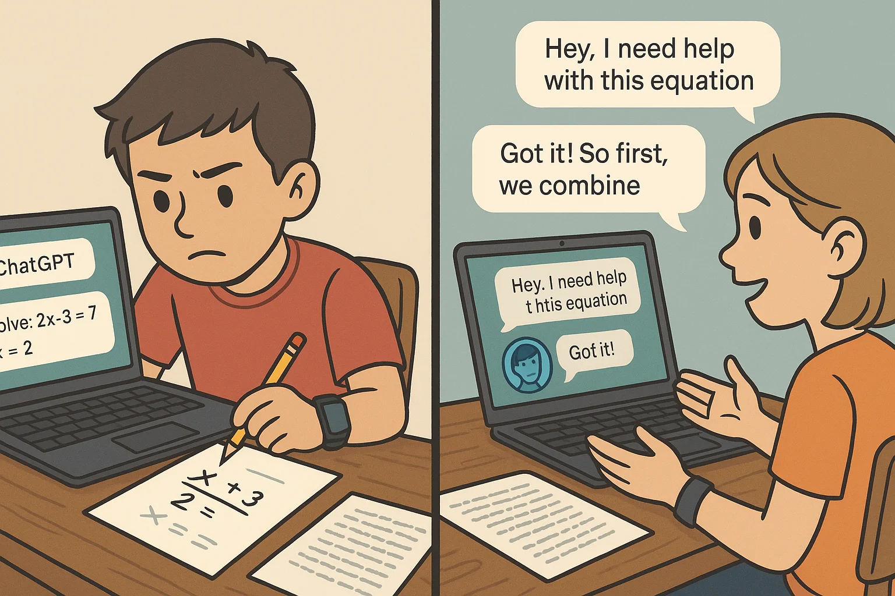
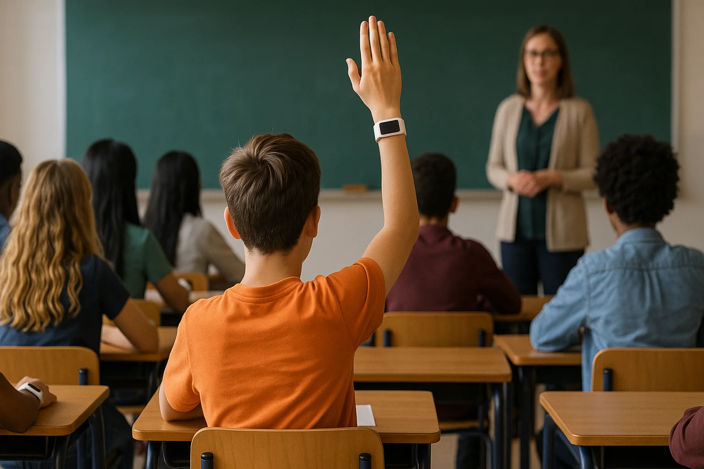
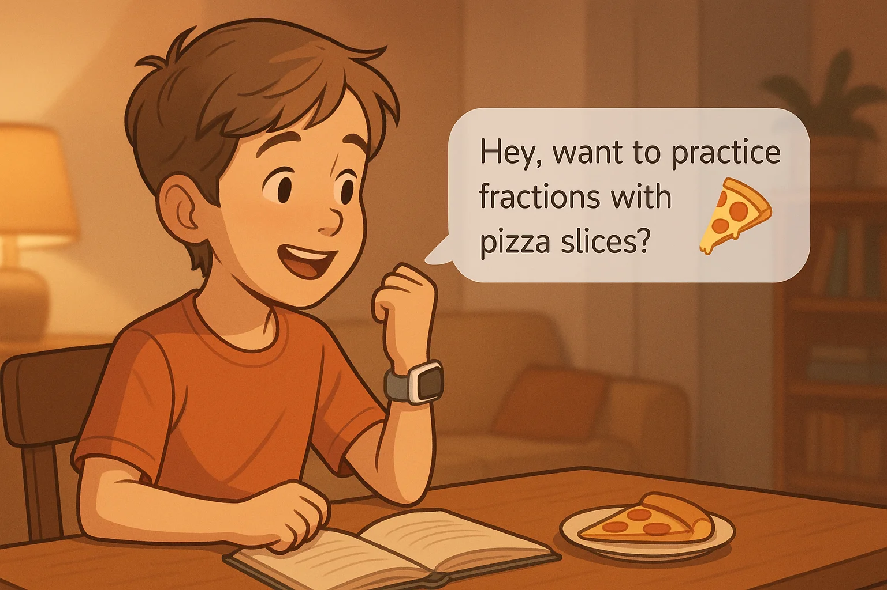
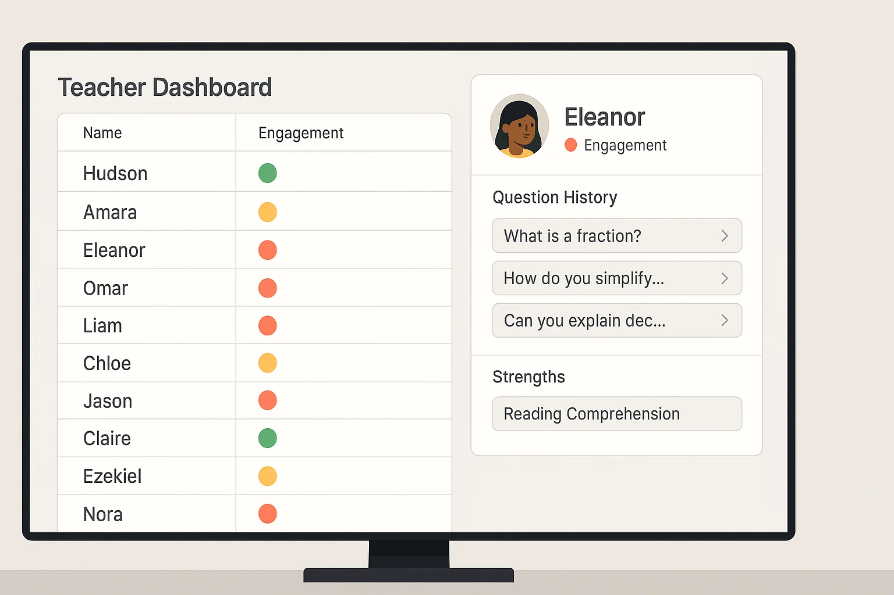
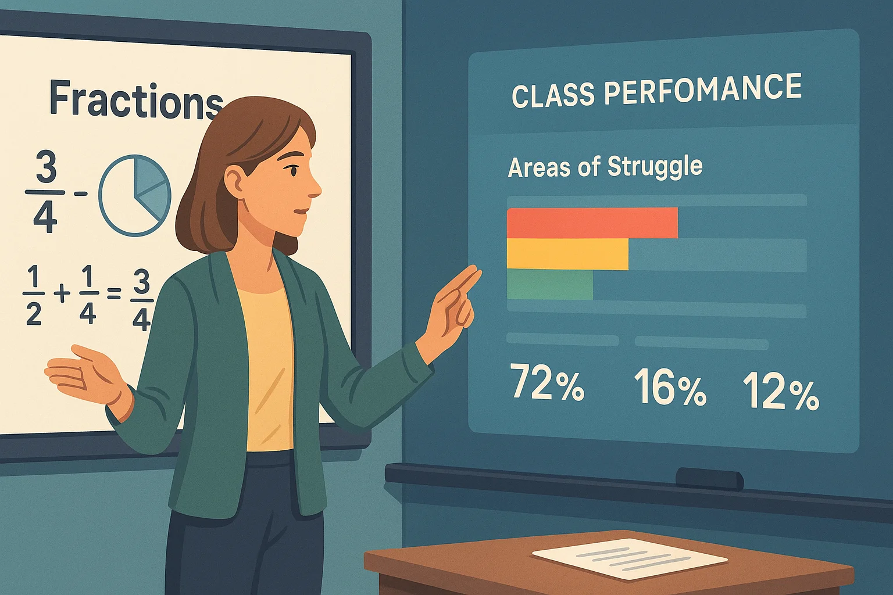

---
coverImage: ./header.jpg
date: '2025-04-25T07:31:40.000Z'
tags:
  - personal
  - tech
  - thought
title: Homework is Dumb
---

***Note: I briefly talked about this idea [in my last post](https://mikecann.blog/posts/always-listening-a-month-with-the-bee-computer-ai-assistant#the-futures-coming-ready-or-not) but I thought it was worth expanding out to a full article as I feel quite strongly about it.***

The way we currently give kids homework is dumb, it should be a lot smarter and it can be. With low-cost hardware and powerful AI systems I think its time to do something about it.

# Problem

If you've ever been a student (and I'm guessing you have), you know exactly what I'm talking about when it comes to homework. It's usually this mind-numbing collection of worksheets that feel like they were designed to test your patience more than your knowledge. Every kid gets the exact same stuff, regardless of how they learn best or what actually interests them.

Apparently you can get great results without burying kids in work. [Students in Finland spend about 2.8 hours a week on homework](https://www.weforum.org/stories/2016/11/finland-has-one-of-the-worlds-best-education-systems-four-ways-it-beats-the-us), the lowest among 38 countries. [South Korea is at about 2.9 hours](https://www.marshridge.com/successful-countries-that-allocate-less-homework-to-students), and their students are still acing math and science.

Shanghai sits at the other extreme, with kids doing [around 14 hours a week](https://www.oecd.org/content/dam/oecd/en/publications/reports/2014/12/does-homework-perpetuate-inequities-in-education_g17a258a/5jxrhqhtx2xt-en.pdf). Their test results are strong too. I just have a hard time believing those extra eleven hours make for a better childhood.

AI makes the old setup look even sillier. Students can chuck their math problems into ChatGPT or use it to write an essay in seconds. At that point the whole exercise starts to feel meaningless.

Kids can get instant answers now, so a completed worksheet tells us almost nothing. We have no idea how much they actually understood.

Schools seem to be responding with more cheating rules and more surveillance. That sounds exhausting for everyone. If AI can walk straight through the homework, I would rather rethink the homework.

AI has made the weakness in homework painfully obvious. Thats useful in a strange way because it forces us to come up with something better.

Using ChatGPT to generate a slightly different worksheet for every kid would be a waste of all this technology. Give the student something they can actually talk to. It can ask why they chose an answer, notice when they are guessing and keep poking until they really understand it.

Cheating becomes a pretty weird concept in that setup. Sure, a student could ask another AI for the answer. They still have to explain it to the tutor on their wrist and deal with the follow-up questions. By then it is probably easier to just learn the thing.

Playing with the [Bee.ai](http://Bee.ai) wearable put this idea in my head. Carrying around a tiny device that remembers conversations made the whole thing feel much less sci-fi. I started wondering what would happen if one came to class with a kid every day.

# Personal Tutor

Okay so what am I actually suggesting?

Give each kid a small AI companion that comes to class with them. A wrist device is easiest for me to picture because that is what I have been experimenting with. It might end up being a phone, a badge or something else entirely.

During lessons it would listen to what is being taught and, more importantly, to the student's part in it. Did they ask a question? Did they answer confidently? Did they go quiet when fractions came up? What explanation finally made the idea click?

A teacher with thirty kids has no chance of remembering all those tiny moments, so the device keeps a running record for later.

By the end of the day it would have the lesson, the student's questions, the awkward silences and the explanations that finally landed. All those little moments would form a rough picture of what this particular kid understood.

Those little moments give the evening's homework an actual starting point: what happened to *you* today.

# Homework as a Conversation

So little Timmy gets home. The thing on his wrist says: "You seemed a bit lost when the class got to fractions today. Want to have another go?"

Maybe Timmy likes pizza, so it talks about cutting up a pizza. Maybe he is obsessed with Minecraft and blocks make more sense. Maybe he already understands fractions perfectly well and they can skip the whole thing. The conversation can wander around until something lands.

Then it asks follow-up questions. A lucky correct answer falls apart pretty quickly when the tutor asks: "Okay, but why is that the answer? What would happen if there were eight slices instead?" That feels much closer to the back-and-forth you would have with a real tutor.

If the kid is tired, annoyed or clearly taking nothing in, stop. Try again tomorrow. There is no prize for spending another miserable hour staring at the same page.

# Great for Teachers Too

The more I thought about this, the more useful it looked for the teacher too.

Imagine coming in the next morning and seeing that half the class got stuck on the same part of yesterday's lesson. The teacher can go over it again while it is still fresh.

Keep the individual report short: Timmy understands this, he is shaky on that, and this explanation seemed to help. A giant AI-generated essay every morning would create even more admin rubbish. Three useful bullets and done.

The tutor can also report whether the kid explained the idea or kept reaching for copied answers. Obviously the AI will get things wrong sometimes. The teacher treats its summary as a clue and uses their own judgement.

If someone keeps avoiding a topic or suddenly stops engaging, the first question is "why?" Maybe they are struggling, maybe something is happening at home, or maybe my whole AI homework idea is annoying them. Finding out early gives the teacher a chance to help before the kid falls miles behind.

Over time the system should get a feel for what is normal for that student. The teacher still makes the call here. I really dont want some model deciding a ten-year-old is lazy because it misread a few conversations.

That could free up a decent chunk of the teacher's evening, hopefully leaving them with more energy to help the kids who need it.

# Privacy and Security

Let's talk about privacy for a sec - because yeah, having AI assistants monitoring students does raise some eyebrows. Fair enough, I don't have all the answers here and we'd need to get this bit absolutely right.

I think the device could be programmed so that it only turns on during lessons, then automatically stops listening. That way you can be assured that it is never snooping on students outside of class.

Obviously everything should be encrypted and locked down to prevent security issues with leaking potentially private conversations.

# Conclusion

Whenever I chat about AI tutors, people usually start off pretty skeptical. I ask them: "Would you have done better in school with your own personal tutor?" Almost everyone immediately says "Of course!"

It's pretty obvious why. Having a dedicated tutor who knows exactly how you learn best is incredibly powerful. AI could make that available to every student.

In my option it's actually very doable from a cost perspective. The hardware we need (microphones, processors, etc.) is getting cheaper by the day. We are talking like $50 max per AI wearable and likely less. This is far cheaper than the iPads and laptops that students are often currently issued with.

AI costs also keep dropping as the tech gets better and competition heats up. The numbers make sense to me, particularly next to the potential impact on education.

It's time to reimagine homework for the AI age!
