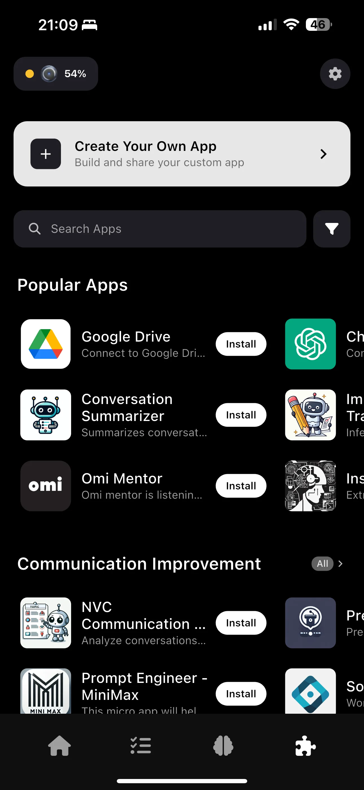

So it's been [5 months since I last wrote something](https://mikecann.blog/posts/always-listening-a-month-with-the-bee-computer-ai-assistant) about an "always listening" AI wearable, the Bee Pioneer. Despite the delay my interest in the space has not waned and clearly neither has the market's given [Amazon just acquired Bee](https://techcrunch.com/2025/07/22/amazon-acquires-bee-the-ai-wearable-that-records-everything-you-say/).

If you haven't read that post then the TLDR is that it was a good first step but is plagued by poor hardware (not waterproof) and some questionable software decisions.

Since then I have bought and tried two more always listening devices, the [Limitless AI Pendant](https://www.limitless.ai/) and the [Omi Puck / Pendant thing](https://www.omi.me/?srsltid=AfmBOopB0CUCHIP28stKi5D3a9BTcivQjgAc6OIsfCukWdAPB1q9VwLo) and I have thoughts…

## Limitless Pendant

Let's start with the Limitless Pendant.

### Hardware

The hardware for this device is kind of interesting, you can either wear it as a sort of clip on your clothing:

Or as a necklace using the string provided:

I chose to wear mine as a necklace as I don't always wear clothes that can easily clip this thing onto.

So things I don't like about this design:

1. There is nothing actually holding the pendant onto the rope, it can quite easily come off
2. The light must always be on, you can dim it but it must always be on and because the microphone is on the same side as the light you can't just turn it around to face your body to hide the light.
3. The battery lasts all day though to be honest I would hope it would last longer given its size
4. It's not 100% waterproof. It's quite expensive too so I really didn't want to risk wearing it in the shower or during heavy sweat from sport.

Things that I DO like:

1. Less likely that I'm going to get it wet because I'm less likely to forget I'm wearing it unlike a watch

### Software

Like with the Bee I found that there is still a fundamental flaw in the design of these always listening devices; they are unable to distinguish between me talking to other people and a TV show playing in the background. This is going to have to be solved before these things become mainstream.

I was hopeful that the Limitless was going to be a bit smarter here as I remember them saying they would be asking for permission before recording anyone unrecognized but I can unfortunately no longer find any reference to that on their website.

Also, I wish I had known this before purchasing it, but the Limitless pendant really is trying to be an AI wearable for business rather than personal usage.

It has 3 categories of things you can do: Lifelog which is just your transcription of what you have been up to, Ask which is just a chatbot and Settings which let you control the device and that's it.

What I really wanted to see was a running todo list of things that I should be remembering and checking off.

This for me is one of the key reasons for forgoing so much privacy and was a total dealbreaker.

So although I might have just about been able to stomach the monthly subscription if it did everything I wanted

I decided that this wearable was not for me and stopped wearing it after just a few days.

## Omi AI

Next up is the Omi AI which I am currently wearing but probably not for much longer..

## Hardware

At first glance the hardware seems quite nice, it's very small, practically unnoticeable when wearing it. Like with the Limitless it has a single status light that you cannot disable but unlike the Limitless the microphone is on the bottom so you can just wear it so the light faces your chest.

It comes with a necklace and this silicone "bumper" that you are supposed to wrap the device in then thread the necklace through the loop to turn it into a pendant. Why on earth didn't they just make the case have a loop built into it so you don't need this little plastic bumper around it?

I guess they did this because they were originally envisioning this:

I shit you not. This is from the [official Omi video](https://www.youtube.com/watch?v=MZLzvN3vmtI) on the device, they were planning that you would strap this thing to the side of your head.. yeah.. no thanks.

Anyways other things I really DON'T like about the Omi hardware:

1. The entire thing is a button rather than having one on the side or something like the Limitless. This means that it's suuuper easy to accidentally press it

Things that I like about it:

1. It is small but still just about lasts 1 day
2. I can turn it around so the light isn't shining through my t-shirt like Iron Man

Also by the way, this thing came with absolutely no instructions out of the box. I had no clue how to turn it on and no idea how to turn it off or anything.

"Oh no worries" I thought to myself, "the app setup process will tell me how to use it surely" well..

### Software

Yeah this is the biggest load of hot garbage I have ever seen.. I'm pretty sure the devs just vibe coded the crap out of this.

Now to be clear I actually think that some ideas in the app are not too bad such as the idea of "apps":

Rather than showing the transcript for your voice on the home of the app it instead shows a list of summarized conversations and the summarizer you can change by choosing the right "app":

I actually don't mind this idea, having tried a few of these apps now I know how bad their transcription can sometimes be, so by having another process that takes the raw transcription and converts it into something usable I think is a good idea.

Aaaand that's about it for my compliments about this thing. Okay let's try to do this quickly:

1. The hardware-software interface is unbelievably bad. Expect to see "Your Omi Disconnected" notifications A LOT as you walk away from the device or do anything to even slightly inconvenience it.
2. Expect to see no internet connection messages all the time, even though you are definitely connected

1. Expect to see your battery level on the device swing wildly between 100%, 41%, 63%, -1% for no reason whatsoever.
2. The AI chat is just about useless.. that's if you should ever be able to get it to work

1. It does have a todo list (yay!) but for some reason that I am unable to fathom, it regularly undoes all of your "done" to-dos which is incredibly frustrating. Oh and there is no way of hooking up these todos to your existing todo app like Google Tasks or Todoist or something like that.

1. This is the absolutely worst one, but because I had no idea how to use this thing I think I turned it off or put it in mute or something FOR 4 DAYS. I kept trying to turn it back on, double click it, long-hold click, re-link it etc. and yet I could not get it to start transcribing again and the whole time the UI said it was connected and listening… SO FRUSTRATING.

Also there doesn't appear to be any monthly charge for the device which has me SUPER worried.. Don't forget, [whenever a service is free, you are the product](https://www.forbes.com/sites/marketshare/2012/03/05/if-youre-not-paying-for-it-you-become-the-product/).

# Conclusion

Both of these devices have nice shiny exteriors but are both incredibly flawed in many ways.

To me these things are still the future. I want to be able to augment my day-to-day life with an always present assistant and I am happy to continue to experiment with them but I honestly do think that the future has to be all purely on-device and open-source for it to be trustworthy in the long-term.
