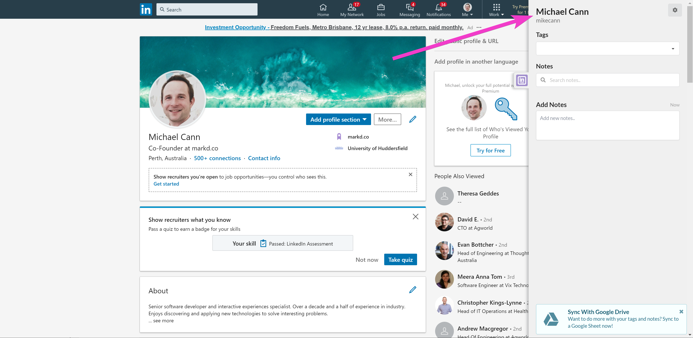
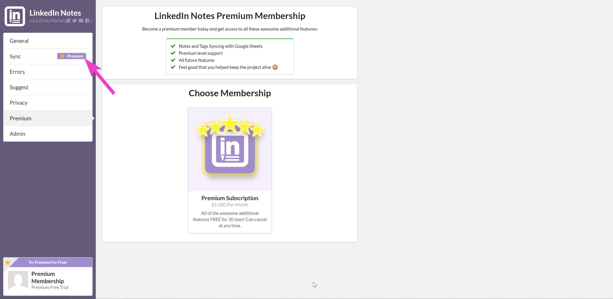

Lately we (Markd Ltd) have been working on a few different projects, today we are happy to announce one of those new projects, [LinkedIn Notes](https://chrome.google.com/webstore/detail/linkedin-notes/efjjkjipkkciokjblkmmfbihellibile).

<!-- more -->

# TLDR;

<iframe width="853" height="480" src="https://www.youtube.com/embed/OD8sAuqS2vA" frameborder="0" allow="autoplay; encrypted-media" allowfullscreen></iframe>

The above is a demo of it in action, should give you an indication of what its all about.

# What?

[LinkedIn Notes](https://chrome.google.com/webstore/detail/linkedin-notes/efjjkjipkkciokjblkmmfbihellibile) is a Chrome Extension that makes it easy to add tags and notes to LinkedIn Connections then gather them together for later processing.

Once installed you can simply visit any LinkedIn Connection page and you will see a sidebar open on the right hand side of the screen.

You can add tags and notes to that Connection. If you want to hide the sidebar you just have to click the logo on the sidebar tab.

You can easily move that tab up and down so it wont get in the way of other UI elements or extensions below it.

<iframe width="853" height="480" src="https://www.youtube.com/embed/xWqa8jBZPBY" frameborder="0" allow="autoplay; encrypted-media" allowfullscreen></iframe>

Collecting custom notes and tags is all well and good but once you have done that what can you do with them?

Well we didnt know but instead of building a bunch of complex controls we decided to allow simple exporting of the data out to a Google Sheet. That way the data can be copied, chopped and cut up however the user wants.

To enable syncing to a Google Sheet you must enable Premium Membership in the extension options.

Once enabled the user can then connect to Google and create a sheet to sync to.

Then thats it. From now on any new notes or tags will automatically be added to the Google Sheet. The user can then do with the data whatever they like.

# Why?

So why have we decided to spend some time working on this? Well we noticed when working on [Markd.co](https://markd.co/) that quite a lot of the users were simply using Markd for adding notes to LinkedIn Contacts.

So when looking for other potential projects to work on we thought of a "Markd Lite" like product might do well, we could monetize it immediately and it shouldnt take too long to build with all our past experience.

# Next

For now we are going to see what users think of the product. If there is demand for it then we will work on other features.

So let us know if the comments below if you like this and want to see more. If you have a bug, or other feature suggestion you can leave it on our community Trello board: https://trello.com/b/AuDEewtt/linkedin-notes
