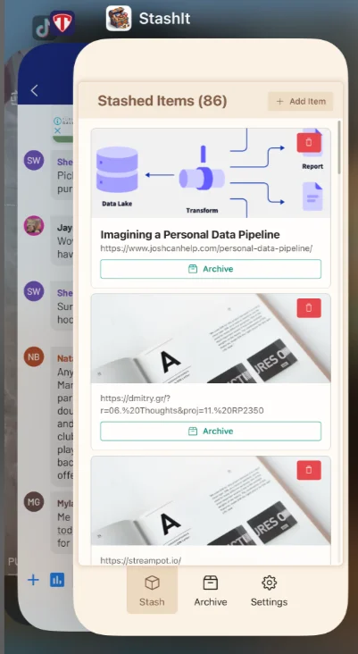
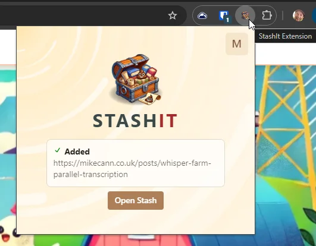
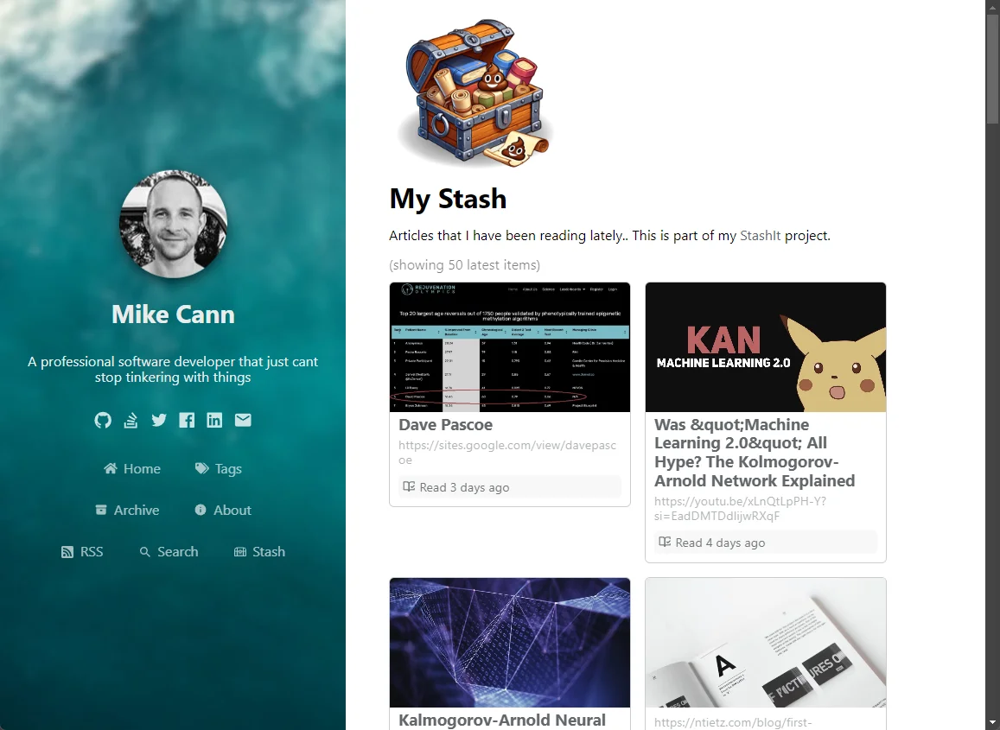

I have a confession to make, I have a super-power; the ability to stay in the flow.

You see, throughout the working day I am continually assaulted with potential "side quests".

A friend might send me a message with a link to some article they thought I would like to read. Bam! New side-quest: read the article, formulate an opinion and reply.

Or I am reading some technical document for something for my job and suddenly I come across a link to something else tangential to the document and Bam! New side-quest, go down rabbit hole following links.

Or im out chatting to someone about a really interesting topic and they mention something I should checkout and Bam! New side-quest read article on phone rather than paying attention to my friend.

Each of these side-quests although potentially fun, would inevitably pull me out of the "flow" of whatever I was doing disrupting my most-productive-self.

So what is my super power? Well its a practice / tool I have been a fan of for a long time now..

# Save it for later

[Pocket](https://getpocket.com/) (initially named Read It Later) is a simple service that stores links that you can then browse later on.

It works by having a mobile app and chrome extension. You simply press a button to trigger the extension or another mobile button share to the app, very simple and quick.

This means you can stay in the flow but track that side-quest for later.

Pocket for me for many years but then one day they made an update that frustrated me so I decided to swap it out to using a similar feature that was built into my RSS reader of choice [Inoreader](https://www.inoreader.com/).

But then Inoreader decided to jack up its prices beyond a point I wanted to pay for.

So I was kind of fed up at this point and thought what every self-respecting software engineer thinks to themselves; "Sod it, i'll just build it myself! How hard can it be?"

# StashIt

Just like that [StashIt](http://stashit.lol/) was born.

Just quickly on the name and logo; I wanted to stay in keeping with side-quest / game related theme with the "stash" but then realized that if you combined "Stash" and "It" together it created a rather amusing double / triple entendre hence the domain choice https://stashit.lol/.

There isn't that much to say about the functionality as if you know Pocket then its basically like that but with far fewer features.

Right now the main web lets you add, archive, delete and read items. This was all I really needed for the initial version at least.

It was important that it worked well on mobile as I run most of my side-quests when im out and about or sat on the sofa. So the first think I did was to ensure that the web app was nice and responsive.

I then wrapped it up into a [Capacitor](https://capacitorjs.com/) app

The final piece was to put together a quick chrome extension that meant I could quickly track that side-quest when browsing the web in the browser.

And thats about it functionality wise. Nice and simple but very useful.

Oh one more thing; because I built it I can build very specific functionality into it tailored just for me.

For example this blog now has an additional page: https://mikecann.co.uk/stash

So I now have a page I can point people to that shows a continually changing list of side-quests I have been on lately :)

# Technical Specifics

Another goal of this project was to explore some ideas technically, scratch itches that my work at [Gangbusters](https://www.gangbusters.io/) cant currently reach.

So in no particular order here are some of the technologies used in this project:

Convex, React, Typescript, NextJS, Capacitor, Vite, Turbo-repo, Chrome Extension API, Capgo Live Updates, Convex Auth, Radix Themes, Bun

This blog post would turn into a book if I talked about each of those so instead here are some notable thoughts on some of them.

## Convex

A fantastic experience [as always](https://mikecann.co.uk/posts/tinkering-with-convex). It really is a pleasure every time I start a new project with Convex. Just so fast I can get going and how clear the data model is.

The one issue I bumped into again this time however was something I had mentioned before.

Unfortunately Convex doesnt have any "aggregation" query methods. So this means that to show the number of items within the stash or archive then you have to do some sub-optimal solutions.

The standard recommendation is to keep track this count number yourself in the database and increment and decrement it yourself as you add and remove items. This is potentially error prone as you must remember to update this cross-cutting-concern in multiple mutations.

Another way of doing it is to simply return all the records in the table within a query, then `.length` on the array. This is the method I ended up doing for this solution. I capped the number of items returned to 500, so should the count get larger than 500 then it will just read "500+".

It probably means that that query is going to be quite expensive one to run but for now its okay.

There is hope on the horizon. Convex are very aware of these "aggregation" issus and are [exploring ways to solve them](https://github.com/ldanilek/aggregate). Fingers crossed for that as it is just about the only big thing I miss from Postgres.

## NextJS

I decided to go with NextJS on this project as although this blog is powered by Next its using the old pages way of doing things and I haven't updated it in a while so I thought I would try the new hotness and checkout what everyone is talking about.

Well im not impressed. Sure it works and _may_ be flexible and fast (at render time) but at what price?

- I find the SSR confusion real. The React Server Components "use-client" or "use-server" is just a headache conceptually and I end up just sprinkling "use-client" everywhere to make the error messages go away.

[This](https://www.mux.com/blog/what-are-react-server-components?utm_source=pocket_saves) post makes me feel better that im not the only one.

- The dev experience I find way slower than Vite because it doesn't pre-build the pages only when you first visit it, you end up with a big pause when trying to navigate.

- Several times my Next cache got corrupted. How? I have no idea. All I know is I suddenly started getting very strange errors that took me ages to work out. In the end I just deleted the `.next` folder and built it again and all was well. Still super frustrating.

So ye; I dont think im going to go NextJS next time.

## Capgo Live Updates

[BattleTabs](https://mikecann.co.uk/posts/introducing-battletabs) is built on Capacitor so I decided to go with it for the mobile app for this project too.

BattleTabs works by simply iframing https://battletabs.io. So this means updates are a breeze as we simply need to reload the iframe within the Capacitor wrapper to have it auto-update.

I probably should write a blog post on this at some time as I think its a super interesting way of designing a cross-platform app, but I think ill leave that for another day.

The more traditional way of updating a web-based mobile app these days however is to use a service that can "live update" the code by having the device download the new code bundle then unpack and replace the existing code. This means you are able to provide speedy updates without having to re-submit to the various app stores each time.

For a Capacitor app there are two main options that I could see. Either [Appflow's Live Updates Service](https://capacitorjs.com/docs/guides/deploying-updates) or [CapGo's Live Updates Service](https://capgo.app/).

Both have free and paid tiers but Capgo also has an open-source version. I wanted to experiment with self-hosting my own updates using a [simple http action](https://github.com/mikecann/stashit/blob/master/packages/convex/convex/updates.ts) I wrote using Convex then storing the updates in Convex's storage system.

When the CI builds the game, it zips up the output and then [uploads it to the Convex backend which creates a new version](https://github.com/mikecann/stashit/blob/master/apps/client/scripts/createAndUploadNewAppVersion.ts) ready for the mobile app to consume.

This all works really well and was surprisingly simple to do, I was pleasantly surprised.

## Radix Themes

Radix Components are used in many of the popular [ShadCN/ui](https://ui.shadcn.com/) components so I thought I would give their opinionated ["themes"](https://www.radix-ui.com/themes/docs/overview/getting-started) library a go.

I enjoyed the [very prescriptive](https://www.radix-ui.com/themes/docs/theme/overview) way of doing things, sometimes its nice to just be told one way of doing things.

I did however find that I was still needing to use `style` prop fairly often. I also found myself wishing for a bit more control around styling. I was starting to suspect that I would have to pull in tailwind. I did however resist but I think I would have to bow the inevitable eventually.

I also find it kind of odd how only some css properties were listed as attributes. I suspect this is intentional as with everything in Radix but coming from the pure flexibility of the [emotion](https://emotion.sh/docs/introduction) based [ChakraUI](https://v2.chakra-ui.com/) it just felt a little frustrating at times tho again I suspect this is intentional.

So all in all im not exactly sure what to think about Radix Themes. I think im still looking for the perfect UI library. ChakraUI gets close, if only it wasnt such a massive drain on Typescript compilation performance.

## Convex Auth

All my Convex projects up to this point have been using [Clerk](https://clerk.com/) for their authentication. I was however getting issues when trying to implement clerk into the Capacitor app so I decided why not give the [newly released Convex Auth](https://www.convex.dev/auth) a try instead.

Its all very new stuff but it seemed to work quite well. I think I have a bit more tinkering to do with it but I was pleasantly surprised how smooth everything worked.

# Project Status & Conclusions

For now this is still very much a personal project that im going to keep tinkering with and adding to as I need it.

I was thinking of releasing the source but I decided not to just yet as everything is a bit all over the place and im likely to change stuff over the next several months. If you are super interested in having a look however then let me know and I can sort something out :)

I may revist this project in a future post so stay tuned!
