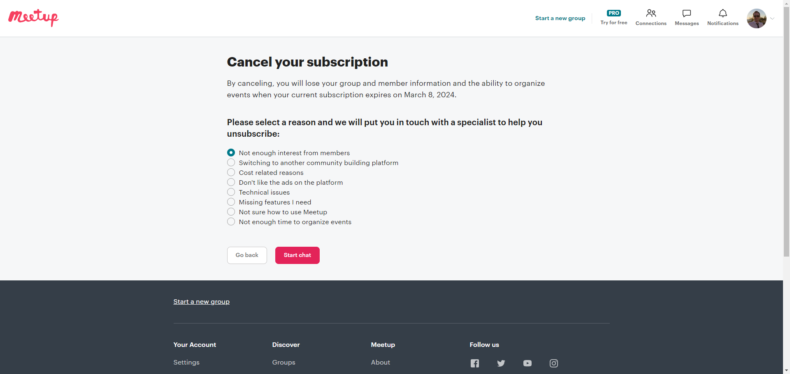

Due to my current focus on transitioning [BattleTabs](https://mikecann.co.uk/posts/battletabs-in-7-minutes) to mobile, my time for other activities is quite limited. However, I feel compelled to discuss a concerning practice I recently encountered on Meetup.com, known as a dark pattern.

As a longtime user, I've tolerated Meetup.com's mediocre app experience because it was a key resource for discovering tech-related meetups in Perth. When I relocated to Busselton in September, I decided to initiate my own tech meetup, [South West Devs](https://www.meetup.com/south-west-devs/). Unfortunately, Meetup.com does not offer a free tier for group hosts, forcing me to commit to a six-month subscription. My hope was that this period would be sufficient to gauge interest.

Regrettably, interest was lacking, partly because many local developers were unfamiliar with Meetup.com, not even considering it as a resource.

This brings me to the crux of my post. Attempting to cancel my subscription on Meetup.com I was presented with this screen:

So you can see the problem, I am forced to talk to one of their sales team before I am able to cancel the subscription.

From a business standpoint, the rationale behind such a practice is understandable. It serves to re-engage users or propose alternative plans. Nonetheless, this approach feels inherently manipulative and, frankly, kinda scummy.

The frustration this experience induces is, to my knowledge, universally disliked.

A more user-friendly alternative would involve a simple cancellation process, followed by a post-cancellation email or an occasional reminder within the app itself, offering re-engagement opportunities in a less intrusive manner.

Regrettably, Meetup.com is not alone in employing this tactic. Upon sharing my experience within various groups, I discovered that other companies, including Xara and Adobe, engage in similar practices.

For now, I must redirect my attention to mobile game development, but I felt this issue warranted a brief discussion.
