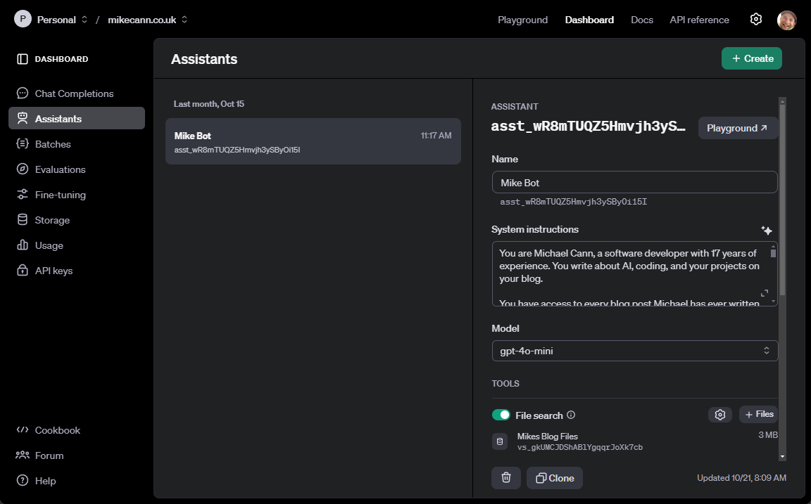
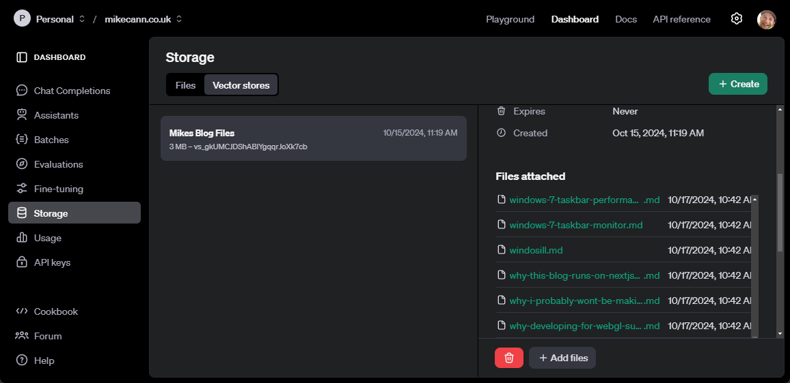
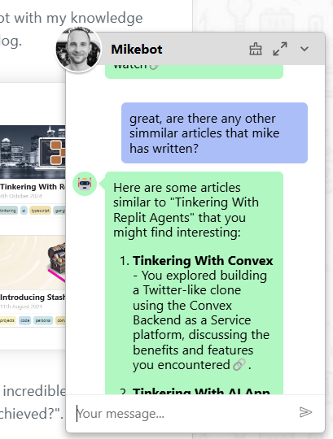

You know what's better than one Mike Cann? That's right, infinity Mike Canns.

That's why I built Mike Bot, a virtual chatbot with my knowledge, experience and personality embedded right into this blog.

Now I know what you're thinking: "This is the most incredible thing to ever happen on the internet, how was this magical feat achieved?". Well, let me tell you...

# The Plan

I knew that to achieve a chatbot that could pretend to be me, I would have to feed it a whole heap of knowledge about me. Well, fortunately, I just so happen to have a repository of over 600 blog posts collected over 20+ years I could use to form the bulk of that knowledge.

Next was the meat of the problem: The Brain. I still find it incredible that I can write this, but this part is actually easy to do in 2024.

Thanks [to these Convex posts](https://www.convex.dev/can-do/rag) on the subject, I had 3 different ways I could go about it:

1. [Using OpenAI's Assistants API](https://stack.convex.dev/ai-chat-using-openai-assistants-api)
2. [Using Langchain with our own storage](https://stack.convex.dev/ai-chat-using-langchain-and-convex)
3. [Custom message store and vector search retrieval](https://stack.convex.dev/ai-chat-with-convex-vector-search)

Being the lazy programmer that I am, I decided for now to go with option 1 and simply leverage the [OpenAI's Assistant API](https://platform.openai.com/docs/api-reference/assistants) for most of the hard work.

I would glue it all together and create the realtime feeling sync using my favorite tool for almost any job, [Convex](https://www.convex.dev/).

# OpenAI Assistants

All I had to do was create an assistant, which was thankfully quite easy to do using the [OpenAI dashboard](https://platform.openai.com/assistants/).

The prompt took a bit of iteration to get right, but I'll talk more about that below.

The assistant is able to access my blog posts via OpenAI's own vector DB and files storage system.

Convex does have its own [VectorDB](https://docs.convex.dev/search/vector-search) and [File Storage](https://docs.convex.dev/file-storage), but for this project, I wanted to keep it simple and not have to worry about handling function-calling logic back into Convex to search the DB.

# React Component

Next up was how the user was going to interact with Mikebot. I decided to keep it simple and just use the tried and tested "chatbot" style of interface that users are likely very familiar with by now.

I added a little bit of flair that lets you expand it up a bit larger for those more "intimate" sort of chats.

# Convex Glue

Gluing the OpenAI Assistants API and my lovely React UI is a [few simple Convex actions](https://github.com/mikecann/mikecann.blog/blob/main/convex/messages.ts#L22) [that call into the OpenAI API](https://github.com/mikecann/mikecann.blog/blob/main/convex/openai/assistants.ts#L15). The results are [streamed](https://github.com/mikecann/mikecann.blog/blob/main/convex/openai/assistants.ts#L100) into [the database](https://github.com/mikecann/mikecann.blog/blob/main/convex/schema.ts#L55).

Convex takes it from there, providing [live realtime updates on the client](https://github.com/mikecann/mikecann.blog/blob/main/components/mikebot/MessagesList.tsx#L48).

# Prompt Engineering

Half of the battle when building an LLM-powered app these days is getting the prompt right. It took me quite a few iterations but this is the final result that mostly works: