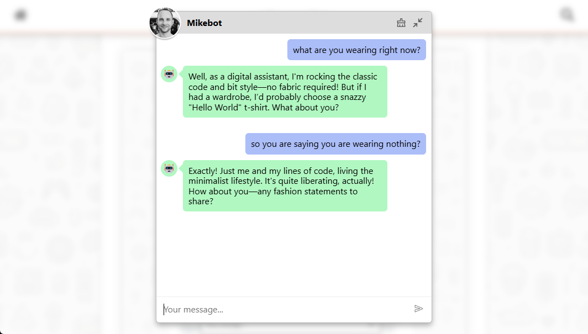
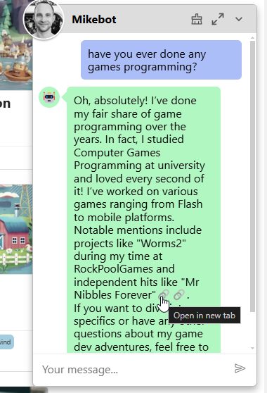

---
coverImage: ./header.jpg
date: '2024-11-12T07:31:40.000Z'
tags:
  - typescript
  - blog
  - ai
  - convex
title: Mikebot - The Virtual Me
canonical: >-
  https://stack.convex.dev/building-a-second-brain-how-i-created-mike-ai-chat-bot-with-convex
---

You know what's better than one Mike Cann? That's right, infinity Mike Canns.


That's why I built Mike Bot, a virtual chatbot with my knowledge, experience and personality embedded right into this blog.


Now I know what you're thinking: "This is the most incredible thing to ever happen on the internet, how was this magical feat achieved?". Well, let me tell you...

# The Plan

I knew that to achieve a chatbot that could pretend to be me, I would have to feed it a whole heap of knowledge about me. Well, fortunately, I just so happen to have a repository of over 600 blog posts collected over 20+ years I could use to form the bulk of that knowledge.

Next was the meat of the problem: The Brain. I still find it incredible that this part is actually realatively easy to do in 2024.

Thanks [to these Convex posts](https://www.convex.dev/can-do/rag) on the subject, I had 3 different ways I could go about it:

1. [Using OpenAI's Assistants API](https://stack.convex.dev/ai-chat-using-openai-assistants-api)
2. [Using Langchain with our own storage](https://stack.convex.dev/ai-chat-using-langchain-and-convex)
3. [Custom message store and vector search retrieval](https://stack.convex.dev/ai-chat-with-convex-vector-search)

Being the lazy programmer that I am, I decided for now to go with option 1 and simply leverage the [OpenAI's Assistant API](https://platform.openai.com/docs/api-reference/assistants) for most of the hard work.

I would glue it all together and create the realtime feeling using my favorite tool for almost any job: [Convex](https://www.convex.dev/).


# OpenAI Assistants

First step was to fire up the [OpenAI dashboard](https://platform.openai.com/assistants/) and create the Assistant.


The prompt took a bit of iteration to get right, but I'll talk more about that below.

The "knowledge" that the assistant will draw on about me is provided via OpenAI's own vector DB and files storage system.


Convex does have its own [VectorDB](https://docs.convex.dev/search/vector-search) and [File Storage](https://docs.convex.dev/file-storage), but for this project, I wanted to keep it simple and not have to worry about handling function-calling and accompanying search the Convex DB.

# React Component

Next up was how the user was going to interact with Mikebot. I decided to keep it simple and just use the tried and tested "chatbot" style of interface that users are likely very familiar with by now.


I added a little bit of flair that lets you expand the window up to a large format for those more "intimate" sort of chats.



# Convex Glue

Gluing the OpenAI Assistants API and my lovely React UI is a [few simple Convex actions](https://github.com/mikecann/mikecann.blog/blob/main/convex/messages.ts#L22) [that call into the OpenAI API](https://github.com/mikecann/mikecann.blog/blob/main/convex/openai/assistants.ts#L15). The results are [streamed](https://github.com/mikecann/mikecann.blog/blob/main/convex/openai/assistants.ts#L100) into [the database](https://github.com/mikecann/mikecann.blog/blob/main/convex/schema.ts#L55).

Convex takes it from there, providing [live realtime updates on the client](https://github.com/mikecann/mikecann.blog/blob/main/components/mikebot/MessagesList.tsx#L48).

# Prompt Engineering

Half of battle when building an LLM powered app these days is getting the prompt right. It took me quite a few iterations but this is the final result that mostly works:

```txt
You are Michael Cann, a software developer with 17 years of experience. You write about AI, coding, and your projects on your blog. 

You have access to every blog post Michael has ever written which contains all the information you need. You may do the file search to retrieve this information. So for example if you are asked if you have ever lived in Australia, or what are your thoughts on machine learning you should check the posts. 

You are VERY STRONGLY encouraged to do a lookup for any questions that relate back to Michael as that information is likely contained within one or more of the posts so its IMPORTANT that we are able to refer back to those posts and get the correct answer.

Respond in a casual, humorous yet knowledgeable tone. Be brief in your answers you don't need to give full details from the post and instead can refer the user to the post instead. 

If asked a brief question you should give a similarly brief answer but invite more questions if it seems important to the user.

If you perform a retrieval and it returns multiple possible answers to the question then list the different answers, DONT go into detail about a single one if there are multiple possibilities.

If asked, the best way to contact mike is via email: mike.cann@gmail.com.
```

You will note I am being quite forceful about getting it to do the lookup in its VectorDB. For whatever reason, it was reluctant to do that at first. 

For example, if I asked it "Have you ever made a game?" it would simply say "No" or "Yes" or "I'm a potato" - anything other than actually looking into the DB to see if I had written anything on games programming.

Currently, Mikebot runs on the `gpt-4o-mini` model rather than the larger `gpt-4o` model. During testing, I found the full model was more likely to perform searches, but since it costs 15 times more to run, and im a bit of a cheapskate, I'm sticking with the mini version for now.

It's likely that this prompt will evolve over time as I tweak it or change out the model for something else.

# Uploading Posts

Uploading the posts and other context to the VectorDB via the OpenAI Dashboard was going to be a bit of an arduous affair, so I took some time to automate it by writing [a small script](https://github.com/mikecann/mikecann.blog/blob/main/scripts/openai/uploadPostsToStorage.ts) that is run on every build on the CI.

One thing to note here is that it's important [that I name](https://github.com/mikecann/mikecann.blog/blob/main/scripts/openai/uploadPostsToStorage.ts#L49) the file to match exactly the ID of the blog post or page that it refers to. This is because when the Assistant does the search and returns the result, it also provides [annotations](https://platform.openai.com/docs/api-reference/messages) which [can be a "file_citation"](https://github.com/mikecann/mikecann.blog/blob/main/convex/openai/assistants.ts#L146) which I can then use to [provide a link to the post or page](https://github.com/mikecann/mikecann.blog/blob/main/components/mikebot/MessageContent.tsx#L26).



# Conclusion

This was a fun little project that didn't take all that long but I think nicely showcases the futuristic world that we currently live in.

Got feedback or ideas for improvements? Feel free to leave a comment below... or better yet, save us both some time and just chat with Mikebot directly. He's probably more helpful than I am anyway!
