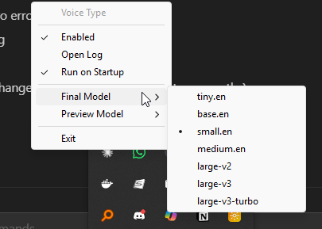

---
coverImage: ./header.jpg
date: "2026-02-24T07:31:40.000Z"
tags:
  - ai
  - software
  - personal
title: "Mikerosoft"
---

Just a quick one this month because wow are things moving fast at the moment. The entire software development industry is in the process of being turned on its head.

SaaS stocks are down across the board as AI companies continue to accelerate ahead. Everyone is starting to come to the conclusion that the future looks less like big, expensive software products that cater to the most and is starting to look more like [bespoke personalised software](https://x.com/karpathy/status/2024583544157458452?s=20).

I wrote about this potentially becoming a thing 3 years ago in [The Future of Application](https://mikecann.blog/posts/the-future-of-applications) and here we are.

I personally have been having a whole lot of fun smashing out little hyper-personalized apps for my specific problems, tailored exactly to how I want them. I have put these all under the banner "[Mikerosoft](https://mikerosoft.app/)" (man I hope I dont get sued for that..)

Everything is fully open source here: [https://github.com/mikecann/mikerosoft](https://github.com/mikecann/mikerosoft) but PLEASE dont open github issues for new features or whatnot, the idea of this is that you clone this repo and then open it in Cursor or Claude Code or whatever and ask it to customize stuff to your own liking.

As a dirty Windows user I always felt like we never got the love from developers so im excited by the possibilities that vibe coding now opens up.

I wont list all the tools but here are some of my favorites:

# Voice Type

[https://github.com/mikecann/mikerosoft/tree/main/tools/voice-type](https://github.com/mikecann/mikerosoft/tree/main/tools/voice-type)

This is my version of [Whisprflow.ai](https://wisprflow.ai/) a $16 per month product that I built in vibed in like 2 hours (while doing a bunch of other things).

<iframe width="560" height="315" src="https://www.youtube.com/embed/lYjgJ8KIh-Y" title="YouTube video player" frameborder="0" allow="accelerometer; autoplay; clipboard-write; encrypted-media; gyroscope; picture-in-picture; web-share" referrerpolicy="strict-origin-when-cross-origin" allowfullscreen></iframe>

The neat thing about this one is that it has its own little tray icon and settings so I can tweak the whisper model that it uses. Im really happy with this one and use it all day every day.

# Task Stats

I have [a long history with writing small apps](https://mikecann.blog/posts/introducing-glancer-pc-vitals-at-a-glance) for windows that are designed to show the Operating Stats at a Glance. I can remember spending a LONG time knocking out these tools over the years. Now its just a matter of asking for something then walking away and coming back to a fully working very very good tool.

<iframe width="560" height="315" src="https://www.youtube.com/embed/WPUqWzkOS4E" title="YouTube video player" frameborder="0" allow="accelerometer; autoplay; clipboard-write; encrypted-media; gyroscope; picture-in-picture; web-share" referrerpolicy="strict-origin-when-cross-origin" allowfullscreen></iframe>

Task Stats is another example of that, its a tool that sits on your task bar and gives you stats about Windows at a glance, I find it incredibly useful when trying to understand what my system is doing at any time.

I probably spent the most time iterating on this one (not really that much, a few hours) mainly because Windows really makes it quite hard to extend the taskbar you have to do all kinds of shenanigans, but it works!

Im really happy with the way it looks and works and the great thing is its mine to customise to my heart's content.

# Explorer Context Menu Tools

As a dirty windows user I obviously hate to use Explorer but unfortunately its the devil you know so I have to work with its issues for now. To make things a little bit nicer tho I have developed a number of little tools that help with my Convex day-job video production tasks.

# Misc CLI Tools

[ghopen](https://github.com/mikecann/mikerosoft/tree/main/tools/ghopen) - lets me quickly open my browser to the github repo for this project or its PR if we are working on a PR branch

[copypath](https://github.com/mikecann/mikerosoft/tree/main/tools/copypath) - copies the current working directory to my clipboard, very handy
