---
coverImage: ./header.webp
date: "2026-02-25T07:31:40.000Z"
tags:
  - ai
  - software
  - personal
title: "Mikerosoft"
---

Just a quick one this month because wow are things moving fast at the moment. The entire software development industry is in the process of being turned on its head.

SaaS stocks are down across the board as AI companies continue to accelerate ahead. Everyone is starting to come to the conclusion that the future looks less like big, expensive software products that cater to the most and is starting to look more like [bespoke personalised software](https://x.com/karpathy/status/2024583544157458452?s=20).

I wrote about this potentially becoming a thing 3 years ago in [The Future of Application](https://mikecann.blog/posts/the-future-of-applications) and here we are.

I personally have been having a whole lot of fun smashing out little hyper-personalized apps for my specific problems, tailored exactly to how I want them. I have put these all under the banner "[Mikerosoft](https://mikerosoft.app/)" (man I hope I dont get sued for that..)

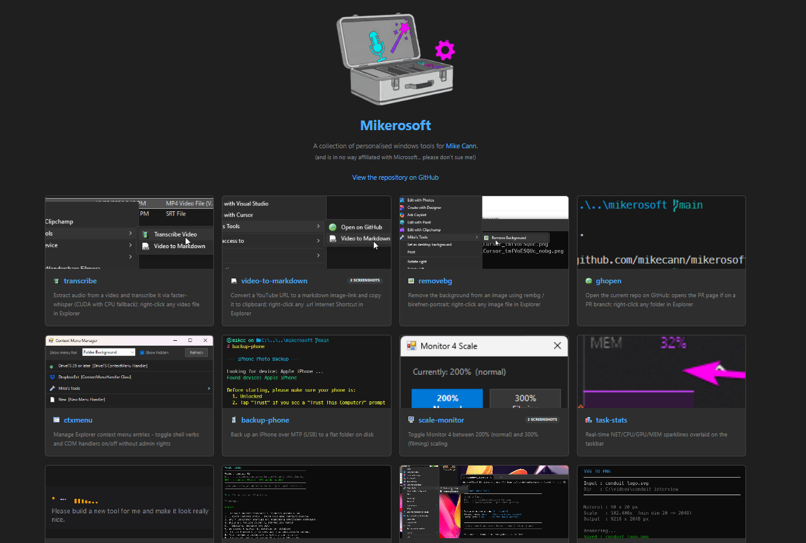

Everything is fully open source here: [https://github.com/mikecann/mikerosoft](https://github.com/mikecann/mikerosoft) but PLEASE dont open github issues for new features or whatnot, the idea of this is that you clone this repo and then open it in Cursor or Claude Code or whatever and ask it to customize stuff to your own liking.

As a dirty Windows user I always felt like we never got the love from developers so im excited by the possibilities that vibe coding now opens up.

I have 14 tools and counting, I wont list all of them but here are some of my favorites:

# Voice Type

[https://github.com/mikecann/mikerosoft/tree/main/tools/voice-type](https://github.com/mikecann/mikerosoft/tree/main/tools/voice-type)

This is my version of [Whisprflow.ai](https://wisprflow.ai/) a $16 per month product that I built in vibed in like 2 hours (while doing a bunch of other things).

<iframe width="560" height="315" src="https://www.youtube.com/embed/lYjgJ8KIh-Y" title="YouTube video player" frameborder="0" allow="accelerometer; autoplay; clipboard-write; encrypted-media; gyroscope; picture-in-picture; web-share" referrerpolicy="strict-origin-when-cross-origin" allowfullscreen></iframe>

The neat thing about this one is that it has its own little tray icon and settings so I can tweak the whisper model that it uses. Im really happy with this one and use it all day every day.

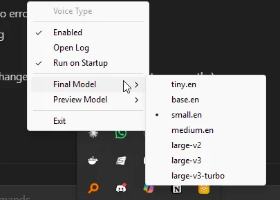

# Task Stats

I have [a long history with writing small apps](https://mikecann.blog/posts/introducing-glancer-pc-vitals-at-a-glance) for windows that are designed to show the Operating Stats at a Glance. I can remember spending a LONG time knocking out these tools over the years. Now its just a matter of asking for something then walking away and coming back to a fully working very very good tool.

<iframe width="560" height="315" src="https://www.youtube.com/embed/WPUqWzkOS4E" title="YouTube video player" frameborder="0" allow="accelerometer; autoplay; clipboard-write; encrypted-media; gyroscope; picture-in-picture; web-share" referrerpolicy="strict-origin-when-cross-origin" allowfullscreen></iframe>

Task Stats is another example of that, its a tool that sits on your task bar and gives you stats about Windows at a glance, I find it incredibly useful when trying to understand what my system is doing at any time.

I probably spent the most time iterating on this one (not really that much, a few hours) mainly because Windows really makes it quite hard to extend the taskbar you have to do all kinds of shenanigans, but it works!

Im really happy with the way it looks and works and the great thing is its mine to customise to my heart's content.

# Explorer Context Menu Tools

As a dirty windows user I obviously hate to use Explorer but unfortunately its the devil you know so I have to work with its issues for now. To make things a little bit nicer tho I have developed a number of little tools that help with my Convex day-job video production tasks.

## ctxmenu

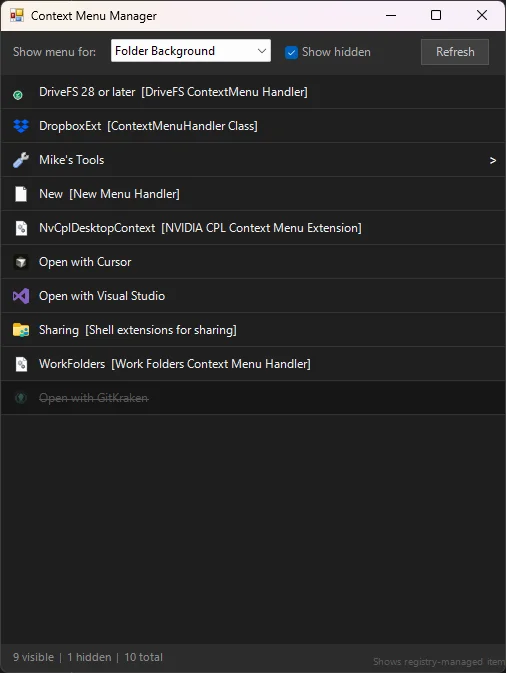

[ctxmenu](https://github.com/mikecann/mikerosoft/tree/main/tools/ctxmenu) is probably my favourite of the bunch. Its a little GUI that lets you manage all the Windows Explorer right-click context menu entries without needing to dig through the registry yourself. You can toggle entries on and off, which is super handy because over time that context menu just becomes an absolute disaster zone of stuff you never use.

The clever bit is it does all of this without needing admin rights, it shadows HKLM entries with HKCU overrides so Windows thinks the entry is disabled. Completely reversible and totally safe.

## generate-from-image

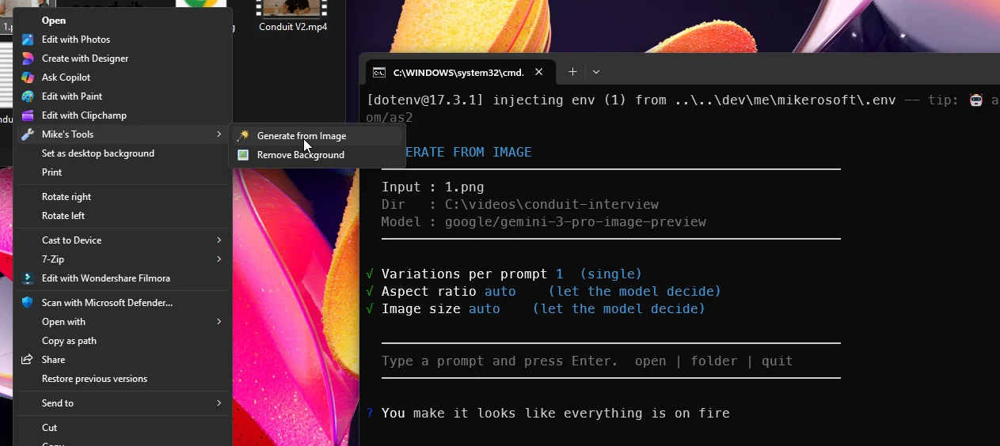

[generate-from-image](https://github.com/mikecann/mikerosoft/tree/main/tools/generate-from-image) is a right-click context menu tool for images. You right-click any image, pick "Generate from Image", describe what you want, and Gemini generates a new image based on your input. It drops you into a little interactive loop so you can keep refining until youre happy.

I use this a lot for quickly generating variations on cover images and thumbnails. Really handy having it baked right into Explorer.

## removebg

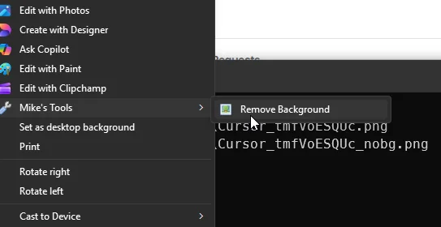

[removebg](https://github.com/mikecann/mikerosoft/tree/main/tools/removebg) does exactly what it says - right-click an image, hit "Remove Background", done. Uses the `birefnet-portrait` model which is surprisingly good for photos of people. The output lands right next to the original with `_nobg` appended so you dont lose the original.

I used to pay for a service to do this. Now I just right-click.

## svg-to-png

[svg-to-png](https://github.com/mikecann/mikerosoft/tree/main/tools/svg-to-png) is a tiny one but I use it constantly. Right-click an SVG, it renders it out to a PNG at a minimum of 2048px on the shortest side. No Inkscape, no Figma, no messing around. Just right-click and go.

# Video Production Tools

A big chunk of my day-job at Convex involves producing tutorial videos, so I have built a little pipeline of tools that sit in the context menu and make that process a lot smoother.

## transcribe

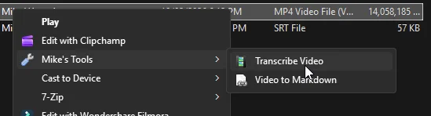

[transcribe](https://github.com/mikecann/mikerosoft/tree/main/tools/transcribe) right-clicks a video file and runs it through faster-whisper to spit out an `.srt` file alongside the video. Uses CUDA if you have a GPU, falls back to CPU if you dont. I use this as the first step before generating descriptions and titles.

## video-description

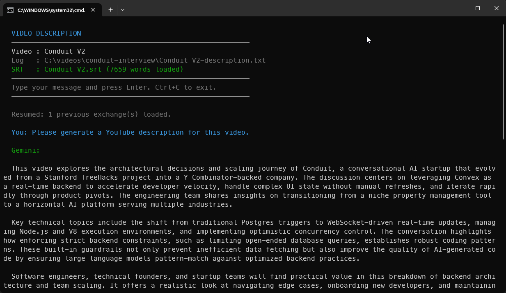

[video-description](https://github.com/mikecann/mikerosoft/tree/main/tools/video-description) takes a video (and its transcript if one exists), fires it at Gemini, and gives you back a full YouTube description - timestamps, hashtags, resource links, the lot. It drops you into an interactive chat so you can iterate on it. Each session is saved to a `.txt` file next to the video so you can pick up where you left off.

I used to spend ages writing these. Now I spend about 30 seconds.

## video-titles

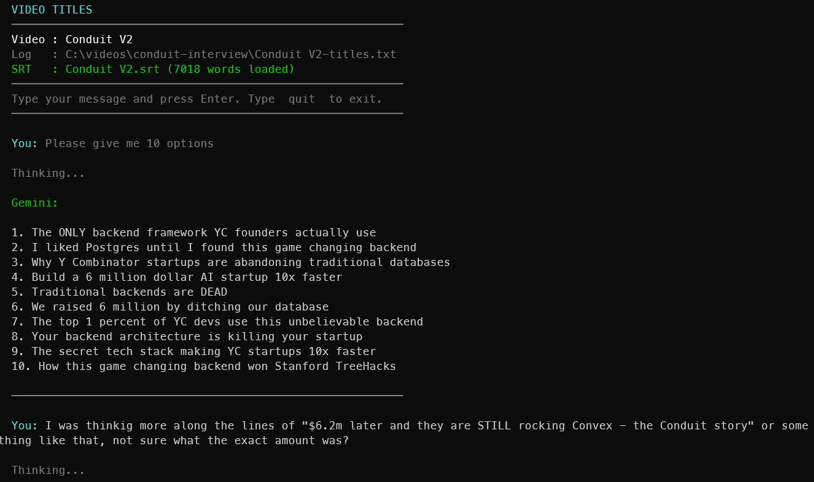

[video-titles](https://github.com/mikecann/mikerosoft/tree/main/tools/video-titles) is similar but focused on brainstorming video titles. It uses a "Compelling Title Matrix" framework in the system prompt which tends to produce titles that are actually good rather than just generic. Again, interactive chat, saved session, right there in the context menu.

## video-to-markdown

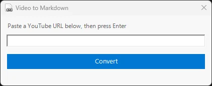

[video-to-markdown](https://github.com/mikecann/mikerosoft/tree/main/tools/video-to-markdown) converts a YouTube URL into a clickable thumbnail markdown snippet and copies it to your clipboard by leveraging my existing project [https://video-to-markdown.com/](https://video-to-markdown.com/). Right-click anything in Explorer, paste a YouTube URL, hit enter. Useful when youre writing blog posts or docs and want a nice embedded thumbnail link.

# Other Bits

## scale-monitor

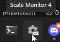

[scale-monitor](https://github.com/mikecann/mikerosoft/tree/main/tools/scale-monitor) is very specific to my setup but a good example of the kind of hyper-personalised thing I mean. I have one monitor that I use normally at 200% DPI but when I start filming for Convex I want it at 300% so the content is easier to read on camera. This little tool gives me a tiny popup to toggle between the two instantly, no reboot, no sign-out, no digging through display settings. One click.

## backup-phone

[backup-phone](https://github.com/mikecann/mikerosoft/tree/main/tools/backup-phone) backs up all photos and videos from my iPhone over USB without needing iTunes or iCloud or any of that nonsense. It connects via MTP, processes newest photos first, converts HEIC files to WebP on the fly, and skips anything already backed up. Run it, walk away, done.

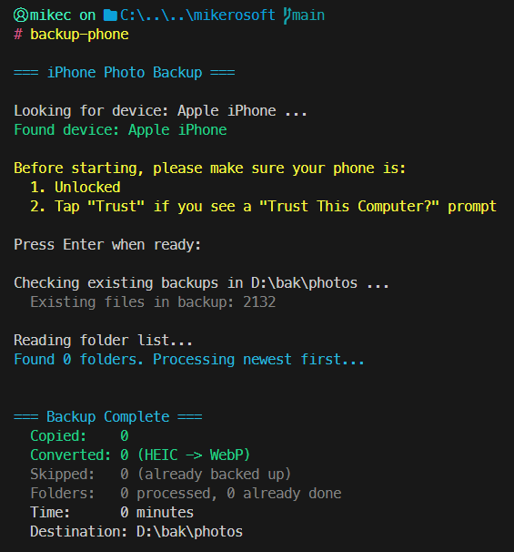

# Misc CLI Tools

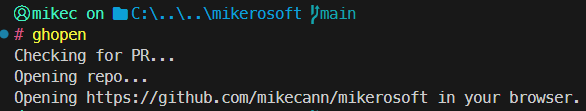
[ghopen](https://github.com/mikecann/mikerosoft/tree/main/tools/ghopen) - lets me quickly open my browser to the github repo for this project or its PR if we are working on a PR branch

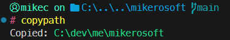
[copypath](https://github.com/mikecann/mikerosoft/tree/main/tools/copypath) - copies the current working directory to my clipboard, very handy

# Wrapping Up

The thing I keep coming back to is how much time I used to spend either not having a tool and just suffering, or spending days building something properly. Now the cost of "just build it" is so low that I find myself reaching for it constantly.

None of these tools are particularly impressive in isolation. But the fact that I built all of them in a weekend, they're all exactly what I want, and I can change any of them at any time - that's the bit that feels genuinely different.

Anyway, go clone [the repo](https://github.com/mikecann/mikerosoft), open it in Cursor, and start building your own.
