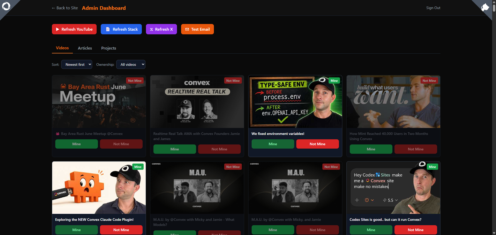

Alright, just a quick one this month.

I have a new page to gather all the content, projects etc I make for [Convex](https://www.convex.dev/).

https://convex.mikecann.blog/

I wanted to have a single place to gather all the projects I work on for [Convex](https://www.convex.dev/). Now obviously its not everything, all the community outreach and misc coding efforts but its a good representation of the "creative" works.

# Creative Aside

Speaking about creative this is a bit of a tangent but Convex is becoming a bigger and bigger part of my "identity" online. Just about any software project I work on these days is a "Convex" project.

It sucks up a lot of my creative output. Im not saying its a bad thing but im just observing that. I guess its something I hadnt considered when I took on this "DevX" role.

I have also noticed that my online-identity and the company become interlinked.

One downside of this I suppose is that I always feel like I have to be a bit more careful about what I say online so that it doesnt get construed as the "Convex Position".I generally am careful online, treating just about anything I do online as "public" by default.

# Convex Portfolio

Anyways back to the point. The sourcecode for portfolio is here: https://github.com/mikecann/mikes-convex-portfolio and is built with Convex obviously.

It uses various APIs to scrape the content from various sources.

Then I have an admin backend where I indicate if the content is "mine" or not because some content was not produced by me, for example various videos on the Convex channel.

Anyways, I think its works pretty well and services as a place I can point people to in the future if they want to see what I get up to for my day-job :)
