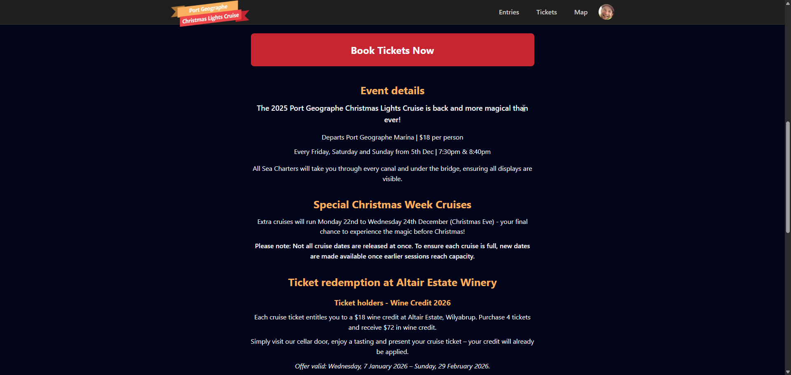
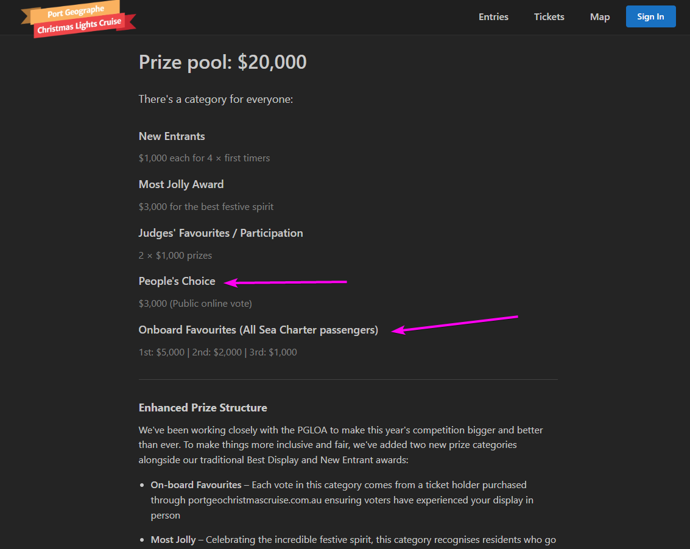
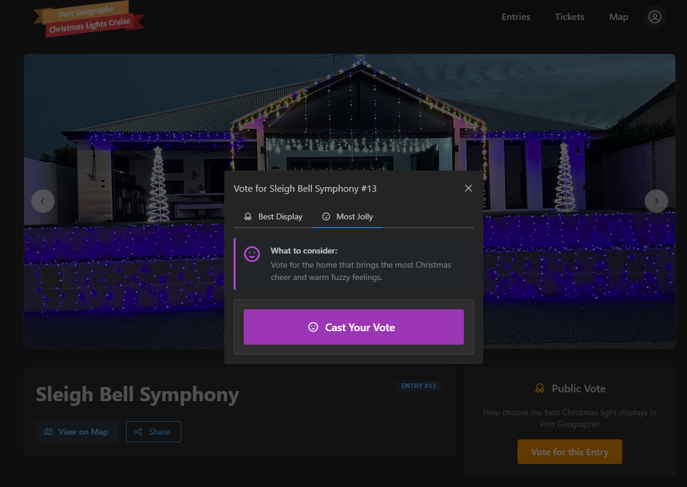
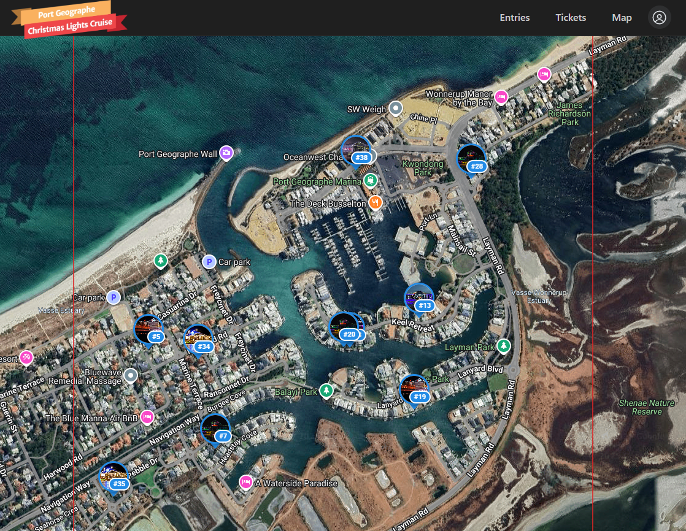
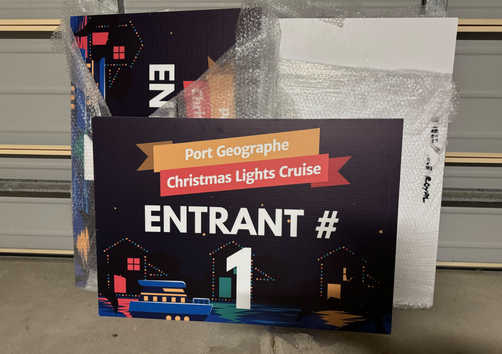
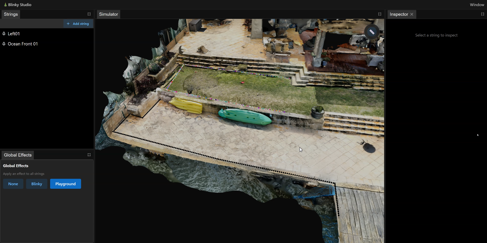

---
coverImage: ./header.webp
date: "2025-11-15T07:31:40.000Z"
tags:
  - personal
  - pgloa
  - website
  - convex
  - typescript
title: Port Geographe Christmas Cruise
---

A little over 2 years ago I moved from the bustling city of Perth in Western Australia three hours south to a small seaside town called Busselton. I was keen to get involved in my local neighborhood, meet my neighbours and basically settle into my new home.

I decided that I would get involved with the local residents association called the [Port Geographe Landowners Association (PGLOA)](https://www.portgeographe.com.au/). After attending a few of their monthly meetings I was encouraged to join the committee as deputy chair which I accepted not really knowing anything about committees previously.

It was while on the committee I was approached by [Aigle Royal](https://www.aigleroyal.com.au/) who are land and property developers and the company currently behind the development of the Port Geographe Canals that I live on. They were looking for help with their annual christmas lights competition that they hold for residents in the canal.

I had a few ideas of how things could be improved particularly from a technical side and thus before I knew it I had volunteered to rebuild the [competition website](https://portgeochristmascruise.com.au/) to streamline both bookings for the cruise (which tours the canals and lights) and makes entering the competition and voting for the entrants much easier and more fair.

# Fair Voting

One of the key improvements I wanted to make was to require that all voters first register with the site. This would ensure that every vote can be tied back to an email address. Doing so was critical in my mind to keep things fair so that the lights competition wouldn't just become a matter of "whoever had the most facebook friends that they could share their entry with".

A voter's email address could then be tied back to a purchase of a cruise ticket thus ensuring that any vote from that email address had actually seen the lights in person rather than just voting online.

We did however still want to encourage people to share their entries on facebook and encourage their friends to vote so the $20k prize pool was split into a few different categories with the lions share being awarded to votes originating from voters on the boat.

# Jolly Category

Another thing I was keen to push for was adding a prize category that would encourage competition entrants to dress up, wave and greet people on the boats and cruises.

This was already happening voluntarily by some entrants in previous years and made for a really nice and fun atmosphere when cruising the canals looking at the lights and so I was keen to incentivize more of that behavior with a dedicated prize.

# The Map

One feature on the site I was keen to implement was an interactive map so that as people are navigating the canals they could see where they were on the map and where other entries and and what the entry was they were looking at.

# Signage

One difficulty with the competition in past years was the fact that people touring the canals didn't even know that a competition was currently under way as there was no advertising anywhere on the canals or boat. I thought that this was a bit of a shame and meant that the competition didnt get as much attention or participation as it could.

So this year I encouraged Aigle Royal to print some large signs that each entrant can place outside their house with their entry number on it. When someone cruising the canals sees this hopefully they will be encouraged to vote for the entrant number that is prominently displayed.

As Aigle Royal doesnt have an office down here in Busselton I offered to look after and distribute them to the entrants. So I now have 40 of these signs sitting in my garage waiting for entrants to come collect them in a couple of weeks 😋.

Oh BTW we did consider putting QR codes on each sign that would take people directly to the relevant entrant page but were worried that the QR code would likely be too small when viewed from the canals to be useful. Maybe this was a mistake? We will see.

# Technical Details

The whole thing is build to be responsive as I know that many users of the site are likely to be on one of the boats as they are traveling around the canals so making that work well was a priority.

The site is build using React and Vite as a Single Page Application (SPA). I probably should have gone with a SSR framework like Next or TanstackStart for better page load time but I wanted to see how far I could go without pulling in one of those.

The site is of-course powered by [Convex](https://convex.dev) and hosted on Cloudflare.

I also experimented around with AI based End-to-End testing for the first time with this site. If you are interested i the technical details around that then I did a video for Convex on it that you can see here:

<iframe width="560" height="315" src="https://www.youtube.com/embed/XnE_m5DU3os?si=ZVAdjWeKzM2O3K1s" title="YouTube video player" frameborder="0" allow="accelerometer; autoplay; clipboard-write; encrypted-media; gyroscope; picture-in-picture; web-share" referrerpolicy="strict-origin-when-cross-origin" allowfullscreen></iframe>

# Conflict of Interest?

Now I plan on entering this year and have actually been working on the technical aspect of my entry since February this year! Im not quite ready to talk about it yet as I am still putting it all together but I will for sure be making some content and a blog post for it once its done and up.

The question naturally arises tho if I am entering the competition and running the website that the voting will happen on is there a conflict of interest there?

Well I made sure to clear this point with both Aigle Royal and the PGLOA committee beforehand and both are satisfied that its all good.

The fact that every vote can be tied to an email address means that it will be very hard for me to "cheat" the voting as if there was any doubt then a third party could simply verify that each email address was real.

I have also told the committee and Aigle Royal that if I did win a prize and there was any challenge to my winning of the prize and conflict with my involvement in the competition then I would forfeit my winnings.

Im doing all of this for the love of the community and wanting to get more involved in the neighbourhood that I live in, not for a little bit of prize money.

# Conclusion

Im very happy with how the site has turned out, I think its a big improvement on previous years. Hopefully both the entrants and voters think the same too.

We plan on doing an "exit survey" after everything has settled in the new year to see what people thought about the site and what could be improved for 2026.

Anyways, let me know what you think below!
