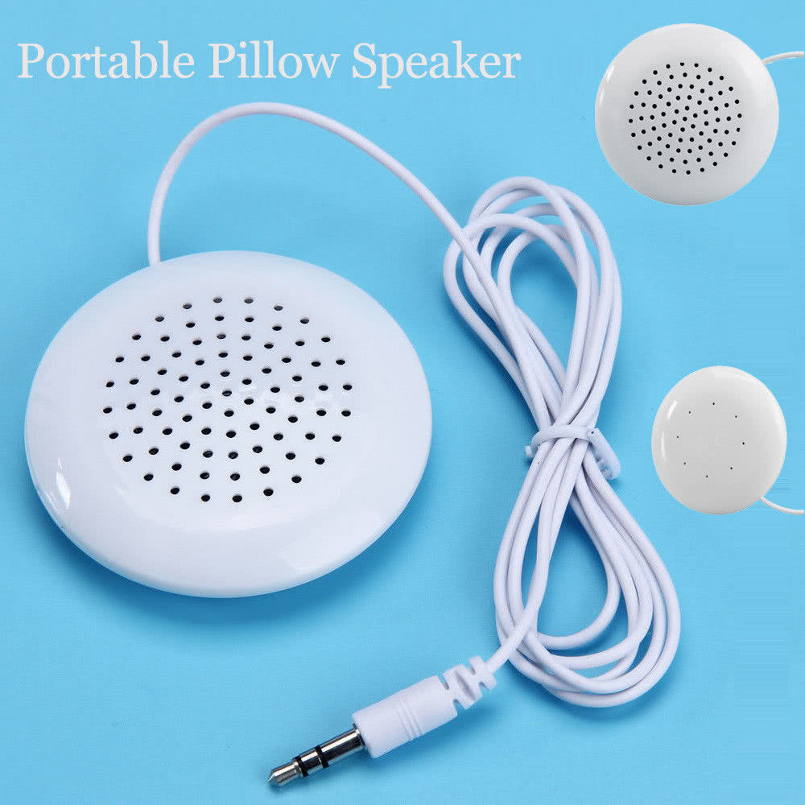
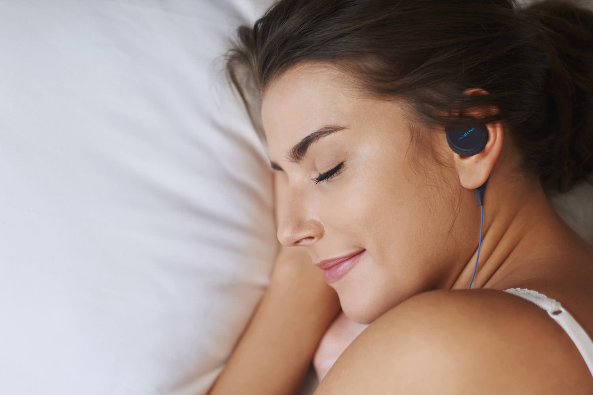

---
coverImage: ./header.jpg
date: '2018-10-30T14:51:40.000Z'
tags:
  - misc
  - personal
  - lifehack
  - sleeping
  - headphones
title: Sleeping Headphones Update
oldUrl: /personal/sleeping-headphones-update
---

Its been quite some time since my original post on [The Sleeping Headphones Saga](./photos-personal/the-sleeping-headphones-saga/) so I thought it was time I updated with my current situation my my experiments since then.

<!-- more -->

# Recap

If the last post is [TLDR;](./photos-personal/the-sleeping-headphones-saga/) then basically the summary is that I (like many others) like to listen to music / audiobooks in bed to help me sleep with. I have been doing it for over two decades now and I thought I would share my experience trying to find the right headphones for my sleeping audio pleasure.

Up to that point I wasnt 100% happy with any of the options on the market and despite trying quite a few, some more expensive than others, I ended up with \$13 Panasonic RP-HS46 as my daily driver for now.

# Pillow Speaker

So one experiment I have tried since the last post is to buy a [Portable 3.5mm Pillow Speaker](https://www.ebay.com/itm/Portable-3-5mm-Pillow-Speaker-for-iPod-MP3-MP4-CD-Phone-Universal-White-Speaker-/253812585068) you can find lots of variants of it for sale on ebay.

The idea is that instead of headphones going directly in your ear you attach this little speaker to your device then tuck it under your pillow. Then you rest your head on the pillow and enjoy your music / audiobook or whatever.

At just \$5 I wasnt expecting much and wasnt disappointed.

The sound quality is predictably terrible, tho thats not a show stopper if it meant that I could listen to my audio without wires.

Well the problem is that the speaker is actually quite thick (1cm roughly) and hard plastic meaning that you cant put directly under your pillowcase as its way to hard to rest your head on. Thus you are forced to put it under your pillow, which means you have to turn the volume up quite loud to be heard. This was a show-stopper for my light-sleeping partner.

I think this idea could potentially work if the speaker was soft and thin enough that you couldnt notice it under some padding. As it stands however, this \$5 solution is pretty much useless to me.

# BedPhones Wireless

In the last post I mentioned that I had ordered the brand new [Dubslabs BedPhones Wireless headphones](https://www.dubslabs.com/products/bedphones-wireless-sleep-headphones-the-worlds-smallest-on-ear-headphones.html) and was hopeful that they were finally going to be the solution to my problem.

Well after 6 months they finally arrived from the US. I went to bed eagerly that night hoping that the wireless soft-ear-pieces were going to be perfect for sleeping.. Well actually before I get onto the negatives lets list the positives:

- Great sound quality
- Love that they are wireless, no more wires wrapped around my neck
- The battery lasts all night, great for someone like me that has a habit of waking at 4am then struggling to sleep again without them.

Okay so thats great.. but for me the natives outweigh the positives:

A minor annoyance that its hard to tell which button does what on the controls without looking at them. The apple headphones controls does this better.

Another minor annoyance its really hard to open the little cover on the charging port for the headphones which is particularly a problem when the light level is low early morning and is exactly the time when you want to be putting them back on charge.

A big negative is that the wire that holds them in place on my ear really isnt very good. I know others have complained about this too and although Dubslabs have supposedly done work on this it really just isnt as good at solid plastic clasp that fits around the ear in the Panasonic RP-HS46.

Another big negative is even though the ear pieces are thin and padded I still find them really uncomfortable when resting my head on my side on my pillow. To be fair this is the same with every pair of headphones, but what I usually have to do is pull one headphone out my ear when I want to rest my head on my side, then when I swap sides of my head I have to swap headphones, I have to do this multiple times during the night every night. I was hoping the bedphones would solve this problem by allowing me to keep them in all the time but unfortunately they dont, they are still to uncomfortable.

# Conclusion

So after all that im still using my trusty Panasonic RP-HS46's. They certaintly arent perfect but they are better than the plain Apple earpods. The Dubslabs wireless headphones were a bit of a letdown for me, but I have donated them to my sister and she likes them so thats good that the money wasnt wasted.

So the quest for the best sleeping headphones continues, until next time..
