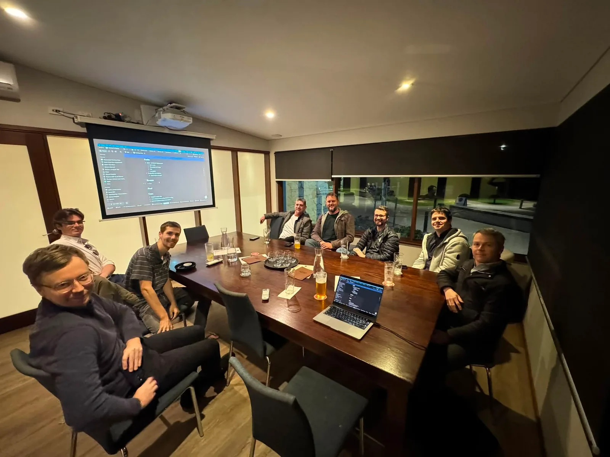
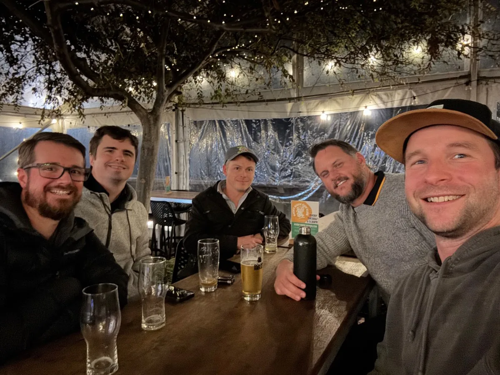
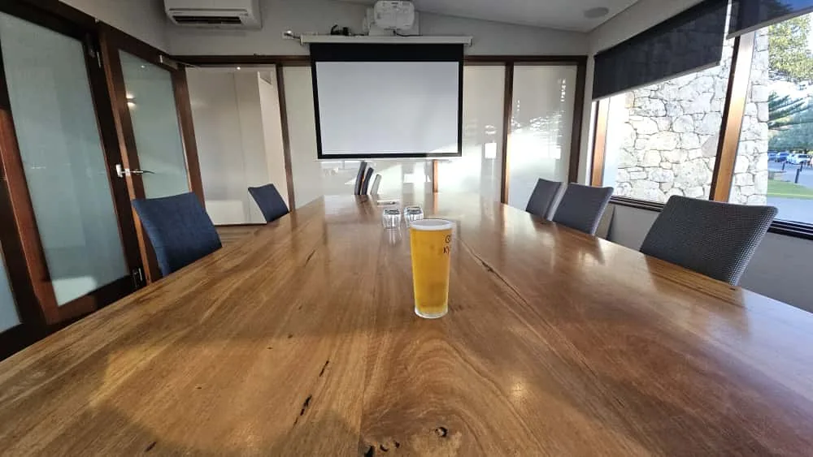
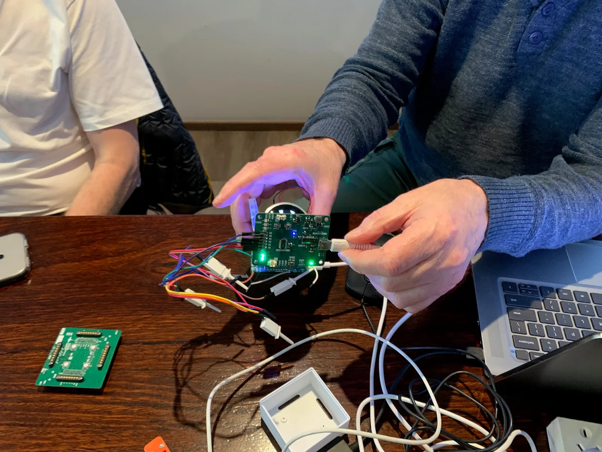
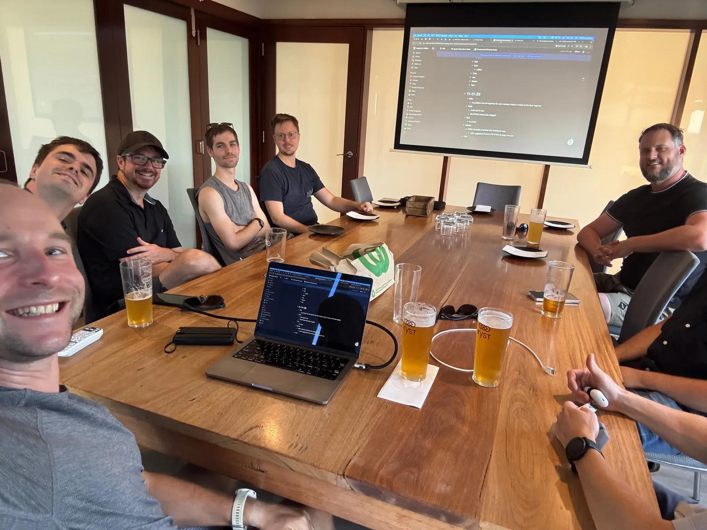
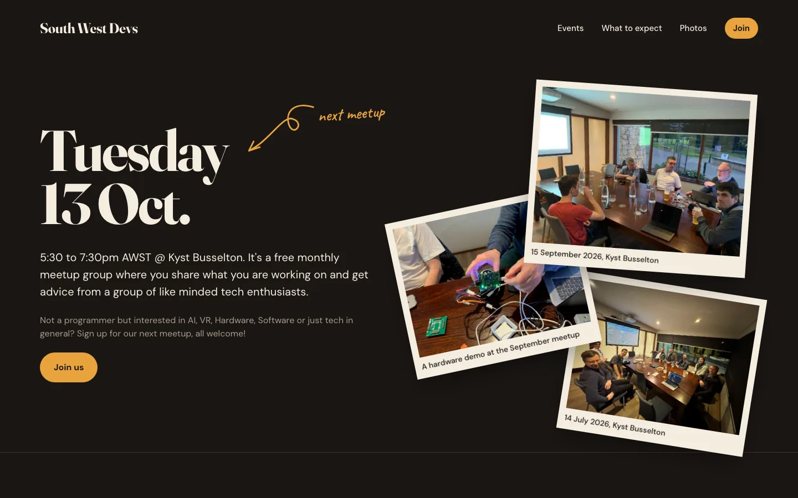

I honestly can't believe I haven't properly written about this before, but a couple of years back now I started a little tech meetup group down here in Busselton called [South West Devs](https://www.southwestdevs.com.au/). It's a free monthly get-together for anyone in the South West of WA who's into tech, and I thought it was about time I wrote up how it all came about.

# Why I started it

When I was living in Perth I used to go to a bunch of tech meetups, and I really missed having that regular thing where you get together with people who are into the same stuff as you. You chat about what you're working on, what's been going on in the tech news that month, that kind of thing.

So when we moved down to Busselton in September 2023 I went looking for something similar, but I couldn't find anything. There just weren't any groups down here, so I figured I would have to start one myself.

# Finding the people

This turned out to be a lot harder than I expected. My first go was a group on Meetup.com, which got zero interest (and then [they made it a pain to cancel](https://mikecann.blog/posts/meetup-and-the-cancel-subscription-dark-pattern), but that's another story). Next I tried a [Facebook group](https://www.facebook.com/groups/southwestdevs) and got basically no interest there either.

My last resort was to just cold email a bunch of local businesses, and that's how I managed to find one person, Keith. We met up at Rocky Ridge, and then that turned into two, then three, then four.

# Outgrowing the pub

As the group got bigger I noticed it would start breaking up into little smaller groups around the table, so you would end up only really talking to the couple of people sat next to you. It was kinda outgrowing the pub format.

So I decided to move it to the boardroom at [Kyst](https://kyst.au) on the foreshore. It's got a big table and a projector so people can actually show stuff, which suits us perfectly, and since the move we've grown to six, seven, eight and now nine or so most months.

# The Mastermind

We meet up once a month and run it as a "Mastermind", which is basically a show and tell. Everybody gets five or ten minutes (or however long, depending on how many people turn up) to talk about something they are interested in. At the end they pose a question to the group and see whether the group can help them with it.

Then the following month, when it's their turn to talk again, we check whether the answer to their question actually helped them or not.

I really like it because everybody gets to talk about something they're interested in. The loudest voice in the room doesn't overwhelm the speakers, so the people who might not talk quite as much still get their turn. It also means that as the organiser I don't have to go and find speakers or organise specific talks every month, it kinda just runs itself.

# The website

Oh and we have a website now! Up until recently the group only really existed as a Facebook group and a WhatsApp chat, which made it pretty hard for anyone new to find us or work out what we actually do.

So I put together [southwestdevs.com.au](https://www.southwestdevs.com.au/), with a lot of help from my good buddy Claude. It's pretty simple, it shows when the next meetup is and what a night looks like, and there are photos from past meetups (which is where most of the photos in this post came from).

# Getting too big?

Now unfortunately the Mastermind format does start to break down once you get to around ten or twelve people, as it just takes too long to get around everybody. We're starting to push up on that limit now, so if the numbers keep growing I'm going to have to rethink how we run the group. I'm not sure what that looks like yet, maybe we add some other kinds of events alongside the Mastermind.

Anyways, if you're in the South West and into tech in any way (you don't have to be a programmer) then come along, everyone is welcome. All the details are on the [website](https://www.southwestdevs.com.au/).
