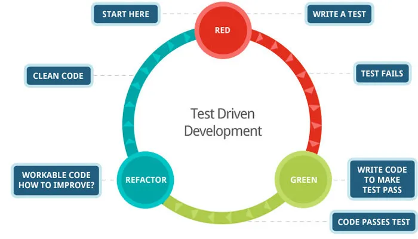

---
coverImage: ./header.jpg
date: "2025-07-10T07:31:40.000Z"
tags:
  - ai
  - coding
  - thought
title: The Future of Applications
---

**_TLDR; How I think the forgotten art of Test Driven Development is the solution to vibe coding at scale._**

2 and half years ago and 27 days BEFORE the release of ChatGPT I wrote this post: [AI & The Future of Game Development](https://mikecann.blog/posts/ai-and-the-future-of-game-development)

In it I predicted that software developers would come to treat their application as a black box. They would neither know nor care how it worked, they would only desire the correct output.

Well fast-forward to 2025 and tools like [Bolt](https://bolt.new/), [Lovable](https://lovable.dev/) and [Chef](https://chef.convex.dev/) have exploded in popularity as we saw the birth of a new way of developing software known as [Vibe Coding](https://en.wikipedia.org/wiki/Vibe_coding).

## Vibes

When you vibe code you are cruise-controlling your way though app development.

You prompt the AI for a new feature or request a change to something existing. You then just sit back as it does its thing. You then just check that your app still works and accept the code changes usually without inspecting them, you are going purely on “vibes”.

Doesn't this sound awfully a lot like what I predicted back in 2022?

Yes you may now call me nostra-cann-mus

Now in my prophesied post of 2022 I went on to make one more prediction and I think this is one that is ripe to be explored right now.

## Problems

You see the issue with Vibe Coding is that it produces shitty code.

Who cares tho right? So long as you get the output you want who cares what in that black box, just dont look inside.

Well the problem is that it turns out it kind of does matter as I discovered after a 3 day vibe coding binge.

I made a video about it if you want to watch me recount the horrors of that adventure:

<iframe width="560" height="315" src="https://www.youtube.com/embed/IV36_9QNF9w?si=PmG7Mq2I4XEdDoA6" title="YouTube video player" frameborder="0" allow="accelerometer; autoplay; clipboard-write; encrypted-media; gyroscope; picture-in-picture; web-share" referrerpolicy="strict-origin-when-cross-origin" allowfullscreen></iframe>

If you aint got time for dat then no worries, the TLDR; is that just like human coding, vibe coding falls over beyond a certain point because the AI desperately tries implement whatever half-baked request asked of it without much thought for the architecture or maintainability of the application.

This is one of those key distinctions between Junior and Senior human software developers.

A more senior developer has had enough time to lie in the bed they have shit in and thus know that you have to spend time thinking about the code structure otherwise you will inevitably run into maintainability issues down the road.

We even have a term for this phenomenon: “technical debt”.

## Solving AI Tech Debt

So what has this got to do with my 2022 prediction?

Well right at the end of the article I mentioned this:

> I guess in some aspects this is the ultimate promise of [BDD](https://en.wikipedia.org/wiki/Behavior-driven_development). We specify in written english what the system under test should do and dont care about how it does it so long as it does it.

What I meant by that is that even though you can prompt your way to a solution of some sort the output is only as valid for as long as the LLM remembers or cares to pay attention to your prompt.

The issue everyone is currently facing with vibe coding is that as a codebase grows in size the AI just like a human looses the ability to keep it all in context and thus forgets some of your previous requirements.

This leads to what I sometimes describe as “carpet fitting”. You ask the AI to change the thing over here but it ends up breaking the other thing over there.

What we need is a way to make our prompts “verifiably correct” now and in the future. That way as we make subsequent prompts the AI and us are able to verify that our earlier prompts still hold true.

Well fortunately the software industry has just the solution to this conundrum that it has been fine art over decades: **Automated Testing** or more specifically **Test Driven Development** (TDD).

What if instead of writing a prompt asking the LLM to do something for you, you instead:

1. Write a test in plain English
2. Have the AI fill out the test code that would ensure that your requirement passes
3. Have the AI write the implementation to make that pass.
4. Once we know we have a working version then the AI is then safe to go back and tidy up the code to make it more maintainable so long as the tests still pass.

Then you the human can write another set of requirements and the cycle starts all over again.

_Image borrowed from [this post](https://medium.com/@tunkhine126/red-green-refactor-42b5b643b506)_

It has long been known that this test-first mentality creates better, more maintainable code but then downside has always been cited as a reduction in development speed. It takes time to write all those tests, time that could be spent just implementing features.

Well in the age of AI speed of development is no longer really an issue, now the issue is one of correctness and confidence.

Writing tests is now painless, what we want is confidence that what LLM has just slopped out is actually going to work and is is going to be maintainable in the future.

## Parallel Benefits

So if we change from a model of prompt-wait prompt-again-and-hope and instead change to a model of Test, Implement, Refactor we can verify that any future changes don't break existing code.

The nice thing about this is that you can treat all those tests as independent entities that can be run in parallel. This means there is room to massively speed up the development process by working on multiple features at once.

You can be working on the next feature (Red) while the AI is still working on the last. So long as at the end of the day everything eventually becomes consistent and merges nicely who cares, its just a black box right?

Sure this might use up quite a lot of compute but as the cost of compute continues to fall I see this really becoming less and less of an issue.

## Conclusion

So this is what I want to see next. I want to see vibe coding start to take inspiration from what the software industry has learnt over the past 50 years around building maintainable code.

I don't think Vibe coding is going away in fact I think eventually its going to become the ONLY way people build apps.

I do think that for us to get to that future though we will have to flip our mental model from a prompt first to a test-first mindset.

Keen to hear what you think!
