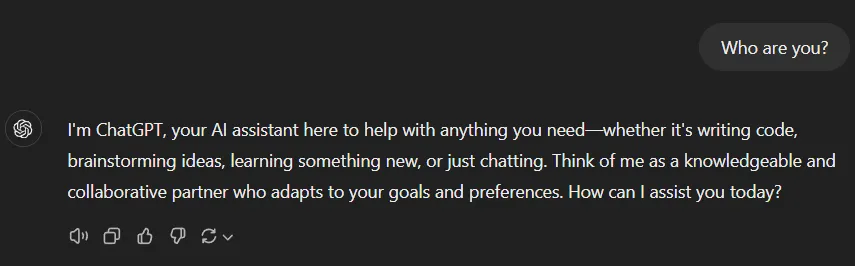
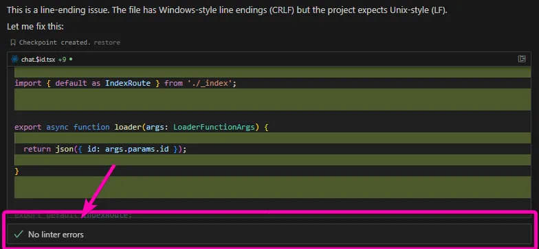

I, along with every other coder on the planet right now, am starting to heavily leverage agentic coding tools in our day-to-day work. Whether it's standalone tools like [bolt.new](http://bolt.new), [v0](https://v0.dev/), [Lovable](https://lovable.dev/), or those built directly into our IDEs like [Cursor](https://www.cursor.com/), [Windsurf](https://codeium.com/windsurf) and [Copilot](https://github.com/features/copilot), they are rapidly becoming indispensable.

[I recently joined Convex](https://mikecann.blog/posts/hello-convex) and immediately began investigating how these tools could work optimally when combined with [Convex](https://convex.dev/). During [some of this recent work](https://stack.convex.dev/6-tips-for-improving-your-cursor-composer-and-convex-workflow), I had a revelation that I [captured in this tweet](https://x.com/mikeysee/status/1872481285945586063). I'd like to expand on that a bit here.

# Knowing what you don't know

Lets do a quick experiment. Think about some really complex topic right now, like [quantum chromodynamics](https://en.wikipedia.org/wiki/Quantum_chromodynamic) or [CRISPR gene editing](https://en.wikipedia.org/wiki/CRISPR_gene_editing). Now how sure are you could explain how one of these topics to someone? 

You aren't sure right? You can be pretty confident that you don't know enough about that particular complex topic.

LLMs fundamentally cannot do this, they cannot know what they don't know. They are simply mechanistic token predictors. 

That doesn't mean that the model's structure hasn't formed in a way that resembles human memory, with unfathomably complex relationships between ideas and concepts. These intricate connections are precisely why models excel at predicting the next token and generating outputs that mirror human output.

The key issue is that they cannot do something humans find effortless and natural: being uncertain about things. 

Being uncertain requires more than just predicting future tokens, it demands self-introspection and reflection. Self-introspection, by definition, requires having a concept of "self".

This isn't to say that LLMs can't create an illusion of self-awareness, but they're merely reflecting their system prompts.

LLMs could potentially introspect themselves, I discuss this below in the section on Mechanistic Interpretability, but I argue this would fundamentally differ from human self-reflective introspection.

Simply increasing model size (from GPT-2 to GPT-3 to GPT-4) doesn't solve the "knowing what you don't know" problem. While it may reduce certain types of mistakes, the core mechanism remains the same: predicting the next token.

# Why is knowing what you don't know important for agents today?

As mentioned in the intro, I've been investigating how well Cursor's Composer works with Convex coding. A significant issue is that the large models (Claude and GPT4) have incomplete knowledge of Convex. This leads to frequent hallucinations in their output, they confidently produce incorrect solutions, using wrong imports or completely fabricated API surfaces.

[RAG](https://stack.convex.dev/6-tips-for-improving-your-cursor-composer-and-convex-workflow#2-add-a-convex_instructionsmd) and [Cursor's Docs](https://stack.convex.dev/6-tips-for-improving-your-cursor-composer-and-convex-workflow#1-reference-the-convex-docs) features help fill these knowledge gaps, but this only treats the symptoms rather than the root cause. If the agent could recognize its own knowledge gaps, it would either ask humans for more context or seek out that information itself, instead of confidently providing incorrect answers.

# Why is knowing what you don't know required for AGI?

Artificial General Intelligence (AGI) itself doesn’t have a universally agreed-upon definition. But most people would agree it involves some level of reasoning across multiple domains and resembled “human-like” intelligence. 

I would argue that to provide human-like intelligence the hallucination problem needs to be solved and the only way that can be solved is if it is able to know exactly when it hallucinated or put another way, its able to know when it doesn't know.

Cursor’s composer has a “linting” step that it runs after it generates a code artifact.

This helps the agent identify many common issues with hallucinated outputs but is obviously very specific to the coding domain and doesn't apply to most other disciplines that LLMs can be applied to.

# Is the solution Mechanistic Interpretability?

Anthropic has been making some [really great contributions](https://www.anthropic.com/research/mapping-mind-language-model) towards trying to understand how exactly LLMs work. 

Anthropic's work has mostly been concerned with LLM safety, but as I have outlined above, I think this work will be key for future AGI. The model needs to be able to introspect itself to understand what it does and doesn't know.

This form of mechanistic introspection differs from human introspection, we don't examine our individual synapses to determine our knowledge. Instead, we have a more "fuzzy" kind of introspection that lets us look back through our memories and experience a "feeling" of certainty.

# Are emotions important?

I think emotions may play a crucial role here, something I haven't seen widely discussed but have long suspected. 

Why do we possess such a diverse range of complex emotions, and what purpose do they serve?

I have a pet theory that emotions help us synthesize vast amounts of memories and experiences. They create an abstracted layer above our individual experiences, enabling quick responses to specific stimuli or thoughts.

This abstraction lets us "feel unsure" about a topic instantly, rather than having to exhaustively search through every relevant memory and experience, a process that would be both time-consuming and energy-intensive.

If this theory holds true, could emotions be essential for developing true AGI?

# Tool use

One might argue that when an AI uses a tool like "search the web," it indicates the model recognizes its knowledge gaps. However, I argue this is merely another form of token prediction.

The model has been prompted (by the user or system) to use the "search web" tool when specific patterns trigger that action as the most probable next step. Yet this cannot truly represent "using web search when you don't know the answer" because the LLM fundamentally cannot recognize its own knowledge gaps.

One can imagine a scenario however where a “tool” might be the ability for the model to introspect its own weights and via mechanistic interpretability analyze its own knowledge at the neuron level to determine if it “knows” something. 

# Conclusion

I may well be completely off-base with all of this and am very happy to be proven wrong so please do drop me a comment below or reach me [on X](https://x.com/mikeysee) or elsewhere if you want to chat more about this fascinating topic.