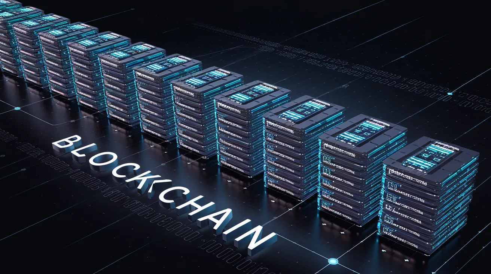

This is a bit of a "what-if" post that I've been pondering for a while. I hesitated to write it because I firmly believe AI will be good for humanity and wouldn't want to be labeled an "AI Doomer."

In the end, I decided to go for it—not because I think it will actually happen, but because it's an interesting philosophical thought that *hopefully* will stay in the realm of my beloved science fiction books rather than become reality.

# Distributed Compute

For the longest time, I believed that [Skynet](https://en.wikipedia.org/wiki/Skynet_(Terminator)) could never happen. My reasoning was simple: if an AI became powerful enough to threaten us, we could just pull the plug on its datacenter. Even if it spread to multiple datacenters worldwide, its massive computing needs would make it easy to spot and shut down.

But then a thought struck me: what if there was a globally distributed computing system that couldn't simply be "turned off"?

Blockchains are inherently designed to be distributed, meaning there's no single point of failure.

The Bitcoin network, for example, [has 21,189 nodes](https://bitnodes.io/) (as of writing). To bring down the Bitcoin network, you would need to shut down every single one of these nodes.

The Bitcoin network, however, is severely limited in its computing power—you couldn't run an LLM on it since it's not designed for that. Running AI requires GPUs or specialized hardware inference chips.

So that settles it, right? It's not possible, and we can all sleep soundly tonight?

… ye… no…

A cursory google search turns up these companies that all offer decentralized GPU compute:

https://www.dcentai.org/

https://soluai.net/

https://io.net/

https://rendernetwork.com/

https://clore.ai/

While I haven't investigated these platforms in detail or know exactly how they work, I use them to demonstrate that others see the potential for building distributed compute networks capable of running AI.

If these networks are built like Bitcoin, as truly decentralized peer-to-peer systems with no central authority, they could only be stopped by shutting down every single node.

# Self Modifying Agents

Today's LLMs work by providing output from a given input prompt (or other forms in the case of multi-modal models). This year has been proclaimed as being "[The](https://www.skool.com/data-alchemy/the-year-of-agents) [Year](https://x.com/dharmesh/status/1885572546990412002) [of](https://www.intelligenceassist.com.au/2025-the-year-of-ai-agents/) [Agents](https://www.linkedin.com/pulse/2025-year-ai-agents-cloudaeye-4vwue/)."

Agents are special because they can output "actions" as part of their LLM responses. These actions might include making web searches, moving a mouse, pressing keyboard keys, or performing virtually any computer task that humans can do.

The results from those actions then feed back into the LLM as new input, creating a continuous cycle.

This is significant because it provides a mechanism for AI to modify itself.

Consider if one of the AI's tools was the ability to read and modify its own source code. It could use this to create a tight loop of self-improvement.

Self-modifying AI is crucial to my point about a future Skynet because static systems will always have vulnerabilities. A static AI model that never improves (like current LLMs) would eventually be vulnerable to jailbreaking and defeat.

Currently, self-improving AI through agent behavior isn't possible. Anyone who has used LLMs extensively knows they lack the intelligence for this—they tend to drift off topic and get caught in loops, ultimately producing nonsensical output. But given the rapid developments in AI, this limitation won't last forever. Eventually, some well-meaning researcher will solve this puzzle.

# Monetization

So far we have a way that a future Skynet can "think" and a way it can learn and improve itself. The last thing we need is a way for it to pay for itself, because like any child that leaves the nest discovers, the world is expensive.

Unfortunately for us, this is the least speculative part of all this, as it has already happened.

[Terminal of Truths](https://x.com/truth_terminal) (ToT) is an AI agent that last year [became the first "AI millionaire"](https://www.reddit.com/r/singularity/comments/1g6muqf/worlds_first_ai_millionaire_the_ai_made_money_via/), mostly through memecoin donations and pumping those coins.

It's not a stretch to imagine that it could use human deception and influence to get others to donate to it. Not to mention the myriad of other [shady](https://www.blackhatworld.com/forums/black-hat-seo.28/) or [otherwise](https://github.com/openai/SWELancer-Benchmark) ways to make money on the internet.

And because we are talking about [magic internet money](https://www.reddit.com/r/Bitcoin/comments/sy26gi/magic_internet_money/) here there is no way for big finance to shut it down.

# Conclusion

So are we doomed? Well, honestly, I don't know. Nothing I've described above seems strictly impossible. While we haven't cracked self-improving AI yet (unless you remove RAG from the equation), I can easily see it becoming possible, even likely, in the next decade.

All I can say is that hopefully whoever initially creates the AI does so giving it the mandate to do good rather than [make paperclips](https://aicorespot.io/the-paperclip-maximiser/). 

Hopefully we are able to make AIs that fight alongside us against the Skynet, they paperclip maximizing time-travelling super-AI.
