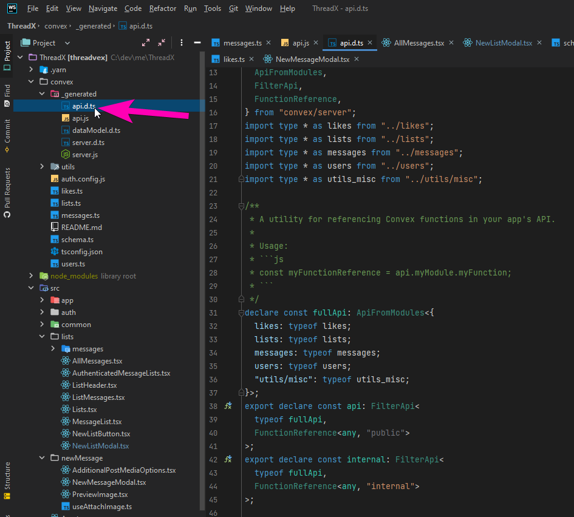
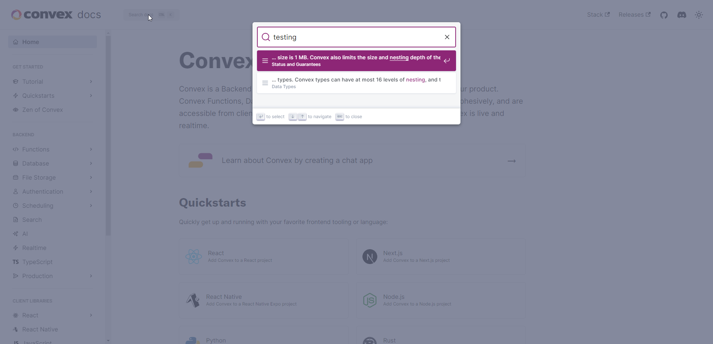

---
coverImage: ./header.jpg
date: '2023-08-04T08:31:40.000Z'
tags:
  - tinkering
  - convex
  - typescript
  - projects
  - BaaS
title: Tinkering With Convex
---

As a serial tech-tinkerer I knew I wasnt going to be able to resist the pull of [Convex](https://convex.dev) a new powerful Backend as a Service (BaaS) platform. So after reading the docs I dove in and a day later I had a working Threads / Twitter / X - like clone with realtime likes, replies and dynamic searchable lists!

# What is Convex?

[Convex](https://convex.dev) is a "Backend as a Service" (BaaS) platform similar to [Firebase](https://firebase.google.com/) or [Parse](https://parseplatform.org/) both of which I have been a fan of in the past but both of which have some fairly major shortcomings.

If you are interested in some of the specifics of the platform I strongly suggest checking out their [rather excellent docs](https://docs.convex.dev/home).

I personally find that I learn best by implementing something. So I started to wonder "what app should I build to test Convex?".

Then it hit me, why not build a Twitter clone. It has the requirement that you have realtime incoming messages, likes and other features and it can stretch the full-text searching and image uploading capabilities.

But Twitter clones are so 2006. This is 2023 so instead I built.. a Threads clone.. And because Twitter is now called X, thus "ThreadX" was born.

# Demo

So after a fun 8 hours of solid tinkering I had an application. Its a little rough around the edges but you can see it in action here:

<iframe width="853" height="480" src="https://www.youtube.com/embed/kTYDdVEg1us" frameborder="0" allow="autoplay; encrypted-media" allowfullscreen></iframe>

If you want to play with it yourself you can find the application at: [https://threadx-app.netlify.app/](https://threadx-app.netlify.app/) and the source for the project at: [https://github.com/mikecann/ThreadX](https://github.com/mikecann/ThreadX)

# Things I love

There is so much to love with Convex, here are some of the things that I like the most:

## Speed of development

Its so fast to build with Convex!

The demo app I built above (ThreadX) took me less than a day to put together and a whole bunch of that time was spent fighting with UI libraries (why I ever strayed from the trusty ChakraUI I dont know) and flexbox. If I didnt bother styling it it would have been done much sooner.

Because Convex is a bundler, API layer, server-side route handler, database AND client-side query handler then you get incredible synergies from all of that.

For example here is the server-side mutation to send a message:

```ts
export const send = mutation({
  args: {
    body: v.string(),
    imageId: v.optional(v.string()),
  },
  handler: async ({ auth, db, storage }, { body, imageId }) => {
    if (body.length > 1000) throw new Error("message too long");
    if (body.length < 5) throw new Error("message too short");
    const user = await getMe({ auth, db });
    await db.insert("messages", {
      body,
      authorId: user._id,
      likes: BigInt(0),
      replies: BigInt(0),
      imageId,
    });
  },
});
```

Then 7 seconds later Convex has checked and built the function and generated an API for me to call it


```tsx
export const NewMessageModal: React.FC<Props> = ({ isOpen, onClose }) => {
  const sendMessage = useMutation(api.messages.send);

  const onSend = () => {
    sendMessage({ body: text, imageId: storageId })
      .then(() => setText(""))
      .catch(onNonCriticalError);

    onClose();
  };

  return (
    <Modal isOpen={isOpen} onClose={onClose} size={"lg"}>
      ...
      <Button
        css={{ transition: `all 0.2s ease` }}
        color={"gradient"}
        isDisabled={!text || isUploading}
        isLoading={isUploading}
        onClick={onSend}
      >
        Post
      </Button>
      ...
    </Modal>
  );
};
```

(shortened for brevity)

I cant overstate how good it feels to be able to go at this speed AND know that everything is scalable and ACID.

## Realtime updates

I have spent A LOT of time thinking about and coding up various realtime systems for both [BattleTabs](https://mikecann.blog/posts/battletabs-in-7-minutes) and other projects and let me tell you, its never simple and never "just works". There are ALWAYS caveats and issues.

Some problems I have encountered in the past:

1. It works with individual entities, but doesnt work queries that involve lists of entities.
2. [Its very inefficient / expensive](https://supabase.com/docs/guides/realtime/quotas)
3. [How do you scale](https://elixir-lang.org/blog/2020/10/08/real-time-communication-at-scale-with-elixir-at-discord/#:~:text=Starting%20technologies,while%20Python%20powered%20their%20API.) and maintain a massive list of websocket connections?
4. [It only works at the "application"](https://wundergraph.com/blog/deprecate_graphql_subscriptions_over_websockets) level so any other changes to the database (dashboard, migrations, other changes) arent captured.
5. [How do you have](https://the-guild.dev/blog/subscriptions-and-live-queries-real-time-with-graphql) a clean [developer experience](https://firebase.google.com/docs/firestore/query-data/listen) for this?

So I was exited that with Convex I could simply write this on the server:

```ts
export const listAll = query({
  args: {},
  handler: async (context) => {
    const me = await findMe(context);
    const messages = await context.db
      .query("messages")
      .filter((q) => q.eq(q.field("isReplyToMessageId"), undefined))
      .take(10);
    return convertToDetailedMessage({ ...context, messages, me });
  },
});
```

and this on the client:

```ts
import * as React from "react";
import { useQuery } from "convex/react";
import { api } from "../../convex/_generated/api";
import { Spinner, VStack } from "@chakra-ui/react";
import { ListListsDoc } from "./AuthenticatedMessageLists";
import { Message } from "./messages/Message";

interface Props {
  list?: ListListsDoc;
}

export const AllMessages: React.FC<Props> = ({ list }) => {
  const messages = useQuery(api.messages.listAll) || [];
  if (!messages) return <Spinner />;
  return (
    <>
      {messages.map((message) => (
        <Message key={message._id.toString()} message={message} />
      ))}
    </>
  );
};
```

🤯

This is the perfect developer experience in my opinion. You just declare the data you want in a simple to understand query and the platform takes care of the rest ensuring that "messages" is updated whenever there is something new or updated.

Critically this also works for queries that reference other documents (JOINs). So if one of those joined documents changes then the parent query is "invalidated" and updated.

## Flexible type-safe database schema

Over the [many](https://mikecann.blog/about) years of my development career I have worked with quite a few different databases.

I started off with MySQL and MSSQL then hopped on MongoDB when NoSQL was all the rage then migrated over to Postgres when the sugar-high wore off. In-between I used hosted DBs like Parse, DynamoDB and Firebase too.

NoSQL databases were fun and scalable but I found that I ended up creating layers of abstraction around my database to enforce a "schema". I was basically re-creating a relational table structure on top of NoSQL which seemed crazy. So I made the leap to Postrgres which had the best of both, relational tables AND JSON columns.

Postgres and other relational databases aren't perfect however and between scaling, cost and migrations I always found myself getting frustrated. [Prisma](https://www.prisma.io/) helps speed up development but is still far more rigid than a NoSQL DB.

One issue that always frustrated me with the rigid table structure of relational DBs was the lack of ability to declare "kinds" of rows in the table.

For example in my demo app "ThreadX" a user can add new lists of messages.


Okay, so if you were designing a schema for a DB how would you structure this?

Simple you might think. We just have a table `List` where each row contains a single list with some columns on it such as "name" and "ownerId".

Now imagine how a product like ThreadX might develop over time..

Management comes to you and wants to allow the user to create different "kinds" of lists. They want to have lists that allow users to filter messages by a given search term.

This is pretty simple to do in the UI, we just add a radio button that lets us select what "kind" of list we want to make.


This is really easy to model in Typescript simply as a union:

```ts
type List =
  | {
      kind: "all_messages";
      ownerId: string;
      name: string;
    }
  | {
      kind: "search";
      ownerId: string;
      name: string;
      query: string;
      includeReplies: boolean;
    };
```

But what about the database? Well now its going to get a bit tricky as Postgres as a relational database doesnt allow us to add or remove columns based on the "kind" of row, instead you have to make some columns nullable and provide nulls for fields that dont exist on that row "kind".

Now imagine we add lots more "kinds" of lists where some properties CAN be null as a value. Now things start to get hairy, managing this is quite a cognitive overhead.

So how does Convex handle this? Well let me show you the schema:

```ts
export default defineSchema({
  lists: defineTable(
    v.union(
      v.object({
        kind: v.literal("all_messages"),
        ownerId: v.id("users"),
        name: v.string(),
      }),
      v.object({
        kind: v.literal("search"),
        ownerId: v.id("users"),
        name: v.string(),
        query: v.string(),
        includeReplies: v.boolean(),
      })
    )
  ).index("by_ownerId", ["ownerId"]),
});
```

As you can see this basically mirrors our Typescript types above which is super cool as it matches perfectly to the way we ideally construct the concepts on the UI side.

When we want to query messages for a list its super simple to pattern match against the list kind, like so:

```ts
export const listForList = query({
  args: {
    listId: v.id("lists"),
  },
  handler: async (context, { listId }) => {
    // ... skipping some stuff

    const list = await context.db.get(listId);

    const query = match(list, {
      all_messages: () =>
        context.db.query("messages").filter((q) => q.eq(q.field("isReplyToMessageId"), undefined)),

      search: ({ query, includeReplies }) => {
        let q = context.db
          .query("messages")
          .withSearchIndex("search_by_body", (q) => q.search("body", query));

        if (!includeReplies) q = q.filter((q) => q.eq(q.field("isReplyToMessageId"), undefined));

        return q;
      },
    });

    const messages = await query.take(10);

    // ... skipping some stuff
  },
});
```

Thanks to the pattern matching provided by [Variant](https://github.com/paarthenon/variant) (BTW I have [talked extensively about my love of this](https://mikecann.blog/posts/discriminated-unions-and-pattern-matching-in-typescript)) and the Typescript compiler, now whenever we add a new "kind" of list the compiler will ensure that we have handled all cases.

Because Convex also supports "optional" types as well as unions in its database schema it makes "migrationless" changes to your database but in a super-safe way thanks to its automatic checking process.

## No messing around with writing your own "API" layer

As you have already seen from my examples above, writing an API on the server that your client can talk to is as simple as simply exporting the return of `query` or `mutation`.



Convex automatically generates the 'API' for you so things stay nice and typesafe at compile time.

Runtime input validation is handled using the same runtime typing system the database schema employs. This is super convenient and powerful:

```ts
export const send = mutation({
  args: {
    body: v.string(),
    imageId: v.optional(v.string()),
  },
  handler: async ({ auth, db, storage }, { body, imageId }) => {
    if (body.length > 1000) throw new Error("message too long");
    if (body.length < 5) throw new Error("message too short");
    const user = await getMe({ auth, db });
    await db.insert("messages", {
      body,
      authorId: user._id,
      likes: BigInt(0),
      replies: BigInt(0),
      imageId,
    });
  },
});
```

Note the `body` and `imageId` "args" types there.

## Transaction guarantees

One of the [big selling points](https://docs.convex.dev/database/writing-data) of the Convex DB is the fact that reads and write are atomic and guaranteed to be transactional.

This transactional nature is something that has bit me personally on several occasions with Postgres.

Whenever you have situations where multiple people could be writing to the same record at the same time or even if you have the same person writing to the same record (on two different devices for example) and you DONT use transactions then you have a risk of your data becoming corrupted.

This might seem like an unlikely thing to happen when you consider a call to change something in the database takes single digit milliseconds but trust me, eventually it will happen. It will likely happen when you start to see an increase of traffic. The result will be unpredictable and almost impossible to replicate bugs.

So the fact that with Convex I can write the following and be 100% sure that I will never have my reply counter on each message get out of sync with the number of replies a message has is a big deal:

```ts
export const reply = mutation({
  args: {
    body: v.string(),
    toMessageId: v.id("messages"),
    imageId: v.optional(v.string()),
  },
  handler: async ({ auth, db }, { body, toMessageId, imageId }) => {
    if (body.length > 1000) throw new Error("message too long");
    if (body.length < 5) throw new Error("message too short");
    const user = await getMe({ auth, db });
    await db.insert("messages", {
      body,
      authorId: user._id,
      likes: BigInt(0),
      isReplyToMessageId: toMessageId,
      replies: BigInt(0),
      imageId,
    });
    const message = ensure(await db.get(toMessageId), `couldnt get message ${toMessageId}`);
    await db.patch(toMessageId, { replies: message.replies + BigInt(1) });
  },
});
```

## Sessions, RLS, Middleware, etc

Convex has a series of [blog posts](https://stack.convex.dev/row-level-security) on the their ["middleware"](https://github.com/get-convex/convex-helpers/) solutions to problems such:

1. [Sessions](https://stack.convex.dev/sessions-wrappers-as-middleware)
2. [Authentication](https://stack.convex.dev/wrappers-as-middleware-authentication)
3. [Data Migrations](https://stack.convex.dev/migrating-data-with-mutations)
4. [Relationships](https://stack.convex.dev/functional-relationships-helpers)
5. [Hono](https://stack.convex.dev/hono-with-convex)
6. [Single-flighting](https://stack.convex.dev/throttling-requests-by-single-flighting)
7. [Stable queries](https://stack.convex.dev/help-my-app-is-overreacting)
8. [Presence](https://stack.convex.dev/presence-with-convex)

Because DB queries are simply JS that is run inside of the DB then all those solutions are actually just implemented in JS (Typescript actually) and so their implementation is really clean and you can imagine coming up with any number of your own.

BTW [this](https://www.youtube.com/watch?v=iizcidmSwJ4) video from the CTO a couple of years ago was super interesting if you want to go a little deeper and understand how this works.

## Automatic caching

[Convex automatically caches](https://stack.convex.dev/convex-vs-relational-databases#caching) reads and because it handles the mutation as transactions and handles reactivity cleanly then it can be relied upon.

This is massive as it means your costs can be reduced and performance improved for read-heavy applications (most of them).

## Cronjobs, File Storage, Full Text Search, Pagination

Theres a bunch of other really cool features that are built into the system that im keen to explore but this post is starting to get a bit long.

Just to highlight one, their [Scheduled Functions](https://docs.convex.dev/scheduling/scheduled-functions) feature seems awesome particularly the [Exactly Once](https://docs.convex.dev/scheduling/scheduled-functions#error-handling) guarantee for mutations.

If you have ever tried to write an event or distributed messaging system before you know how much a headache this this and similar to transactions is prone to edge-cases and hard-to-replicate bugs. So being sure that your mutation is only going to execute EXACTLY once at a future date without some crazy engineering gymnastics is awesome.

# Things I don't love

Its not all sunshine and unicorn poop however, there are some downsides.

## No self-hosted version

Probably the biggest negative is the vendor lock-in from their hosting of the Convex system.

Similar to Firebase there is no self-hosted version, this means should Convex run out of funding or go a different direction to your business then you are out of luck as there is no way you can take your application and either host it yourself or host it on a different cloud provider.

It appears that Convex are very aware of this problem however and have previously committed that they will release a self-hosted version then reaffirmed this commitment in their [v1.0 release post](https://news.convex.dev/convex-1-0/) from the CEO.

## No docs on testing

Unfortunately right now there isnt a lot of docs on to best test a Convex system. They linked to a couple of blogs posts [when I asked about it](https://discord.com/channels/1019350475847499849/1133997021053857993/1133997021053857993) but I would love to have seen some dedicated docs on this topic.



## No aggregate queries such as 'count'

This is more of a technical issue but there are no "aggregate" queries in the database, so this means [its not possible to "count" the number of items in a query without explicitly iterating them](https://discord.com/channels/1019350475847499849/1094081206280274040/1094081206280274040).

This may or may not be an issue due to the way the JS-as-query-language works I havent done enough performance testing to find out. In the case of ThreadX I decided to simply [keep a count of Likes and Replies on each message](https://github.com/mikecann/ThreadX/blob/main/convex/schema.ts#L8-L9) as a "cached" aggregate count.

## Requires internet connection

I already mentioned that there is no self-hosted version of Convex and compared it to Firebase. One other downside of having no local version of your system is that should your internet go down you are no longer able to work on your project.

This infact happened to me when I was working on ThreadX which forced me to go outside and touch grass.. ewww..

## No enforced reference constraints

Unfortunately the schema doesn't enforce reference constraints this means that unlike Postgres you cant "CASCADE" when you delete a row. For example if I delete a message on ThreadX I would also like to delete any likes that might be associated with it.

I understand this might be a challenging thing to do technically and there are work arounds so _shrug_ its probably not that big of a deal.

It may also be solvable using [the relationship helpers](https://stack.convex.dev/functional-relationships-helpers).

## External Auth provider via Clerk

The [Convex docs on Authentication](https://docs.convex.dev/auth) are great but I cant help wishing that Auth was built into Convex itself to reduce the complexity of having to manage a third-party service and then the headaches with having to "sync" my User object from Clerk over to Convex.

Implementing it in [ThreadX](https://github.com/mikecann/ThreadX/blob/main/src/auth/useStoreUserEffect.ts) wasnt too bad but it could have been smoother.

Jamie the CEO of Convex [also mentions at the bottom of his v1.0 post](https://news.convex.dev/convex-1-0/) that they are hoping to bring Auth in-house which would be fantastic.

# Things that im not sure on

There are a couple of things im not 100% sure on if they are good or bad, time will tell.

## Pricing

Convex [recently reached version 1](https://news.convex.dev/convex-1-0/) and with it they changed their [pricing structure](https://www.convex.dev/plans).

Before they had a much simpler pricing structure but at the same time [I had concerns that the old plan didnt incentivize the right things](https://discord.com/channels/1019350475847499849/1132904064179511317/1132904064179511317).

The new plan is significantly more complicated but I think is good as it puts more concrete limits to prevent people abusing the system and making things worse for everyone else.

Their $2 per 1,000,0000 function calls (above the 25,000,000 you get with your $25 per month plan) does seem a little high however if you compare it against Cloudflares $0.5 / $0.15 per 1 million or Firebase's $0.4 per 1 million.

Convex is however doing a lot more work for each function call and is likely wrapping up the cost of other services in that price such as the cost of maintaining open websocket connections to every single connected client which cannot be cheap and isnt mentioned anywhere on the pricing.

# Conclusion

Ultimately for me the benefits of the platform vastly outweigh the negatives for the kinds of projects I tend to build. It solves many of the issues I have encountered in the past and provides the flexibility that I know it will be able to handle my future requirements.

Im really happy with the ecosystem that the company is building and the rapid pace of innovation. The [CEO Jamie and CTO James](https://discord.com/channels/1019350475847499849/1132904064179511317/1132904064179511317) are very hands-on answering support questions on their Discord which is always as very positive sign in a company.

So I think in the future you will be seeing more projects from me running on Convex :)
