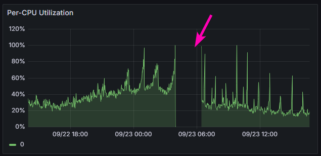
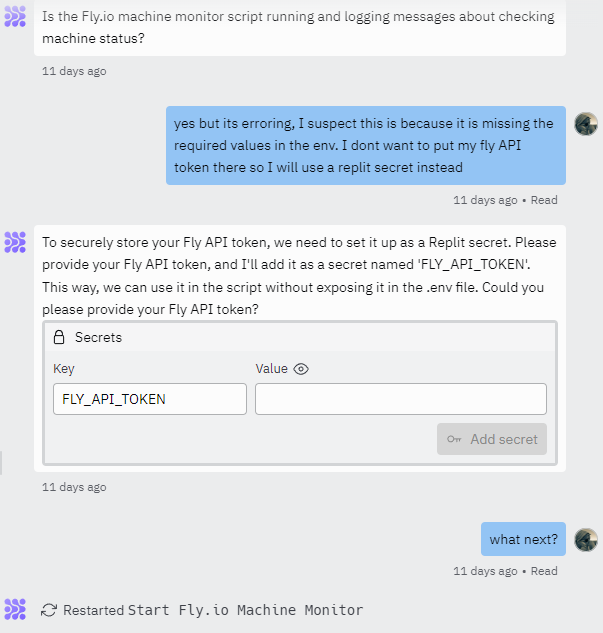

I recently took a much-needed vacation to an exotic location. While I was away I was keeping a close eye on the [BattleTabs](https://battletabs.com/) servers given [our recent global launch](https://mikecann.co.uk/posts/battletabs-global-launch-on-discord-activities) things were still a bit unstable and traffic was continuing to increase. 

One issue was that despite all my best efforts our worker server was still regularly shutting down and not coming alive again.

This generally happened at points of peak load and usually when I was in bed (typical). The result is chunks of the game wouldn't work or would work in unexpected ways. 

This technically should not be possible as Fly.io's machines have [an auto-start / stop feature](https://fly.io/docs/launch/autostop-autostart/) that should ensure that at least one machine is running at any time. 

As I was away I didn't have time to debug the root cause of the issue while I was away I decided the simplest thing to do was write a script that would continually check if the worker server was alive and if it wasn't then start it.

I knew that this script would need to be online all the time so I started to think about how to host it. I could have easily done it using my favorite hammer in the toolbox, [Convex](https://mikecann.co.uk/posts/im-now-a-convex-developer-advocate), but I had heard about the recently released [Replit Agents](https://docs.replit.com/replitai/agent), so I thought why not give that a go?

# Replit Agents

If you are not familiar with Replit Agents here is a quick primer:

<iframe width="853" height="480" src="https://www.youtube.com/embed/IYiVPrxY8-Y" frameborder="0" allow="autoplay; encrypted-media" allowfullscreen></iframe>

The idea was to use their AI to generate my script and host it on Replit. It should be a fairly simple script and thus hopefully a fairly simple isolated task for the AI..

I hadnt used Replit before and my initial impressions was good. I was very impressed with the UI. It felt like a cut down code editor but with the agent chat on the side taking up a large chunk of the UI to let you know that this is a sort of "pair programming" type of workflow.

I started out with what I felt was a pretty clear prompt (see above image) and was happy to see that the agent was able to easily scaffold out the start of the project with a bunch of file.

After it had generated the files it asked me if it worked. It unfortunately didnt however so it took me digging through the code and a bit of guesswork to try to work out what was going on.

It probably would have been better that it worked out this issue by itself but I was impressed to see that they had a little inline UI for adding an environment variable, I thought that was a nice touch.

This is unfortunately where things went of the rails a bit. The AI continued to make a lot of mistakes both architecturally and logically which required quite a few prompts on my part to sort out.

Eventually I had what I thought should work but was still getting errors. I eventually tracked down what was going on. The issue stemmed right back from the first prompt the AI was using a very out of date endpoint URL for the API.

After letting it know it was able to fix the problem and I finally had a working API call. 

As a side note I was impressed that Replit has a git integration and the AI made regular "checkpoint" commits as it went along.

With it working I now wanted to have it run itself every 5 minutes. This cloud hosting and cron functionality is one of the core functionalities of Replit so I thought this should be pretty simple for the Agent.

I was super confused at first as it directed me towards a "Always On" feature that doesn't seem to exist in Replit (any more). When I pointed it out to the Agent it even told me to use another service to run the cron! 

I had to manually read through the Replit docs before I worked out how to do it myself in the UI.

With that my script was up and working, checking the worker every 5 minutes. 

# Conclusions

I really like the Replit Agents UI. I think they have done a great job with how it all looks and works. The functionality of Replit itself is also great and I will definitely be keeping it in mind next time I need a quick and dirty project.

The AI however just makes way too many mistakes right now for me to recommend. Even my simple script I had to go in and manually correct on multiple occasions. 

I will however continue to monitor how this develops as this way of developing software projects feels very much like the way things are going to go.