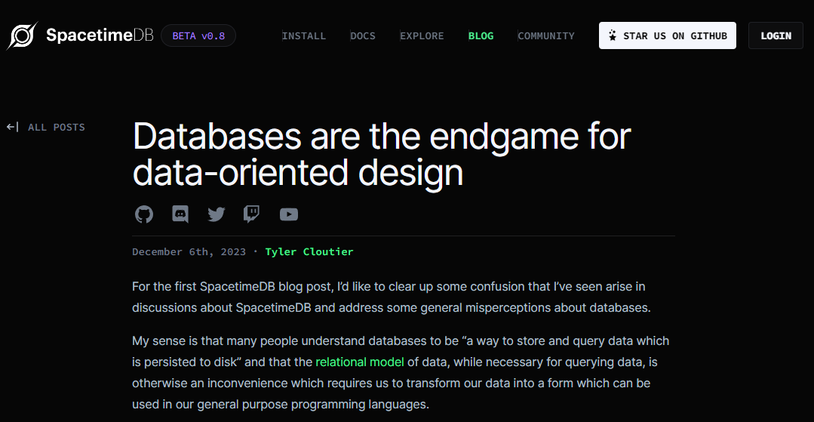
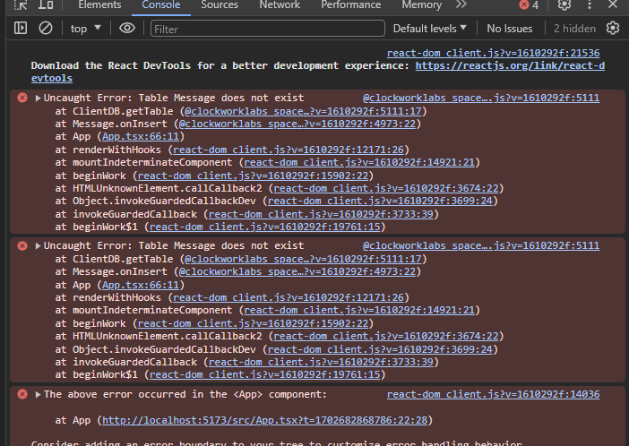
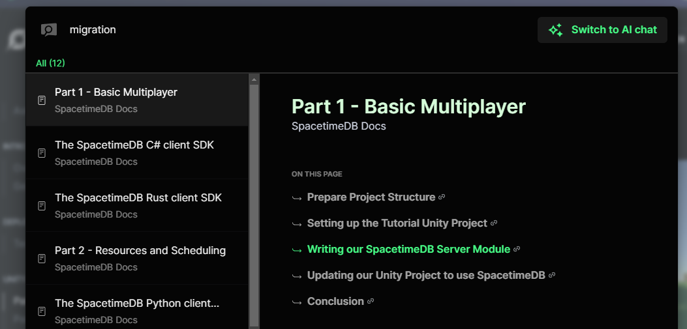

This is going to be a bit of an unusual post as it details a failed tinkering project.

I still want to write it however as I think its an interesting project that has promise and also has some relevance to my [recent](https://mikecann.blog/posts/chatter-craft-collaborative-art-with-just-your-voice) wo[rk wi](https://mikecann.blog/posts/tinkering-with-convex)th [Convex](https://mikecann.blog/posts/im-now-a-convex-developer-advocate).

# SpacetimeDB

What is [SpacetimeDB](https://spacetimedb.com/)? Well it touts itself as a "next generation serverless database."

It grabbed my attention earlier this year as it was focused on game development which is squarely in my wheelhouse.

The basic concept is illustrated in this rather rambling (and a little confusing) blog post: https://spacetimedb.com/blog/databases-and-data-oriented-design



In summary they are aiming to create a realtime database that is a bit like ECS, but as (they argue) ECS can be thought of as a subset of a more traditional relational model, SpacetimeDB can be thought more of as a relational database.

So effectively think of it like Postgres but with some fancy sugar that makes it easier to work with.

In some respects this sounds a bit like convex except for that "realtime" part.

Convex is both an "application" layer and a "database" layer merged together combined with a bunch of developer-facing sugar that makes it great to work with.

The key difference between Spacetime and Convex is that spacetime is designed for stateful "realtime" applications (like games) whereas Convex is primarily a stateless serverless platform. It is possible to do things realtime-ish but as Convex [charges per function invocation](https://www.convex.dev/plans) it would get expensive really fast if you attempted this at scale.

# Pricing

This brings up the topic of SpacetimeDB pricing. Well its currently not mentioned. They have an open-source version of the platform that you can run locally (and presumably self-host) which is nice but if you dont want to mess with servers then they are going to offer a hosted version as is the database business model in vouge at the moment.

If I had to guess it probably wont be cheap to run, they might not even offer a free tier. Running multiplayer game servers has never been particularly cheap due to the high framerates combined with complex processing (such as physics) required.

# Tinkering

So onto the tinkering!

I had the idea I would build a realtime shared-cursor app where you can see everyone else's cursors move around perhaps click the screen and see pretty fireworks or particles or something. Very simple but should hopefully test some of Spacetime's features.

Before I get there however I felt it probably best to start with the quick-start tutorials and unfortunately this is where the troubles began.

You can develop the server-side component of your application in one of two languages, either Rust or C#. [Given my background](https://mikecann.blog/tags/c%20sharp) C# was the natural choice for me.

After copy-pasting the code (no ready-to-go example project unfortunately) from the [C# Quickstart](https://spacetimedb.com/docs/modules/c-sharp/quickstart) and running the `publish` command that pushes the built code to the locally running Spacetime platform I was greeted with the following error:


Unfortunately I couldnt work out what this meant so I headed over to [their discord](https://discord.gg/SpacetimeDB) and posted about my issue. After a bit of back and forth of not fixing it it was suggested that I wait a few days for someone to look at it.

Sure enough a few days later they had [issued a patch](https://discord.com/channels/1037340874172014652/1134597033613869207/1183780061686546493) and the publish command now worked.


Okay so now with the C# project in theory published I attempted to test it using their CLI:

```
spacetime call spacetime-sandbox send_message '["Hello, World!"]'
```

Unfortunately I now got a different error.


I decided to move on, hopefully this was just a CLI issue I thought.

So I started a new [Vite project](https://vitejs.dev/) to get the client-side of the project working.

Spacetime provide client-side SDKs for a number of platforms: Typescript, Python, C# (Unity) and Rust. Although I suspect the most common usecase would be Unity or Rust I thought I would give Typescript a go as I have been using it most lately and I felt I would be able to debug any issues pretty quick.

So I started with the [Typescript Quickstart](https://spacetimedb.com/docs/sdks/typescript/quickstart) and unfortunately again they dont provide a ready-made example project so I went through and manually copied and pasted all the code as they described.

Unfortunately there were many issues in the provided code from non-idiomatic Typescript (use of `let` instead of `const` for example) and poor React structure (they suggest putting everything in a single component without any usage of Context or hooks) to simply not working example CLI commands (`--project_path` instead of `--project-path`).

The code required a lot of massaging but I think I had it all right, compiler issues fixed etc and attempted to run it.

I was now greeted with a new set of runtime errors in the console:



Sigh. I suspect this might be something to do with the HTTP issue that I saw above.

I posted the problem to the discord once again but have yet to have a solution.

Just incase it was something to do with my local setup I decided to have a go and see if I could publish to their testnet which is their hosted version of the platform.

Unfortunately the [docs on the testnet page](https://spacetimedb.com/docs/deploying/testnet) were also not working as they say you should use the `spacetime server set "https://testnet.spacetimedb.com"` command but the CLI errors when you attempt this.

In fairness when I reported this to discord user "⚙ 3Blave" very quickly updated the docs so that it now reads `spacetime server add --default "https://testnet.spacetimedb.com" testnet`

So now you have to login to the spacetime testnet by calling `spacetime identity set-email <your-identity> <your-email>` but this command needs your `identity` which you get from `spacetime identity list` which again errors with:


When I try to manually get my identity from the spacetime website (https://spacetimedb.com/login) I am greeted by a box that asks for my login email but nowhere to "signup" which is really strange. And when I attempt to put in my email I get another error.


Quite frankly I was out of patience at this point and decided to end the tinkering here.

# SpacetimeDB Issues

I had planned to test out these things and make sure they were indeed issues before I wrote about them but as I was unable to get the code working correctly I only have reading the docs to go on. Apologies if I am off with any of these.

## Authorizations / Row Level Security

The first big issue I noticed with Spacetime is there is no concept of "Authorization" or "Row Level Security" that is there is no way that some information can be private from other users.

This is obviously critical for most (if not all) games. You need to hide some information from other players. For example in [BattleTabs](https://mikecann.blog/posts/battletabs-in-7-minutes) each player hides their ship positions from each other until the end of the battle, without this players could cheat by looking at the data that the server sends down or could directly issue queries to the database and retrieve that information.

When queried about this on discord I was informed that [that is indeed coming](https://discord.com/channels/1037340874172014652/1134597033613869207/1183210861700055150) and that there is a concept of "Private Tables" that you designate by prefixing your table with an underscore.

Without any docs on this im not sure exactly how this would work in a real game and how much work this might be for the user to implement.

# Migrations

I could find no mention of how DB migrations are supposed to work in their docs (despite their AI docs search assuring me there are 12 references)



This to me is one of the MAJOR benefits of the way convex works you can very easily migrate your database by [changing the schema definition](https://docs.convex.dev/database/schemas) which then validates every single document in the the DB. This is a far more flexible way of structuring your tables than traditional relational databases but still ensuring the strong relational structure and type-safety enforced by your schema.

Im not exactly sure how SpacetimeDB works under the hood but they talk about replaying a Write Ahead Log, so im interested to know how you would go about evolving your schema over time

# Physics

I have big questions around how you would integrate this in a Unity project that requires server-authoritative physics or other game-engine features. Perhaps you are expected to implement those yourself? Perhaps you are supposed to run Unity headless server instances in parallel and query those from Spacetime?

Open questions for next time.

# Conclusion

This post is getting quite long and is getting quite negative. I dont want it to come across that way, I think SpacetimeDB is an interesting technology and is in a niche (realtime relational database targeted at game developers) that is very interesting to me.

I just feel like perhaps its a bit too early for the project and it needs to bake for a good while longer before its ready for further tinkering.

Keen to hear what you think if you have experimented with Spacetime, leave me a comment below :)
