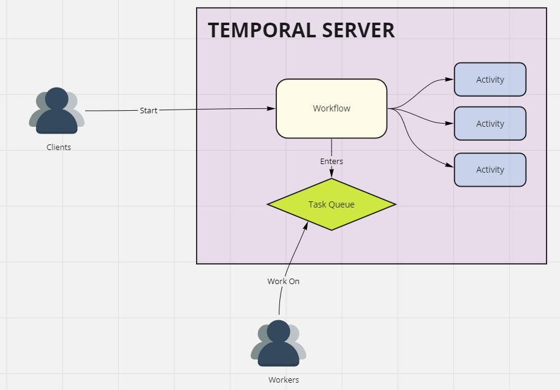
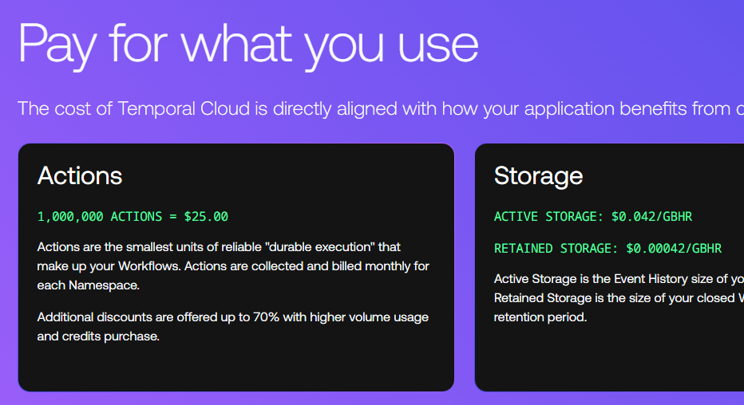

I have been meaning to tinker with Temporal for quite some time now as it intersects some of my interests: [Event Sourcing](https://mikecann.co.uk/posts/serverless-databaseless-event-sourcing), [durable execution](https://mikecann.co.uk/posts/tech-to-tinker-with-in-2022) and [cool application architectures](https://mikecann.co.uk/posts/tinkering-with-convex).

# What is Temporal

From their [website](https://temporal.io/):

> Durable Execution is a development abstraction that preserves complete application state so that upon host or software failure it can seamlessly migrate execution to another machine.

What does that mean exactly?

Well from a coder's perspective it means you can define "Workflows" in Typescript such as:

```ts
export async function SubscriptionWorkflow(email: string, trialPeriod: string | number) {
  await sendWelcomeEmailToUser(email);
  await sleep(trialPeriod);
  await sendSubscriptionEndedEmailToUser(email);
}
```

Temporal will ensure that this function continues to exist even if the server that runs it shuts down. When the server starts up again its able to resume from the correct location. This is what makes it "Durable".

Temporal is also able to handle errors and retry the steps in the Workflow if they error.

If this doesn't immediately strike you as something impressive just think hard about what would be involved when resuming a function's execution at any arbitrary point after the fact then consider throwing in non-deterministic state such as DateTimes and Random numbers.

# Exploring Temporal

My goal with any "Tinkering" I do is to simply try to understand a little more about the technology, hopefully enough that I can form an opinion about it.

The place I tend to start with any new tech is [the docs](https://docs.temporal.io/) and Temporal's is certainly thorough.

I began with environment setup which included the Temporaral CLI and their local running service which even comes with a nice WebUI to display your Workflows:

[](./webui.png)

After reading through the first few pages on the docs I think I could summarize the key structure and terms with the following diagram:

[](./diagram.png)

Clients start Workflows which can contain a number of Activities. Workflows then enter a Task Queue which Workers pull from and execute.

If activities fail then they can be retried an infinite (configurable) number of times.

Every "[Action](https://docs.temporal.io/cloud/pricing#action)" that the system takes (starting a workflow, running an activity, signals, queries etc) is an event which is recorded within the system which is then recorded against your workflow so you can view exactly what happened and when:

[](./events.png)

## Event Sourcing

Its worth taking a little tangent here to talk about another application architecture [dear to my heart](https://mikecann.co.uk/posts/serverless-databaseless-event-sourcing); [Event Sourcing](https://martinfowler.com/eaaDev/EventSourcing.html).

I wont try to explain all of Event Sourcing here, I have spoken about it a few times before on this blog and there are lots of good deep-dives out on the web.

The basic idea however is that your entire application should be described with immutable events. To get the current state of your application you fold / reduce your events down to a state. So as a quick example you might have a "UserCreated" event which contains the users name "dave". Then later dave decides to change his name to "davina" on the UI, so the system triggers a "UserChangedName" event.

Because we record all the events in the order that they were generated and each event is immutable we can always reconstruct the current state of the user at a later date and see exactly what led to that state.

This state reconstruction is called "Projection" in Event Sourcing terminology and is a fundamental part of Event Sourcing.

Now suppose you want to model a "Process" such as the example Temporal Workflow that I showed at the start of this post.

1. You might start with the user clicking a button, this will then create a "UserTrailSubscriptionStartRequested" event.
2. Then a "Process Manager" might pick that event up, send the user an email and emit a "UserTrialSubscriptionStarted".
3. It could also setup a timer such that after the trial period has ended a "UserTrialPeriodEnded" event is fired.
4. The Process Manager could detect that event then sent the user another email to let them know their trail has ended and emit a "UserTrialSubscriptionEnded"

Note what I have just outlined above with "Process Managers" is exactly what a Temporal's "Workflow" is doing except with a nicer developer experience.

Temporal is using some clever build-time tooling to ensure that Activities within a Workflow are effectively the entry points when an event occurs. Because the side-effects are constrained to Activities we can replay a Workflow to resume a paused state.

# Why?

So a good question is why would you want to do this? Well there are many kinds of applications (finance, health, military, industry etc) where you really really want to be sure that something happens and you want to have a really clear record of exactly what happens and potentially reconstruct what happened.

Event based architectures such as Event Sourcing and Temporal let you do that as they capture the system as events then reconstruct the world from those events rather than the other way round (a typical CRUD system).

Temporal.io have been clever as they have taken some of the best bits from Event Sourcing (the Process Managers) and broken it out into an entirely standalone product then given it a nice name: Durable Execution.

# Unanswered Questions

As mentioned above, the Temporal docs are numerous and there is an awful lot of stuff I havent explored.

I unfortunately have run out of time for this Tinkering but I think to get a deeper next time I would have to build a simple application to try and poke holes in it and see what works and doesnt.

Some notes to myself for next time

- How does input validation on Workflows work? Is there input validation at all?
- Signal and Queries look interesting if a little convoluted, would need to explore those more
- Should you use Temporal for your entire application state or just Workflow based state? If not how do the two combine?

# Pricing

It seems like Temporal went with a per-Action based pricing model:

[](./actionpricing.png)

1 million "actions" is $25. This seems quite expensive as basically everything results in an action. Just as a point of comparison [Convex](https://www.convex.dev/pricing) charge $25 per month for 25 million function calls and [Cloudflare](https://developers.cloudflare.com/workers/platform/pricing/) charge $0.3 per 1 million function calls.

As mentioned above however I think I would have to make a real app to get a proper sense of how expensive Temporal would get in practice.

# Thinking in Convex

Speaking about Convex I cant help think about how I might implement a "Workflow-like" structure on Convex.

I have been thinking about doing an Event-Sourced application on Convex for a while but I think a simpler structure that might achieve most of what you want would be via State Machines instead... 🤔

Stay tuned, I may well tinker with this in the future!
